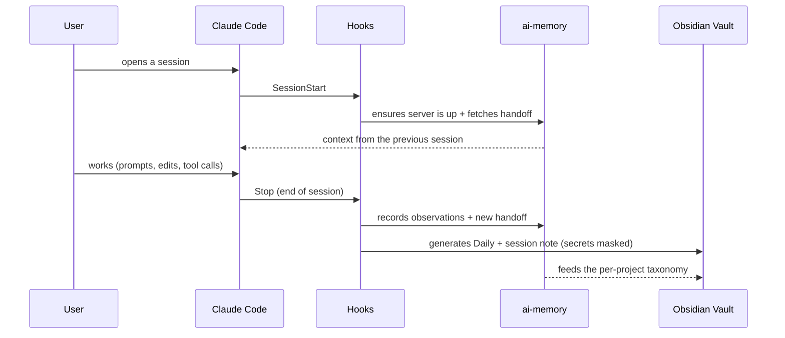

<h1 align="center">muri-saver</h1>

<p align="center"><em>Token governance, persistent memory, and human-readable logging for AI agents — Claude Code, Codex, and Antigravity. The setup I use every day, documented for anyone to install.</em></p>

<p align="center">
  <strong>English</strong> · <a href="./README.md">Português</a>
</p>

<p align="center">
  
  
  
  
  
  
  
  
</p>

<p align="center">
  <a href="https://github.com/murilolol/muri-saver/actions/workflows/ci.yml"></a>
  <a href="./CHANGELOG.md"></a>
  <a href="https://github.com/murilolol/muri-saver/stargazers"></a>
  <a href="https://github.com/murilolol/muri-saver/commits/main"></a>
  
</p>

<br>

<p align="center">
  
</p>

> [!NOTE]
> **TL;DR** — `CLAUDE.md`/`GEMINI.md`/`AGENTS.md` (governance always
> loaded, one file per agent) + the `muri-saver` skill (aggressive savings
> mode on demand, renameable with `--alias`) + lifecycle hooks that record
> on their own into [`ai-memory`](https://github.com/akitaonrails/ai-memory)
> (durable cross-session memory) and into an Obsidian vault (human-readable
> record, with secrets masked) + an ingestor that imports each agent's old
> history. Install in 3 commands, detects the OS on its own, tested on
> macOS, Linux, and Windows.

> [!TIP]
> **Installing with an AI's help?** Send your agent the link to this
> repository and ask it to follow **[`INSTALL-AI.md`](./INSTALL-AI.md)** —
> a runbook written for an AI to run on its own, which opens with a
> `/grill-me` interview (name/alias, which agents, vault, timezone, import
> history?) before touching any file, and ends with automatic verification
> of every piece.

<details>
<summary><strong>⚡ 30-second install</strong> (click to expand)</summary>

```bash
git clone https://github.com/murilolol/muri-saver.git
cd muri-saver
node bin/install.mjs --dry-run   # review what would be done, nothing is written yet
node bin/install.mjs --with-all  # Claude Code + Antigravity + Codex all at once
node bin/doctor.mjs              # checks everything automatically
```

No clone needed: `npx github:murilolol/muri-saver install --with-all`.
Want your own name instead of `muri-saver`? `--alias mendes-saver`.
Old sessions from one of these agents? `node bin/ingest-sessions.mjs --all --dry-run`.
Update later: `node bin/install.mjs --update`. Remove: `--uninstall`.
</details>

<br>

## Table of contents

- [What's new in v2](#whats-new-in-v2)
- [About](#about)
- [How it works](#how-it-works)
- [Status line](#status-line)
- [What ends up in your vault](#what-ends-up-in-your-vault)
- [`ai-memory`](#ai-memory)
- [Before / after](#before--after)
- [Real findings that justify each rule](#real-findings-that-justify-each-rule)
- [Installation](#installation)
- [Customize with your own name (`--alias`)](#customize-with-your-own-name---alias)
- [Configuration, updates and uninstallation](#configuration-updates-and-uninstallation)
- [Importing old sessions (session ingestor)](#importing-old-sessions-session-ingestor)
- [Included skills](#included-skills)
- [What's in here](#whats-in-here)
- [Cross-platform and tests](#cross-platform-and-tests)
- [Quick FAQ](#quick-faq)
- [Complementary documentation](#complementary-documentation)
- [Authorship, credits and license](#authorship-credits-and-license)

<br>

## What's new in v2

| | Before (v1.x) | Now (v2.0) |
|---|---|---|
| 🗂️ **Configurable vault** | `--vault` only created folders; the hook always wrote to `~/Documents/Obsidian Vault` | Vault, timezone and alias live in `~/.claude/muri-saver.json` and **hooks + ingestor respect them** |
| 🔐 **Secrets in the vault** | A key/token pasted into a prompt went unmasked into the dump | Hook and ingestor mask Anthropic/OpenAI/GitHub/AWS/Slack/Google keys, JWT, Bearer, passwords and private keys (`[REDACTED:TYPE]`) |
| ♻️ **Update / remove** | Reinstalling piled up backups; no uninstall | `--update` reuses the config; `--uninstall` removes only what hasn't been edited, with a backup |
| 🧾 **Manifest** | No record of what was installed | sha256 of every installed file; `doctor` checks integrity |
| 🕐 **Timezone** | `America/Sao_Paulo` hardcoded | `--timezone`, default = system timezone |
| 🧩 **Codex SQLite** | Detected, ignored | Read via `node:sqlite` (Node ≥ 22.5): title, `cwd`, and threads without a rollout |
| 🧹 **Subagents** | Subagent transcripts turned into stray sessions | Skipped by default (`--include-subagents` includes them) |
| ✨ **Opt-in enrichment** | Ingestor only did a local dump | `--enrich` generates narrative + taxonomy via Haiku, with a cap per round and per call |
| 🪟 **Windows** | Codex's `C:\...` path turned into the wrong project; `<HOME>` broke the JSON | Both fixed and covered by tests |
| ✅ **Tests / CI** | None | 42 tests (`node --test`) + CI on macOS, Linux and Windows × Node 18/22/24 |
| 📦 **Distribution** | Just `git clone` | Single command `muri-saver <install\|update\|uninstall\|doctor\|ingest>`, ready for npm |
| 📸 **Documentation** | Just text | Real screenshots, [`examples/vault/`](./examples/vault/), troubleshooting, CHANGELOG, English README |

Details in [`CHANGELOG.md`](./CHANGELOG.md) and the full plan (done + next steps) in [`ROADMAP.md`](./ROADMAP.md).

<br>

## About

I use Claude Code (and Codex/Antigravity in parallel) every day across
several projects at once, and three problems kept showing up:

1. **Uncontrolled cost and usage limits** — marathon sessions, the same
   file reread over and over, browser screenshots instead of text, an
   expensive subagent for a mechanical task, high effort applied by
   default to everything.
2. **Memory that evaporates between sessions** — every decision,
   convention and project context had to be re-explained from scratch,
   session after session, even when the project was the same one from
   yesterday.
3. **No human-readable record** of what the AI did — just raw
   transcripts, impossible to navigate after a few weeks, and impossible
   to show someone else without scrolling through thousands of lines of
   JSON.

This came out of **auditing my own usage history** (real transcripts, not
blog theory) to find the patterns that cost the most, and solving all
three problems with one system, not a loose list of tips. Friends of mine
asked to use the same thing after seeing it work — this repository is
that setup, documented and ready to install on another machine, under
whatever name you want.

It's not dogma or generic "best practices." It's what worked for me, with
the numbers to prove why (see the
[Real findings](#real-findings-that-justify-each-rule) section). Adapt it
to your own reality — `bin/doctor.mjs` exists so you can audit yours, not
just trust mine.

> [!TIP]
> **This is for you if:** you've already hit a usage cap without
> understanding why; you re-explain the same project context every new
> session; you switch between Claude Code/Codex/Antigravity and lose
> continuity every time; or you just want a way to look back and see what
> the AI did on a project without opening a 40,000-line JSON transcript.

<br>

## How it works

Five pieces, each solving a different part of the problem — governance
always runs and is cheap, the rest kicks in on demand or in the
background:

| Piece | File(s) | When it runs | Solves |
|---|---|---|---|
| **Global governance** | `CLAUDE.md` / `GEMINI.md` / `AGENTS.md` (one per agent) | Every session, every project | Short, universal rules: check memory before rereading a file, model allocation per subagent, git protections, a keyword map so you don't blindly scan directories |
| **`muri-saver` skill** | `skills/muri-saver/SKILL.md` | On demand ("muri saver" or an explicit request to save) | A long, aggressive list of rules by task type (backend, frontend, browser automation, git, debugging...) — too expensive to keep loaded all the time |
| **Lifecycle hooks** | `hooks/*.mjs` | `SessionStart` / `Stop`, automatic | Memory and logging happen **always**, without depending on the agent remembering — the previous version relied on a written rule and stopped being followed after a few days |
| **Session ingestor** | `bin/ingest-sessions.mjs` | On demand | Imports the history each agent already had before installation — no LLM by default |
| **`ai-memory` + Obsidian Vault** | external daemon + `<vault>/` | Written by the hooks and the ingestor | SQLite/FTS5 database via MCP as the durable source of truth, and a Markdown vault as a human-readable showcase — generated, never handwritten |

<p align="center">
  
</p>

A session's lifecycle, in practice:



This runs on **every** session, even short ones — trivial sessions just
get a cheap record (no LLM cost); they're never silently skipped. Full
design decisions in [`docs/architecture.md`](./docs/architecture.md).

<br>

## Status line

`scripts/statusline.py` is the status line I use every day in Claude Code
— the same visual engine (bars, threshold-based color, proactive hints)
as the renderer I use in Antigravity (`~/.gemini/scripts/usage-status.py`).
The image at the top of this README is its real output in three
situations. Example exactly as it appears in my terminal:

```
📁 muri-saver │ 🌿 main* │ 🧠 on │ ⏱ 1m 46s │ ◔ 170k/1m ▓░░░░░░░ 17% → considere /compact │ 5h ▓░░░░░░░ 9% → 3h 41m │ 7d ░░░░░░░░ 0% → 167h 01m │ ◆ Sonnet 5
```

| Segment | Meaning |
|---|---|
| `📁 muri-saver` | Current project directory |
| `🌿 main*` | Git branch (`*` = uncommitted changes) |
| `🧠 on` | Local `ai-memory` server responding (`off` in gray if it isn't) |
| `⏱ 1m 46s` | Current session duration |
| `▲ +412 -97` | Lines added/removed in the session (shows up when there are any) |
| `◔ 170k/1m ▓░░░░░░░ 17% → considere /compact` | Context tokens used / total window, proportional bar, and a hint that escalates across 4 levels (`tranquilo` → `acompanhe o contexto` → `considere /compact` → `/compact ou /clear agora`) |
| `5h ▓░░░░░░░ 9% → 3h 41m` | % of the 5h usage window and countdown until reset |
| `7d ░░░░░░░░ 0% → 167h 01m` | % of the weekly window and countdown |
| `◆ Sonnet 5` | Active model for the session |

Color changes by threshold (white → yellow at 70% → red at 90%) and the
layout adapts itself for narrow terminals (<120 columns), falling back to
just numbers. Installed by `bin/install.mjs` via
`claude-config/settings.snippet.json` — it only skips this if you already
have your own `statusLine`. Codex CLI has its own status line built into
the TUI (not scriptable the same way), so there's no version for it here.

<br>

## What ends up in your vault

Notes actually generated by the hook and the ingestor from example
sessions (fictional, with a fake key on purpose) — all of them live in
[`examples/vault/`](./examples/vault/) for you to browse on GitHub:

<table>
<tr>
<td width="50%" valign="top">
<p align="center"><strong>Enriched session note</strong><br><sub><code>claude/sessions/Session-…-Claude-0f1e2d3c.md</code></sub></p>

</td>
<td width="50%" valign="top">
<p align="center"><strong>Cross-agent daily log</strong><br><sub><code>dailies/Daily-2026-09-20.md</code></sub></p>

</td>
</tr>
</table>

<sub>Rendering of the notes from `examples/vault/` as HTML with Obsidian's default dark theme (generated by `tools/build-assets.mjs`) — not a screenshot of the app.</sub>

| Folder | What's in it | Who writes it |
|---|---|---|
| `dailies/Daily-YYYY-MM-DD.md` | One line per session of the day (Claude Code, Antigravity, Desktop) | `Stop` hook + ingestor |
| `<agent>/sessions/Session-…md` | Full session note: summary or narrative, sanitized transcript | `Stop` hook + ingestor |
| `codex/dailies/` | Codex's own daily log (doesn't compete with the root `dailies/`) | Codex's hook + ingestor |
| `projects/<project>/<category>/` | Atomic notes across 12 categories (bug, decision, improvement, risk…) | Hook (substantial sessions) + `ingest --enrich` |

<br>

## `ai-memory`

The thing that solves problem #2 from the [About](#about) section (memory
that evaporates between sessions) is
**[ai-memory](https://github.com/akitaonrails/ai-memory)** — an external
project, not mine, but the central piece of this setup.

**What it is:** a long-term memory server for AI coding agents, built by
[Fabio Akita](https://github.com/akitaonrails) (8,000+ stars on GitHub,
MIT license, written in Rust). Your agent already has some memory today,
but it's stuck on one machine, in one agent, and disappears the moment
you switch tools. ai-memory sits on the other side of those walls:

- **Crosses agents** — 20+ harnesses (Claude Code, Codex, Cursor, Gemini
  CLI, OpenCode, Grok, Devin...) feed the same shared memory. Leave
  Claude Code mid-task, open Codex in the same directory, and the next
  agent gets a real handoff.
- **Crosses machines** — memory lives on a local server (laptop,
  homelab, whatever); the project you left on your desktop is the same
  one you pick back up on your laptop.
- **Is plain markdown** — the source of truth is a versioned wiki of
  `.md` files; the database (SQLite + FTS5) is a derived index that can
  always be rebuilt. `grep` it, open it in Obsidian, edit it by hand.
- **Captures the work on its own** — lifecycle hooks record prompts,
  tool calls, and session boundaries, sanitized, with no "remember this"
  ceremony. The default path uses **zero LLM calls**.

Full installation (binary, session-aware MCP, per-project marker file,
optional LLM provider) in
[`docs/ai-memory-obsidian-setup.md`](./docs/ai-memory-obsidian-setup.md).

<br>

## Before / after

| | Without muri-saver | With muri-saver |
|---|---|---|
| **Session start** | Re-explain project context from scratch | `SessionStart` hook injects the previous session's handoff via `ai-memory` |
| **Session end** | Nothing recorded, or a manual record forgotten | `Stop` hook records on its own into `ai-memory` + Obsidian Vault |
| **History from before installation** | Lost in JSON transcripts | `ingest-sessions.mjs` imports everything, with secrets masked |
| **Rereading a large file** | Every time the question comes up again | `memory_query` first — a file read 30-54x becomes 1x |
| **Browser automation** | Screenshot for everything, even for "did I click the right spot?" | Text (`get_page_text`) by default; screenshot only when it's genuinely visual |
| **Model effort** | `xhigh` fixed for everything, including mechanical tasks | Scaled by task/subagent type |
| **Dynamic `/loop`** | Runs on its own indefinitely | Explicit confirmation before letting it reschedule itself |
| **Project history** | Stuck in unreadable JSON transcripts | Browsable Obsidian vault, taxonomy by category |
| **Session running too long** | Turns into an hours/days-long marathon without you noticing | Status line warns you + actively suggests `/compact`/`/clear` + automatic handoff |

<br>

## Real findings that justify each rule

Two full audits of my own history (real transcripts, not guesswork) feed
the `muri-saver` skill and the global governance:

| Finding | Real numbers |
|---|---|
| Marathon sessions are the biggest cost driver — not model choice | A single session burned **2.1 billion cache tokens** over 42h / 7,059 messages |
| Repeated rereads of the same file | A file read **30 to 54 times** in the same session |
| Screenshots instead of text in browser automation | **501 calls to `computer` (screenshot)** against **3 to `get_page_text`/`read_page`** in the same window |
| High effort (`xhigh`) applied by default to everything | Including mechanical/trivial tasks that didn't need it |
| Dynamic loop without confirmation | 4 dynamic loops consumed **~28.2 million tokens** together in a single `/usage` |
| Browser tools reloaded for no reason | Up to 8-9 reloads of the same set of tool schemas in a single long session |

Each line became a specific, testable rule in the skill
(`skills/muri-saver/SKILL.md`) or in the global governance. If **your**
routine is different, some rules might not make sense — audit yours and
adjust (that's exactly why the skill recommends running `/doctor`
periodically).

<br>

## Installation

```bash
git clone https://github.com/murilolol/muri-saver.git
cd muri-saver
node bin/install.mjs --dry-run   # review what would be done
node bin/install.mjs             # installs (Claude Code + whatever else is detected)
node bin/install.mjs --with-all  # or: forces Claude Code + Antigravity + Codex
node bin/doctor.mjs              # checks everything automatically
```

Without cloning, straight from GitHub: `npx github:murilolol/muri-saver install --with-all`
(and `... doctor`, `... ingest --all --dry-run`, etc.).

<p align="center">
  
</p>

Full guide — prerequisites, `ai-memory`, MCP, the `claude-obsidian`
plugin, verification — in [`INSTALL.md`](./INSTALL.md) (for humans) or
[`INSTALL-AI.md`](./INSTALL-AI.md) (for an AI to follow on its own, with
interactive onboarding via `/grill-me`).

<details>
<summary><strong>🩺 Output of <code>doctor</code> after installing</strong></summary>


</details>

<br>

## Customize with your own name (`--alias`)

`muri-saver` is the default name, but it's not mandatory. Any dev who
clones this repository can install it under their own name or nickname —
useful if you (or a coworker, say Mendes or Lucas) want to adopt the same
system without typing "muri saver" to activate something that isn't
yours:

```bash
node bin/install.mjs --alias mendes-saver --author-name Mendes
# or, without the -saver suffix:
node bin/install.mjs --alias lucas
```

This renames the skill (`~/.agents/skills/<alias>/SKILL.md`) and rewrites
all the triggers in the governance templates
(`CLAUDE.md`/`GEMINI.md`/`AGENTS.md`) — `"mendes saver"`,
`"mendes-saver"`, `"/mendes-saver"` — while keeping
`"muri-saver"`/`"muri saver"` as an alternate alias, so nothing breaks if
you mix the two names out of habit. Switching aliases later is just
running it again with the new name: the old skill folder gets backed up
automatically.

<br>

## Configuration, updates and uninstallation

Every install writes `~/.claude/muri-saver.json`:

```json
{
  "version": "2.0.0",
  "alias": "mendes-saver",
  "vault": "/Users/voce/Documents/Obsidian Vault",
  "timezone": "America/Sao_Paulo",
  "agents": ["claude", "codex", "antigravity"],
  "manifest": [{ "path": "…/SKILL.md", "sha256": "…", "kind": "skill" }]
}
```

- **Hooks and the ingestor read the vault and timezone from here.** Vault
  precedence: `--vault` flag > `OBSIDIAN_VAULT` variable >
  `muri-saver.json` > `~/Documents/Obsidian Vault`. Timezone:
  `--timezone` > `MURI_SAVER_TZ` > `muri-saver.json` > system timezone.
- **`node bin/install.mjs --update`** reinstalls using the saved config
  (no need to repeat flags). Governance files the installer created that
  you haven't edited get updated; the ones you edited stay as they are.
- **`node bin/install.mjs --uninstall`** removes the skill, hooks,
  scripts, the hook entries in `settings.json`/`hooks.json`, and
  `muri-saver.json` itself — **only what you haven't edited**, moving it
  to `~/.claude/muri-saver-backups/<date>/` instead of deleting it.
  Vault, `ai-memory` data, and third-party skills are never touched.
- Reinstalling with nothing changed writes nothing and creates no
  backup.

<br>

## Importing old sessions (session ingestor)

Were you already using Claude Code, Antigravity, or Codex before
installing this? `bin/ingest-sessions.mjs` scans each agent's local
history and retroactively records it into the Obsidian Vault and/or
`ai-memory` — **without calling any LLM by default** (100% local
extraction; see [`docs/session-ingestor.md`](./docs/session-ingestor.md)
for why):

```bash
# Simulation — lists what would be imported, writes nothing
node bin/ingest-sessions.mjs --all --dry-run

# Real ingestion, with a limit (good for the first time)
node bin/ingest-sessions.mjs --all --limit 20

# With narrative + taxonomy via Haiku on up to 5 sessions (opt-in, costs cents)
node bin/ingest-sessions.mjs --all --since 2026-09-01 --enrich --enrich-limit 5

# Backup from another machine (e.g. the old home copied to a drive)
node bin/ingest-sessions.mjs --all --source-home /Volumes/Backup/Users/voce
```

<p align="center">
  
</p>

Idempotent (it doesn't duplicate what's already been imported or what the
hook already recorded), skips subagent transcripts (noise), reads
Codex's SQLite when Node has `node:sqlite`, sanitizes secrets and system
tags, and supports `--file <conversations.json>` for Claude Desktop/Web
exports.

<br>

## Included skills

### Mine

Full source vendored here, under this repository's same MIT license:

| Skill | Description |
|---|---|
| [`muri-saver`](./skills/muri-saver/SKILL.md) | Aggressive token/cost/limit savings mode — the central skill of this repository, born from a real usage audit |
| [`grill-me`](./skills/grill-me/SKILL.md) | My complete rewrite of the requirements-interview protocol, forcing the native `AskUserQuestion`/`ask_question` modal instead of raw text in chat |

### Companion skills (third-party)

I use them every day, but **they're intentionally not copied here** —
they're third-party projects, with their own authors and licenses, and a
local copy would just go stale. Each one has a page in
[`skills/companion/`](./skills/companion/) with what it is, when I use
it, and the install command:

| Skill | What it does | Author | License |
|---|---|---|---|
| [`find-skills`](./skills/companion/find-skills/README.md) | Discovers and installs other skills from the open ecosystem (`skills.sh`) | [Vercel Labs](https://github.com/vercel-labs/skills) | MIT |
| [`tdd`](./skills/companion/tdd/README.md) | Test-driven development reference — the red→green loop, what makes a good test, anti-patterns | [Matt Pocock](https://github.com/mattpocock/skills) | MIT |
| [`prototype`](./skills/companion/prototype/README.md) | A throwaway prototype to validate a state/logic model or layout before building for real | [Matt Pocock](https://github.com/mattpocock/skills) | MIT |
| [`grill-with-docs`](./skills/companion/grill-with-docs/README.md) | A `grill-me`-style interview that also generates an ADR/glossary as a side effect | [Matt Pocock](https://github.com/mattpocock/skills) | MIT |
| [`openspec`](./skills/companion/openspec/README.md) | Structured specification (requirements, architecture, execution plan) before implementing | [openspecio](https://github.com/openspecio/openspec) | MIT |
| [`graphify`](./skills/companion/graphify/README.md) | Turns any folder into a browsable knowledge graph (`graphify query/path/explain`) | [safishamsi](https://github.com/Graphify-Labs/graphify) | Apache-2.0 |
| [`impeccable`](./skills/companion/impeccable/README.md) | UI review/critique/polish with a senior design-director's standard | [Paul Bakaus](https://github.com/pbakaus/impeccable) | Apache-2.0 |
| [`emil-design-eng`](./skills/companion/emil-design-eng/README.md) (pack) — *want to use* | Animation review and UI polish with the judgment of whoever built Vaul and Sonner | [Emil Kowalski](https://github.com/emilkowalski/skills) | MIT |
| [`taste-skill`](./skills/companion/taste-skill/README.md) — *want to use* | Gives the AI visual "good taste" from real references | [Leonxlnx](https://github.com/Leonxlnx/taste-skill) | MIT |

Full index in [`docs/skills-companion.md`](./docs/skills-companion.md).
I evaluated the `obra/superpowers` pack and decided not to use it — it's
great, but too heavy on tokens/context for my workflow.

> [!TIP]
> **`grill-me` and `grill-with-docs` are used together, not one instead
> of the other**: `grill-me` (mine, always installed) is the everyday
> default; `grill-with-docs` (third-party, optional) is the upgrade for
> when the decision is big enough to become a permanent ADR. Full
> comparison in
> [`docs/skills-companion.md`](./docs/skills-companion.md#grill-me-vs-grill-with-docs--uso-as-duas-pra-situações-diferentes).

<br>

## What's in here

<details>
<summary><strong>📂 Full repository structure</strong> (click to expand)</summary>

```
muri-saver/
├── bin/
│   ├── cli.mjs                        # single command: muri-saver install|update|uninstall|doctor|ingest
│   ├── install.mjs                    # installer (alias, multi-agent, manifest, --update/--uninstall)
│   ├── doctor.mjs                     # environment check, 100% read-only
│   └── ingest-sessions.mjs            # imports old sessions from each agent into the vault/ai-memory
├── lib/                               # logic shared across bin/ (and the tests)
│   ├── config.mjs  alias.mjs  sanitize.mjs  parsers.mjs  vault.mjs
│   └── enrich.mjs  hooks-merge.mjs  taxonomy.mjs  time.mjs  exec.mjs
├── hooks/
│   ├── obsidian-vault-check.mjs       # Stop: records the session into the vault (Claude Code/Antigravity)
│   ├── ai-memory-ensure-server.mjs    # SessionStart: ensures the ai-memory daemon is running
│   └── codex/obsidian-codex-session.mjs  # Codex CLI's Stop
├── skills/
│   ├── muri-saver/SKILL.md            # my original skill — aggressive savings mode
│   ├── grill-me/SKILL.md              # my rewrite of the interview protocol via native modal
│   └── companion/                     # just READMEs for third-party skills (not vendored)
├── claude-config/                     # CLAUDE.md.template + settings.snippet.json
├── antigravity-config/                # GEMINI.md.template + hooks.snippet.json
├── codex-config/                      # AGENTS.md.template + hooks.snippet.json
├── scripts/                           # statusline.py, usage-status.py, ai-memory-llm-mode.*, smoke test
├── mcp/mcp-servers.example.json       # MCP entries (ai-memory + Obsidian)
├── examples/vault/                    # real output from the hook and the ingestor on fictional sessions
├── assets/                            # README diagram and screenshots (generated by tools/)
├── docs/                              # architecture, setup, ingestor, skills, troubleshooting
├── test/                              # 42 node:test tests + fixtures for each agent
├── tools/                             # build-assets.mjs, ansi-to-svg.mjs, render-note.mjs
├── .github/                           # CI (macOS/Linux/Windows) + issue template
├── README.md · README.en.md · INSTALL.md · INSTALL-AI.md
├── CHANGELOG.md · ROADMAP.md · CONTRIBUTING.md · LICENSE
└── package.json
```

</details>

<br>

## Cross-platform and tests

`bin/install.mjs`, `bin/doctor.mjs`, `bin/ingest-sessions.mjs`, and the
hooks detect the operating system on their own and resolve every path
relative to the home directory (`os.homedir()`) — no hardcoded
`/Users/...` or `C:\Users\...` anywhere in the code. `bin/doctor.mjs`
adapts where it looks for the `ai-memory` binary and the Obsidian app
based on the OS.

The test suite (`npm test`, just `node:test`, zero dependencies) covers
sanitization, aliasing, each agent's parsers (including Windows paths and
Codex's SQLite), the install → update → uninstall cycle, the ingestor
(dry-run, export, vault, idempotency, `--enrich` with a fake `claude`),
and the hooks. [CI](./.github/workflows/ci.yml) runs everything on
**macOS, Linux, and Windows × Node 18, 22, and 24** on every push.

<br>

## Quick FAQ

<details>
<summary><strong>Do I need to use Claude Code, or does this work with something else?</strong></summary>

No — `bin/install.mjs --with-all` sets up Claude Code, Antigravity/Gemini
CLI, and Codex CLI all at once, each with its own governance file
(`CLAUDE.md`/`GEMINI.md`/`AGENTS.md`) and session-recording hook. If your
agent isn't one of these three, adapt the hooks — they're just plain Node
scripts, and the governance templates are plain text.
</details>

<details>
<summary><strong>Will this make my sessions slower?</strong></summary>

It shouldn't — the skill exists specifically to make things *faster* and
cheaper. The hooks run on `SessionStart`/`Stop`, outside the critical
path of each response, and the recording hook has a hard ~8s ceiling
before falling back to a 100% local path — it never blocks `/exit`
waiting on an external API.
</details>

<details>
<summary><strong>My vault isn't at <code>~/Documents/Obsidian Vault</code>. Does this work?</strong></summary>

Yes, since v2: `node bin/install.mjs --vault "/path/to/your/vault"`
writes the path into `muri-saver.json`, and the hooks and ingestor start
using it. In v1 the hook ignored that path — if you installed before,
run `node bin/install.mjs --vault "..."` again.
</details>

<details>
<summary><strong>What if I accidentally paste an API key into a prompt?</strong></summary>

It won't go into the vault raw: the hook and ingestor mask
Anthropic/OpenAI/GitHub/AWS/Slack/Google keys, JWT, `Bearer`, passwords,
and private keys as `[REDACTED:TYPE]` before writing. Even so, treat the
key as leaked and rotate it — it passed through the agent.
</details>

<details>
<summary><strong>How do I update or remove it?</strong></summary>

`node bin/install.mjs --update` to update (reuses the saved config) and
`node bin/install.mjs --uninstall` to remove — see
[Configuration, updates and uninstallation](#configuration-updates-and-uninstallation).
</details>

<details>
<summary><strong>What happens if I don't have Obsidian installed?</strong></summary>

The hooks still write (they create the folders); only comfortable
*reading* depends on the app. The ingestor also has `--export-dir` to
generate standalone Markdown with no vault at all.
</details>

<details>
<summary><strong>Do I have to pay for anything?</strong></summary>

No — `ai-memory` is open-source and runs locally, Obsidian is free for
personal use, and the companion skills are all free/open-source. The
only optional cost is the ingestor's `--enrich` (Haiku, cents per
session, with a cap) — and it comes out of your own subscription.
</details>

<details>
<summary><strong>Something went wrong. Where do I start?</strong></summary>

`node bin/doctor.mjs` first, then
[`docs/troubleshooting.md`](./docs/troubleshooting.md) — it has the real
problems that have come up and how to fix each one.
</details>

<br>

## Complementary documentation

| | Document | Contents |
|---|---|---|
| 🧭 | [`docs/architecture.md`](./docs/architecture.md) | Why each piece exists, how they fit together |
| 🧠 | [`docs/ai-memory-obsidian-setup.md`](./docs/ai-memory-obsidian-setup.md) | Detailed setup for `ai-memory` + Obsidian + session-aware MCP |
| 📥 | [`docs/session-ingestor.md`](./docs/session-ingestor.md) | How the ingestor reads each agent, sanitizes, and avoids duplicates |
| 🧩 | [`docs/skills-companion.md`](./docs/skills-companion.md) | Third-party skills I use, with credits and the install command |
| 🩹 | [`docs/troubleshooting.md`](./docs/troubleshooting.md) | Known issues and how to fix them |
| 👤 | [`INSTALL.md`](./INSTALL.md) | Step-by-step install guide for humans |
| 🤖 | [`INSTALL-AI.md`](./INSTALL-AI.md) | Runbook for an AI to install on its own, with `/grill-me` onboarding |
| 📜 | [`CHANGELOG.md`](./CHANGELOG.md) | What changed in each version |
| 🗺️ | [`ROADMAP.md`](./ROADMAP.md) | Improvements made and coming up |
| 🤝 | [`CONTRIBUTING.md`](./CONTRIBUTING.md) | How to run the tests, regenerate the images, and send a PR |

_These documents are in Portuguese (pt-BR)._

<br>

## Authorship, credits and license

Built and maintained by me, [@murilolol](https://github.com/murilolol),
out of my own real day-to-day use of Claude Code. `muri-saver` and
`grill-me` (the version vendored here) are original content. The other
skills mentioned belong to their respective authors — see
[`docs/skills-companion.md`](./docs/skills-companion.md) for individual
credit. [`ai-memory`](https://github.com/akitaonrails/ai-memory) is by
[Fabio Akita](https://github.com/akitaonrails).

MIT — see [`LICENSE`](./LICENSE) for this repository's original content.
Use it, adapt it, break it, send a PR if you find a bug or have a better
rule to propose.

<br>

<p align="center">
  <sub>If this saved you tokens or an afternoon of a lost session, a ⭐ on the repository helps someone else find it.</sub>
  <br />
  <a href="#muri-saver">⬆ Back to top</a>
</p>
