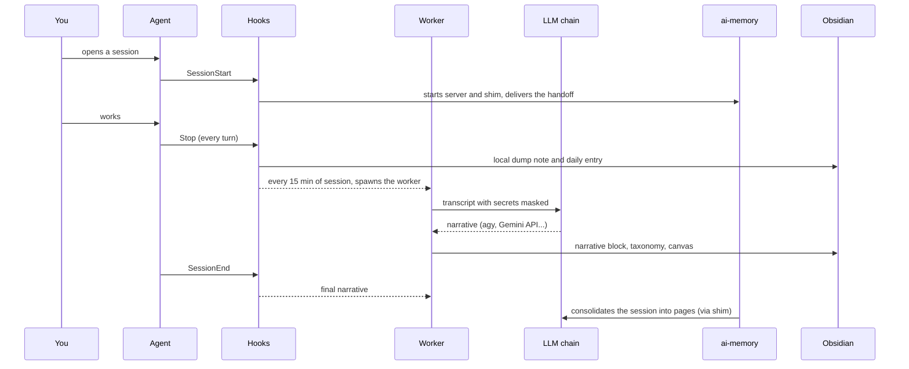

<h1 align="center">muri-saver</h1>

<p align="center"><em>Spend less quota, never lose context, and keep a readable log of everything your AI did. For Claude Code, Codex and Antigravity, on macOS, Linux and Windows.</em></p>

<p align="center">
  <strong>English</strong> · <a href="./README.md">Português</a>
</p>

<p align="center">
  <a href="https://github.com/murilolol/muri-saver/actions/workflows/ci.yml"></a>
  <a href="https://github.com/murilolol/muri-saver/releases"></a>
  
  
  
  
</p>

<p align="center">
  
</p>

Anyone using a coding agent every day hits three problems: the **quota runs
out** without you knowing why, **context evaporates** between sessions, and
there's **no readable record** of what was done. muri-saver came out of
auditing real transcripts (one 42-hour session, a file reread 54 times, 501
screenshots against 3 text reads) and solves all three with one system:

- **Short governance** loaded in every session, plus the `muri-saver` skill
  (aggressive saving mode on demand) and delegation to other agents on their
  own quota.
- **Persistent memory** with [ai-memory](https://github.com/akitaonrails/ai-memory),
  consolidated by a model chain that switches on its own when one hits a limit.
- **Live notes in Obsidian**: every session becomes a note, with a narrative
  written outside your agent's quota.

The docs under `docs/` are in Portuguese; commands, config keys and code are
the same in both languages.

## Contents

- [Gallery](#gallery) · [Usage](#usage) · [Installer options](#installer-options)
- [What's included](#whats-included) · [How it works](#how-it-works)
- [LLM chain](#llm-chain) · [Background jobs](#background-jobs) · [Commands](#commands)
- [Configuration](#configuration) · [Cross-platform](#cross-platform)
- [Local development](#local-development) · [Contributing](#contributing) · [License](#license-and-credits)

## Gallery

| Session note in the vault | Cross-agent daily log | `doctor` after installing |
| --- | --- | --- |
|  |  |  |

The images use fictional data from [`examples/vault/`](./examples/vault/),
including a fake key pasted on purpose (it shows up as `[REDACTED:ANTHROPIC_KEY]`).

## Usage

```bash
git clone https://github.com/murilolol/muri-saver.git
cd muri-saver
node bin/install.mjs --dry-run                 # shows what it would do, writes nothing
node bin/install.mjs --with-all                # Claude Code + Codex + Antigravity
node bin/doctor.mjs                            # checks everything (read-only)
```

Without cloning: `npx github:murilolol/muri-saver install --with-all`.

Then turn on what you want:

```bash
# Obsidian: every session becomes a note in your vault
node bin/install.mjs --update --vault "/path/to/your/vault"

# ai-memory consolidating sessions through the model chain (docs/llm-chain.md)
npx muri-saver llm chain && npx muri-saver llm tune

# Background jobs: idle sessions, reprocessing, backfill, weekly report
node bin/install.mjs --update --with-jobs
```

On Windows, quote the vault path (`"C:\Users\you\Documents\Vault"`). Open a new
agent session and say `muri-saver: review this project using less context`.
Installing with an AI's help? Send it this repo and ask it to follow
[`INSTALL-AI.md`](./INSTALL-AI.md).

[ai-memory](https://github.com/akitaonrails/ai-memory) is a separate program:
install it first ([`docs/ai-memory-obsidian-setup.md`](./docs/ai-memory-obsidian-setup.md)).
Obsidian is optional.

## Installer options

| Option | Default | Description |
| --- | --- | --- |
| `--with-all` | only what's detected | Set up Codex and Antigravity even without `~/.codex`/`~/.gemini` |
| `--vault <path>` | off | Obsidian vault used by hooks and the ingestor |
| `--timezone <IANA>` | system zone | File names and daily notes |
| `--language <tag>` | `pt-BR` | Narrative language (e.g. `en`) |
| `--alias <name>` | `muri-saver` | Install under your own name; the original still works |
| `--narrative-chain <list>` | `agy` Pro → `agy` Flash → Gemini API | Vault narrative models; `off` keeps only the local dump |
| `--ai-memory-chain <list>` | Gemini API → `agy` | Models the shim offers to ai-memory |
| `--llm-key-file <path>` | — | `KEY=value` file to read `GEMINI_API_KEY` from (the key is never copied) |
| `--with-jobs` / `--jobs <list>` / `--no-jobs` | none | Background jobs in the OS scheduler |
| `--with-companion-skills` | no | Installs `find-skills`, `tdd`, `prototype`, `grill-with-docs` |
| `--update` / `--uninstall` | | Reuse the saved config / remove only what you didn't edit |
| `--dry-run` | | Show everything, write nothing |

Existing configs are **merged**, never replaced, and overwritten files are
backed up to `~/.claude/muri-saver-backups/`.

## What's included

| Piece | Runs | Solves |
| --- | --- | --- |
| **Governance** (`CLAUDE.md`, `AGENTS.md`, `GEMINI.md`) | every session | Short rules: memory first, context vs. quota, delegation, logs, git |
| **`muri-saver` skill** | on demand ("muri saver") | Aggressive saving: no rereads, batching, task profiles, short sessions |
| **Delegation** | when worth it | Reading/research to Gemini, review/implementation to Codex, on their quota |
| **Live notes in Obsidian** | every `Stop`/`SessionEnd` | Instant local dump + LLM narrative in a detached process |
| **LLM chain** | narrative and ai-memory | Switches model on limits/errors, per-model cooldown |
| **Background jobs** | OS scheduler | Idle sessions, parked sessions, backfill, report; stop by themselves |
| **Economy report** | on demand / weekly | Where your quota went, measured from your transcripts |
| **Ingestor** | on demand | Imports each agent's old history, no LLM |
| **Audit** | on demand | Observed tokens and repeated calls, locally |
| **Status line** | always (Claude Code) | Context with a `/compact` hint, 5h/7d quotas with countdown |

## How it works


```mermaid
sequenceDiagram
    participant U as You
    participant A as Agent
    participant H as Hooks
    participant W as Worker
    participant L as LLM chain
    participant M as ai-memory
    participant V as Obsidian

    U->>A: opens a session
    A->>H: SessionStart
    H->>M: starts server and shim, delivers the handoff
    U->>A: works
    A->>H: Stop (every turn)
    H->>V: local dump note and daily entry
    H-->>W: every 15 min of session, spawns the worker
    W->>L: transcript with secrets masked
    L-->>W: narrative (agy, Gemini API...)
    W->>V: narrative block, taxonomy, canvas
    A->>H: SessionEnd
    H-->>W: final narrative
    M->>L: consolidates the session into pages (via shim)
```

`Stop` never waits for a model: the narrative runs in a detached process. If
the whole chain is cooling down, the note keeps the dump and gets its narrative
later (next interval, `SessionEnd` or the backfill job).

## LLM chain

The vault narrative and ai-memory consolidation use an ordered list of models.
The first one that answers wins; a quota error or 5xx cools that model down
for as long as the error says, and the next one takes over.

| Kind | Quota | Needs |
| --- | --- | --- |
| `gemini-api:<model>` | free, per model | `GEMINI_API_KEY` |
| `agy:<model>` | Google plan (Antigravity) | `agy` installed |
| `claude:<model>` | **your Claude plan** | `claude` installed |
| `openai:<model>` | the provider's (Ollama, OpenRouter, Groq...) | `llm.openai.baseUrl` |

No default touches the Claude quota. Schedulers don't read your shell profile,
so `llm.apiKeyFile` can point at a `KEY=value` file (even `~/.zprofile`); the
key is never written by muri-saver.

## Background jobs

| Job | When | Stops by itself |
| --- | --- | --- |
| `llm-shim` | service | — |
| `finalize-idle` | hourly | — |
| `reprocess-parked` | hourly at :10 | when its queue is empty |
| `vault-backfill` | every 2h | when its queue is empty |
| `quota-snapshot` | hourly | — |
| `economy-report` | Monday 09:00 | — |

Registered with **launchd** (macOS), **systemd --user** or **crontab** (Linux)
and **Task Scheduler** (Windows). With no free model, queue jobs exit
immediately without spending anything.

## Commands

`npx muri-saver <command>` (or `node bin/cli.mjs <command>` in a clone):
`install`, `update`, `uninstall`, `doctor`, `llm chain|gemini|anthropic|off|status|tune`,
`jobs list|status|install|remove|run`, `delegate <gemini|codex> "<brief>"`,
`report [--days N] [--save]`, `reprocess`, `backfill`, `finalize-idle`, `ingest`, `audit`.

## Configuration

Everything lives in `~/.claude/muri-saver.json`; `--update` keeps what you edit:

```json
{
  "vault": "/path/to/vault",
  "timezone": "Europe/Lisbon",
  "language": "en",
  "llm": { "narrative": ["agy:gemini-3.1-pro-high", "gemini-api:gemini-2.5-flash"], "shim": true },
  "narrative": { "intervalMinutes": 15 },
  "jobs": ["finalize-idle", "reprocess-parked"]
}
```

`"vault": null` turns Obsidian off. Precedence: flag > environment
(`OBSIDIAN_VAULT`, `MURI_SAVER_TZ`, `MURI_SAVER_NARRATIVE_CHAIN`...) > file.

## Cross-platform

No hardcoded user paths anywhere. npm-installed CLIs on Windows are `.cmd`
shims: muri-saver reads the shim and runs the real `.js`/`.exe` directly,
without a shell. The ai-memory data dir comes from `ai-memory status --json`;
its database is read with `node:sqlite` (Node ≥ 22.5) or the `sqlite3` CLI. CI
runs the suite on macOS, Linux and Windows with Node 18, 22 and 24. Real job
registration has been exercised on macOS; on Linux and Windows the generated
files (`.timer`, task XML) are covered by tests.

## Local development

```bash
npm test                                      # 92 tests, node:test, < 2 s
node bin/install.mjs --dry-run --with-all
MURI_SAVER_SCHEDULER=dry node scripts/muri-jobs.mjs install --all
node scripts/vault-backfill.mjs --dry-run
```

Tests run in a temporary home, with the scheduler in `dry` mode, the LLM chain
off and fake `agy`/`ai-memory` binaries from `tools/test-bin/`.

## Contributing

Contributions are welcome — see [`CONTRIBUTING.md`](./CONTRIBUTING.md) and the
[`CHANGELOG.md`](./CHANGELOG.md).

## License and credits

MIT, see [`LICENSE`](./LICENSE). Made by [@murilolol](https://github.com/murilolol)
from real daily use. [ai-memory](https://github.com/akitaonrails/ai-memory) is
by [Fabio Akita](https://github.com/akitaonrails); companion skills belong to
their authors ([`docs/skills-companion.md`](./docs/skills-companion.md)).
