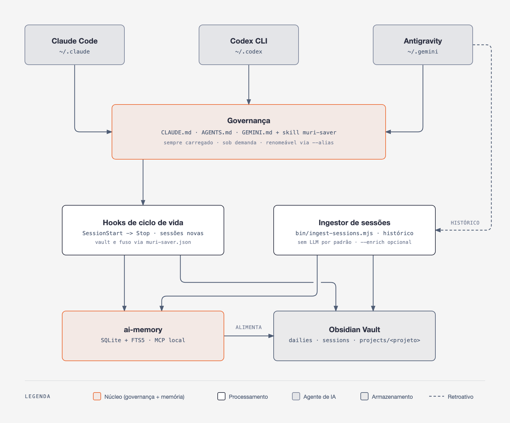
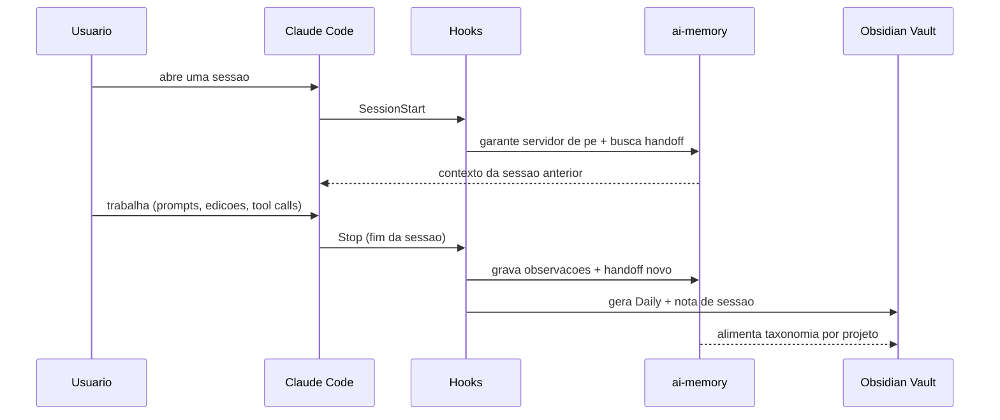

<h1 align="center">muri-saver</h1>

<p align="center"><em>Governança de tokens, memória persistente e registro humano-legível para agentes de IA — Claude Code, Codex e Antigravity. O setup que eu uso todo dia, documentado pra qualquer um instalar.</em></p>

<p align="center">
  
  
  
  
  
  
  
  
  
</p>

<br>

> **TL;DR** — `CLAUDE.md` (governança sempre carregada) + skill `muri-saver`
> (modo de economia agressiva sob demanda) + hooks de ciclo de vida que
> gravam sozinhos em [`ai-memory`](https://github.com/akitaonrails/ai-memory)
> (memória durável cross-sessão) e num vault do Obsidian (registro
> humano-legível). Instalação em 3 comandos, detecta o sistema operacional
> sozinho.

> **Vai instalar com ajuda de uma IA?** Mande o link deste repositório pro
> seu agente e peça pra ele seguir **[`INSTALL-AI.md`](./INSTALL-AI.md)** —
> um runbook escrito especificamente pra uma IA executar sozinha, com
> detecção de SO e verificação automática de cada peça, inclusive o que
> fazer quando alguma delas não está instalada ou habilitada.

<br>

## Índice

- [Sobre](#sobre)
- [Como funciona](#como-funciona)
- [`ai-memory`](#ai-memory)
- [Antes / depois](#antes--depois)
- [Achados reais que justificam cada regra](#achados-reais-que-justificam-cada-regra)
- [O que tem aqui](#o-que-tem-aqui)
- [Skills incluídas](#skills-incluídas)
- [Instalação](#instalação)
- [Multiplataforma](#multiplataforma)
- [Perguntas rápidas](#perguntas-rápidas)
- [Documentação complementar](#documentação-complementar)
- [Autoria e créditos](#autoria-e-créditos)
- [Licença](#licença)

<br>

## Sobre

Uso Claude Code (e Codex/Antigravity em paralelo) todo dia pra vários
projetos ao mesmo tempo, e três problemas apareciam sempre:

1. **Custo e limite de uso descontrolados** — sessão maratona, releitura
   repetida do mesmo arquivo, screenshot de browser em vez de texto,
   subagente caro pra tarefa mecânica, effort alto aplicado por padrão a
   tudo.
2. **Memória que evapora entre sessões** — toda decisão, convenção e
   contexto de projeto tinha que ser reexplicado do zero de novo, sessão após
   sessão, mesmo quando o projeto era o mesmo de ontem.
3. **Nenhum registro legível por humano** do que a IA fez — só transcript
   bruto, impossível de navegar depois de algumas semanas, e impossível de
   mostrar pra outra pessoa sem rolar milhares de linhas de JSON.

Isso aqui nasceu de **auditar meu próprio histórico de uso** (transcripts
reais, não teoria de blog) pra achar os padrões que mais custavam caro, e
resolver os três problemas com um sistema, não uma lista solta de dicas.
Amigos meus pediram pra usar a mesma coisa depois de ver funcionando — este
repositório é esse setup, documentado e pronto pra instalar em outra
máquina.

Não é dogma nem "melhores práticas" genéricas. É o que funcionou pra mim,
com os números que provam por quê (seção
[Achados reais](#achados-reais-que-justificam-cada-regra)). Adapte pra sua
realidade — o `bin/doctor.mjs` existe pra você auditar a sua, não só confiar
na minha.

<br>

## Como funciona

Quatro peças, cada uma resolvendo uma parte diferente do problema:

- **`CLAUDE.md`** roda em toda sessão, todo projeto — regras curtas e
  universais (consultar memória antes de reler arquivo, alocação de modelo
  por subagente, proteções de git, mapa de palavras-chave pra não varrer
  diretório às cegas).
- **Skill `muri-saver`** carrega sob demanda quando você pede economia — aí
  sim vale a pena gastar contexto numa lista mais longa e agressiva de
  regras por tipo de tarefa (backend, frontend, browser automation, git,
  debug...).
- **Hooks** (`SessionStart`/`Stop`) garantem que a memória e o registro
  acontecem *sempre*, sem depender do agente lembrar de fazer isso — a
  versão anterior desse sistema dependia de uma regra escrita no `CLAUDE.md`,
  e ela parava de ser seguida depois de alguns dias sem enforcement real.
- **`ai-memory` + Obsidian Vault** são o destino final: um banco
  SQLite/FTS5 consultável via MCP como fonte de verdade durável, e um vault
  Markdown como vitrine legível por humano, gerada pelos hooks — não escrita
  à mão.

<p align="center">
  
</p>

Ciclo de vida de uma sessão, na prática:



Isso roda em **toda** sessão, mesmo as curtas — sessões muito triviais
recebem só um registro barato (sem custo de LLM), nunca são silenciosamente
ignoradas. Decisões de design completas, e por que a arquitetura é separada
assim (e não tudo num arquivo só), em
[`docs/architecture.md`](./docs/architecture.md).

<br>

## `ai-memory`

Quem resolve o problema #2 da seção [Sobre](#sobre) (memória que evapora
entre sessões) é o **[ai-memory](https://github.com/akitaonrails/ai-memory)**
— um projeto externo, não é meu, mas é a peça central deste setup.

**O que é:** um servidor de memória de longo prazo pra agentes de IA
coding, criado por [Fabio Akita](https://github.com/akitaonrails) (mais de
8 mil estrelas no GitHub, licença MIT, escrito em Rust). A ideia central:
seu agente já tem alguma memória hoje — Claude Code anota algumas coisas,
Cursor lembra outras — mas ela fica presa numa máquina, num agente só, e
some quando você troca de ferramenta. O ai-memory fica do outro lado dessas
paredes:

- **Atravessa agentes** — mais de 20 harnesses (Claude Code, Codex, Cursor,
  Gemini CLI, OpenCode, Grok, Devin...) alimentam a mesma memória
  compartilhada. Sai do Claude Code no meio de uma tarefa, abre o Codex no
  mesmo diretório, e o próximo agente recebe um handoff de verdade — o que
  já foi tentado, o que falhou, o que ainda tá em aberto.
- **Atravessa máquinas** — a memória vive num servidor local (o mesmo
  notebook, uma homelab, o que for); o projeto que você deixou no desktop é
  o mesmo que retoma no notebook.
- **É markdown puro** — a fonte de verdade é uma wiki versionada de
  arquivos `.md` comuns; o banco (SQLite + FTS5) é um índice derivado que
  sempre pode ser reconstruído a partir dos arquivos. `grep`, abra no
  Obsidian, edite à mão — sem vector store pra manter, nada preso num blob
  binário.
- **Captura o trabalho sozinho** — hooks de ciclo de vida gravam prompts,
  tool calls e limites de sessão, sanitizados antes de guardar, sem
  cerimônia de "lembra disso". O caminho padrão usa **zero chamadas de
  LLM** — captura, busca e handoff funcionam sem nenhuma API key.

Neste repositório, `hooks/ai-memory-ensure-server.mjs`,
`hooks/obsidian-vault-check.mjs` e o `CLAUDE.md.template` já vêm
configurados pra usar o ai-memory como essa fonte de verdade — não preciso
reescrever nada disso, só integrar. Instalação completa (binário, MCP
session-aware, marker file por projeto, provedor de LLM opcional) em
[`docs/ai-memory-obsidian-setup.md`](./docs/ai-memory-obsidian-setup.md).

<br>

## Antes / depois

| | Sem muri-saver | Com muri-saver |
|---|---|---|
| **Início de sessão** | Reexplicar contexto do projeto do zero | Hook `SessionStart` injeta handoff da sessão anterior via `ai-memory` |
| **Fim de sessão** | Nada registrado, ou registro manual esquecido | Hook `Stop` grava sozinho em `ai-memory` + Obsidian Vault |
| **Reler arquivo grande** | Toda vez que a dúvida aparece de novo | `memory_query` primeiro — arquivo lido 30-54x vira 1x |
| **Automação de browser** | Screenshot pra tudo, mesmo pra "cliquei certo?" | Texto (`get_page_text`) por padrão; screenshot só quando é visual de verdade |
| **Effort do modelo** | `xhigh` fixo pra tudo, inclusive tarefa mecânica | Escalonado por tipo de tarefa/subagente |
| **`/loop` dinâmico** | Roda sozinho indefinidamente | Confirmação explícita antes de deixar reagendar sozinho |
| **Histórico do projeto** | Preso em transcripts JSON ilegíveis | Vault Obsidian navegável, taxonomia por categoria |
| **Sessão longa demais** | Vira maratona de horas/dias sem perceber | Sugestão ativa de `/compact`/`/clear` + handoff automático |

<br>

## Achados reais que justificam cada regra

Duas auditorias completas do meu próprio histórico (transcripts reais, não
suposição) alimentam a skill `muri-saver` e o `CLAUDE.md`:

| Achado | Números reais |
|---|---|
| Sessão maratona é o maior vilão de custo — não escolha de modelo | Uma sessão sozinha consumiu **2,1 bilhões de tokens de cache** em 42h / 7.059 mensagens |
| Releitura repetida do mesmo arquivo | Um arquivo lido **30 a 54 vezes** na mesma sessão |
| Screenshot em vez de texto em automação de browser | **501 chamadas de `computer` (screenshot)** contra **3 de `get_page_text`/`read_page`** no mesmo intervalo de sessões |
| Effort alto (`xhigh`) aplicado por padrão a tudo | Inclusive tarefas mecânicas/triviais que não precisavam |
| Loop dinâmico sem confirmação | 4 loops dinâmicos consumiram **~28,2 milhões de tokens** juntos num único `/usage` |
| Ferramentas de browser recarregadas à toa | Até 8-9 recargas do mesmo conjunto de tool schemas numa única sessão longa |

Cada linha da tabela virou uma regra específica e testável na skill
(`skills/muri-saver/SKILL.md`) ou no `CLAUDE.md.template` — não teoria
importada de outro lugar. Isso significa também que, se **sua** rotina de
uso for diferente da minha, algumas regras podem não fazer sentido — audite
a sua própria e ajuste (é literalmente pra isso que a skill recomenda rodar
`/doctor` periodicamente).

<br>

## O que tem aqui

```
muri-saver/
├── package.json                       # metadata + scripts npm de conveniencia
├── bin/
│   ├── install.mjs                    # instalador nao-interativo, detecta o SO
│   └── doctor.mjs                     # verificacao de ambiente (Node/Python/ai-memory/MCP/Obsidian/vault)
├── assets/
│   ├── architecture-diagram.png       # diagrama usado neste README
│   └── architecture-diagram.svg       # fonte vetorial editavel do diagrama
├── skills/
│   ├── muri-saver/SKILL.md            # minha skill original — modo de economia agressiva
│   ├── grill-me/SKILL.md              # minha reescrita do protocolo de entrevista via modal nativo
│   └── companion/                     # NAO sao skills vendorizadas — so README explicando cada uma
│       ├── find-skills/README.md      # + tdd/, prototype/, grill-with-docs/, openspec/,
│       └── ...                        #   graphify/, impeccable/, superpowers/ (mesmo padrao)
├── claude-config/
│   ├── CLAUDE.md.template             # governanca global, sempre carregada
│   └── settings.snippet.json          # trecho de merge pro ~/.claude/settings.json
├── codex-config/
│   └── hooks.snippet.json             # idem, pro ~/.codex/hooks.json (suporte opcional ao Codex)
├── hooks/
│   ├── obsidian-vault-check.mjs       # Stop: grava a sessao no vault (Claude Code/Antigravity)
│   ├── ai-memory-ensure-server.mjs    # SessionStart: garante o daemon do ai-memory de pe
│   └── codex/
│       └── obsidian-codex-session.mjs # mesma funcao, pro Codex CLI
├── scripts/
│   ├── usage-status.py                # status de uso/limite formatado pt-BR
│   ├── statusline.py                  # status line completa (contexto, quota, git)
│   ├── ai-memory-llm-mode.sh          # alterna provedor de LLM do ai-memory (macOS/Linux)
│   ├── ai-memory-llm-mode.ps1         # idem, Windows/PowerShell
│   └── test-vault-hooks.sh            # smoke test dos hooks contra HOME fake
├── mcp/
│   └── mcp-servers.example.json       # entradas MCP (ai-memory + Obsidian)
├── docs/
│   ├── architecture.md                # por que cada peca existe e como se encaixam
│   ├── ai-memory-obsidian-setup.md    # instalacao detalhada do ai-memory + Obsidian
│   └── skills-companion.md            # skills de terceiros que uso, com creditos e vantagens
├── README.md
├── INSTALL.md                         # guia curto pra humano
├── INSTALL-AI.md                      # runbook completo pra uma IA instalar sozinha
└── LICENSE
```

<br>

## Skills incluídas

### As minhas

Código-fonte completo vendorizado aqui, sob a mesma licença MIT deste
repositório:

| Skill | Descrição |
|---|---|
| [`muri-saver`](./skills/muri-saver/SKILL.md) | Modo de economia agressiva de tokens/custo/limites — a skill central deste repositório, nascida de auditoria real de uso |
| [`grill-me`](./skills/grill-me/SKILL.md) | Minha reescrita completa do protocolo de entrevista de requisitos, forçando o modal nativo `AskUserQuestion`/`ask_question` em vez de texto cru no chat |

### Skills companheiras (de terceiros)

Uso todo dia, mas **não são copiadas aqui de propósito** — são projetos de
terceiros, com seus próprios autores e licenças, e uma cópia local só ficaria
desatualizada. Cada uma tem uma página dedicada em
[`skills/companion/`](./skills/companion/) — não com o código da skill, mas
com uma explicação própria (o que é, quando eu uso, vantagem, comando de
instalação). Prévia rápida:

| Skill | O que faz | Autor | Licença |
|---|---|---|---|
| [`find-skills`](./skills/companion/find-skills/README.md) | Descobre e instala outras skills do ecossistema aberto (`skills.sh`) | [Vercel Labs](https://github.com/vercel-labs/skills) | MIT |
| [`tdd`](./skills/companion/tdd/README.md) | Referência de test-driven development — loop red→green, o que é um bom teste, anti-padrões | [Matt Pocock](https://github.com/mattpocock/skills) | MIT |
| [`prototype`](./skills/companion/prototype/README.md) | Protótipo descartável pra validar modelo de estado/lógica ou layout antes de construir de vez | [Matt Pocock](https://github.com/mattpocock/skills) | MIT |
| [`grill-with-docs`](./skills/companion/grill-with-docs/README.md) | Entrevista tipo `grill-me` que também gera ADR/glossário como efeito colateral | [Matt Pocock](https://github.com/mattpocock/skills) | MIT |
| [`openspec`](./skills/companion/openspec/README.md) | Framework de especificação estruturada (requisitos, arquitetura, plano de execução) antes de implementar | [openspecio](https://github.com/openspecio/openspec) | MIT |
| [`graphify`](./skills/companion/graphify/README.md) | Transforma qualquer pasta de código/docs num grafo de conhecimento navegável (`graphify query/path/explain`) | [safishamsi](https://github.com/Graphify-Labs/graphify) | Apache-2.0 |
| [`impeccable`](./skills/companion/impeccable/README.md) | Revisão/crítica/polish de UI com padrão de design director sênior | [Paul Bakaus](https://github.com/pbakaus/impeccable) | Apache-2.0 |
| [`superpowers`](./skills/companion/superpowers/README.md) (pack) | Metodologia de dev sênior — debugging sistemático, planejamento, worktrees, code review | [obra](https://github.com/obra/superpowers) | MIT |

Índice completo com mais contexto (quando usar, por que vale a pena) em
[`docs/skills-companion.md`](./docs/skills-companion.md).

<br>

## Instalação

```bash
git clone https://github.com/murilolol/muri-saver.git
cd muri-saver
node bin/install.mjs --dry-run   # revise o que seria feito
node bin/install.mjs             # instala de verdade
node bin/doctor.mjs              # verifica tudo automaticamente
```

Guia completo — pré-requisitos, `ai-memory`, MCP, plugin `claude-obsidian`,
verificação — em [`INSTALL.md`](./INSTALL.md) (humano) ou
[`INSTALL-AI.md`](./INSTALL-AI.md) (pra uma IA seguir sozinha).

<br>

## Multiplataforma

`bin/install.mjs` e `bin/doctor.mjs` detectam o sistema operacional sozinhos
(`process.platform`: `darwin`/`linux`/`win32`) e resolvem todo caminho
relativo à home do usuário (`os.homedir()`) — nada de `/Users/...` ou
`C:\Users\...` hardcoded. `bin/doctor.mjs` inclusive adapta onde procura o
binário do `ai-memory` (`~/.local/bin` vs `~/.cargo/bin`) e o app Obsidian
(`/Applications`, `AppData\Local`, `/usr/bin`) por SO. Testado em macOS;
Linux e Windows seguem a mesma lógica de resolução de caminho — se algo
específico do seu SO quebrar, é bug, não limitação de design.

<br>

## Perguntas rápidas

**Preciso usar Claude Code, ou funciona com outra coisa?**
O núcleo (`CLAUDE.md` + hooks) foi desenhado pro Claude Code, mas os hooks e
o formato de skill são compatíveis com Codex CLI (suporte incluído) e
Antigravity/Gemini CLI (mesma convenção de `AGENTS.md`/hooks espelhados,
ajuste manual). Se seu agente não é nenhum desses três, adapte os hooks —
eles são só scripts Node/Bash comuns.

**Isso vai deixar minhas sessões mais lentas?**
Não deveria — a skill `muri-saver` existe justamente pra ficar *mais* rápido
e barato. Os hooks rodam em `SessionStart`/`Stop`, fora do caminho crítico de
cada resposta.

**O que acontece se eu não tiver Obsidian instalado?**
Os hooks tentam gravar mesmo assim (criam a pasta se não existir); só a
*leitura* confortável do resultado depende do app. `bin/doctor.mjs` avisa se
não encontrar o Obsidian instalado, sem travar o resto da instalação.

**Preciso pagar por alguma coisa?**
Não — `ai-memory` é open-source e roda localmente, Obsidian é gratuito pra
uso pessoal, e as skills companheiras listadas em
`docs/skills-companion.md` também são todas gratuitas/open-source.

<br>

## Documentação complementar

| Documento | Conteúdo |
|---|---|
| [`docs/architecture.md`](./docs/architecture.md) | Por que cada peça existe, como se encaixam |
| [`docs/ai-memory-obsidian-setup.md`](./docs/ai-memory-obsidian-setup.md) | Instalação detalhada do `ai-memory` + Obsidian + MCP session-aware |
| [`docs/skills-companion.md`](./docs/skills-companion.md) | Skills de terceiros que uso, com créditos, vantagens e comando de instalação |
| [`INSTALL-AI.md`](./INSTALL-AI.md) | Runbook pra uma IA instalar tudo sozinha, com verificação |

<br>

## Autoria e créditos

Feito e mantido por mim, [@murilolol](https://github.com/murilolol), a partir
do meu uso diário real de Claude Code. `muri-saver` e `grill-me` (a versão
vendorizada aqui) são conteúdo original. As demais skills citadas pertencem
aos seus respectivos autores — ver
[`docs/skills-companion.md`](./docs/skills-companion.md) pra crédito
individual de cada uma.

<br>

## Licença

MIT — ver [`LICENSE`](./LICENSE) pro conteúdo original deste repositório
(`muri-saver`, `grill-me`, hooks, scripts, documentação). Use, adapte,
quebre, mande PR se achar bug ou tiver uma regra melhor pra propor.
