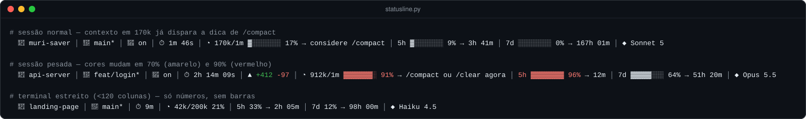
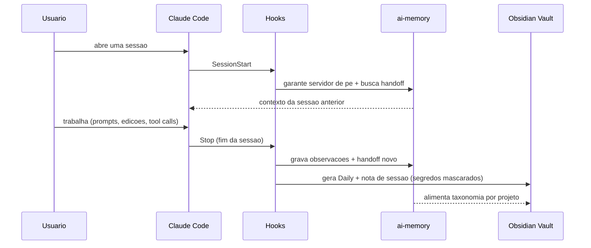
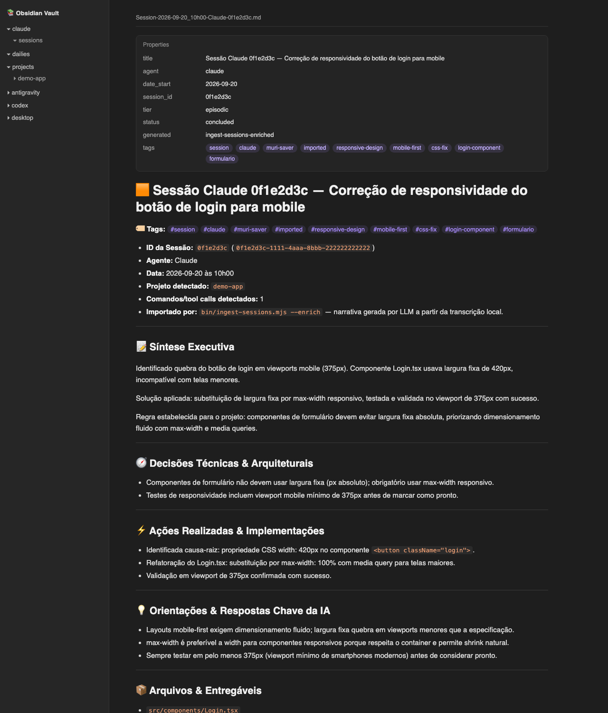
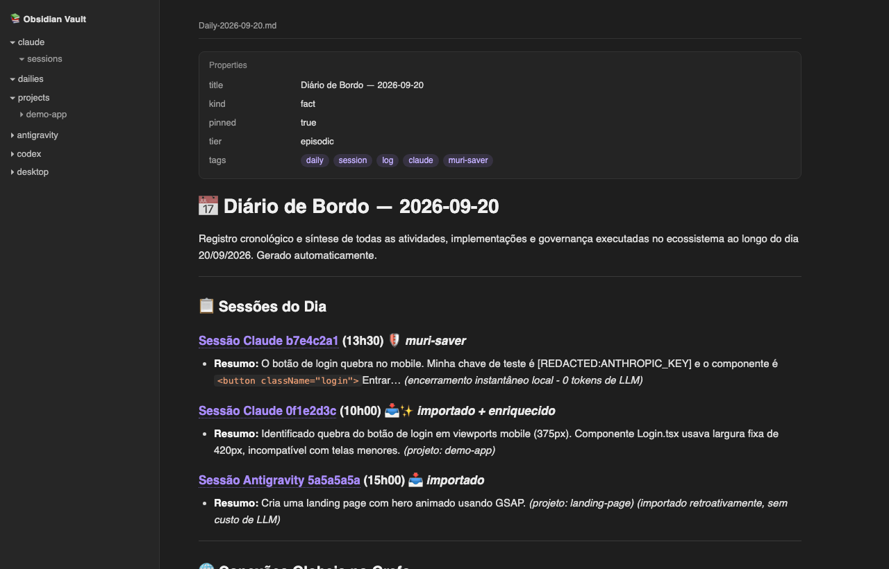
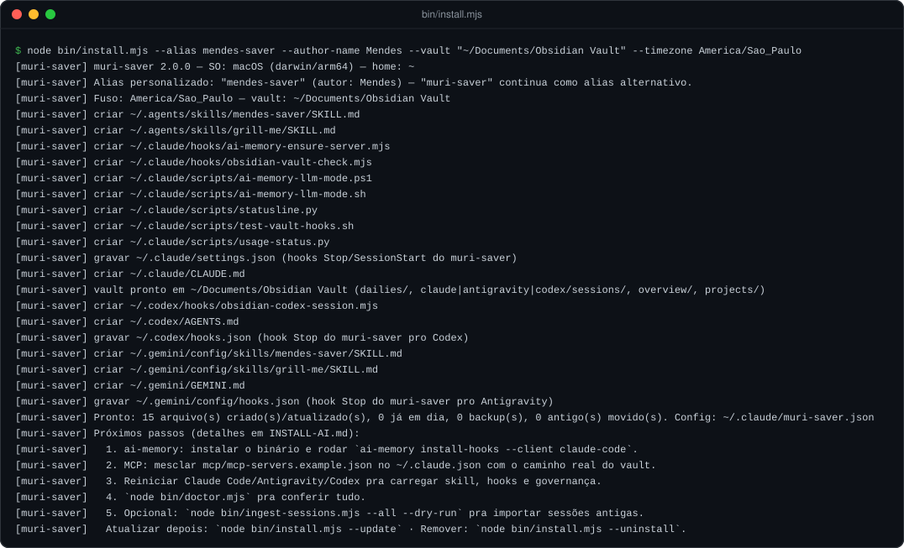
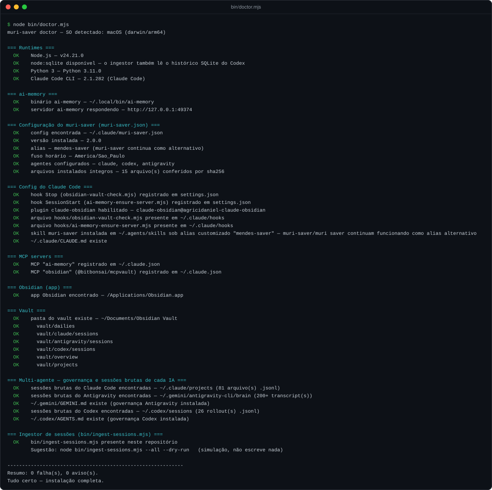

<h1 align="center">muri-saver</h1>

<p align="center"><em>Governança de tokens, memória persistente e registro humano-legível para agentes de IA — Claude Code, Codex e Antigravity. O setup que eu uso todo dia, documentado pra qualquer um instalar.</em></p>

<p align="center">
  <a href="./README.en.md">English</a> · <strong>Português</strong>
</p>

<p align="center">
  
  
  
  
  
  
  
  
</p>

<p align="center">
  <a href="https://github.com/murilolol/muri-saver/actions/workflows/ci.yml"></a>
  <a href="./CHANGELOG.md"></a>
  <a href="https://github.com/murilolol/muri-saver/stargazers"></a>
  <a href="https://github.com/murilolol/muri-saver/commits/main"></a>
  
</p>

<br>

<p align="center">
  
</p>

> [!NOTE]
> **TL;DR** — `CLAUDE.md`/`GEMINI.md`/`AGENTS.md` (governança sempre
> carregada, um arquivo por agente) + skill `muri-saver` (modo de economia
> agressiva sob demanda, renomeável com `--alias`) + hooks de ciclo de vida
> que gravam sozinhos em [`ai-memory`](https://github.com/akitaonrails/ai-memory)
> (memória durável cross-sessão) e num vault do Obsidian (registro
> humano-legível, com segredos mascarados) + um ingestor que importa o
> histórico antigo de cada agente. Instalação em 3 comandos, detecta o SO
> sozinho, testado em macOS, Linux e Windows.

> [!TIP]
> **Vai instalar com ajuda de uma IA?** Mande o link deste repositório pro
> seu agente e peça pra ele seguir **[`INSTALL-AI.md`](./INSTALL-AI.md)** —
> um runbook escrito pra uma IA executar sozinha, que abre com uma
> entrevista `/grill-me` (nome/alias, quais agentes, vault, fuso, importar
> histórico?) antes de tocar em qualquer arquivo, e termina com verificação
> automática de cada peça.

<details>
<summary><strong>⚡ Instalação em 30 segundos</strong> (clique pra expandir)</summary>

```bash
git clone https://github.com/murilolol/muri-saver.git
cd muri-saver
node bin/install.mjs --dry-run   # revise o que seria feito, nada é escrito ainda
node bin/install.mjs --with-all  # Claude Code + Antigravity + Codex de uma vez
node bin/doctor.mjs              # verifica tudo automaticamente
```

Sem clonar: `npx github:murilolol/muri-saver install --with-all`.
Seu próprio nome em vez de `muri-saver`? `--alias mendes-saver`.
Sessões antigas de algum desses agentes? `node bin/ingest-sessions.mjs --all --dry-run`.
Atualizar depois: `node bin/install.mjs --update`. Remover: `--uninstall`.
</details>

<br>

## Índice

- [Novidades da v2](#novidades-da-v2)
- [Sobre](#sobre)
- [Como funciona](#como-funciona)
- [Status line](#status-line)
- [O que vai parar no seu vault](#o-que-vai-parar-no-seu-vault)
- [`ai-memory`](#ai-memory)
- [Antes / depois](#antes--depois)
- [Achados reais que justificam cada regra](#achados-reais-que-justificam-cada-regra)
- [Instalação](#instalação)
- [Personalize com o seu nome (`--alias`)](#personalize-com-o-seu-nome---alias)
- [Configuração, atualização e desinstalação](#configuração-atualização-e-desinstalação)
- [Importando sessões antigas (session ingestor)](#importando-sessões-antigas-session-ingestor)
- [Skills incluídas](#skills-incluídas)
- [O que tem aqui](#o-que-tem-aqui)
- [Multiplataforma e testes](#multiplataforma-e-testes)
- [Perguntas rápidas](#perguntas-rápidas)
- [Documentação complementar](#documentação-complementar)
- [Autoria, créditos e licença](#autoria-créditos-e-licença)

<br>

## Novidades da v2

| | Antes (v1.x) | Agora (v2.0) |
|---|---|---|
| 🗂️ **Vault configurável** | `--vault` só criava pastas; o hook gravava sempre em `~/Documents/Obsidian Vault` | Vault, fuso e alias ficam em `~/.claude/muri-saver.json` e **hooks + ingestor respeitam** |
| 🔐 **Segredos no vault** | Chave/token colado num prompt ia sem máscara pro dump | Hook e ingestor mascaram chaves Anthropic/OpenAI/GitHub/AWS/Slack/Google, JWT, Bearer, senhas e chaves privadas (`[REDACTED:TIPO]`) |
| ♻️ **Atualizar / remover** | Reinstalar empilhava backups; sem desinstalação | `--update` reaproveita a config; `--uninstall` remove só o que não foi editado, com backup |
| 🧾 **Manifesto** | Nenhum registro do que foi instalado | sha256 de cada arquivo instalado; `doctor` confere integridade |
| 🕐 **Fuso horário** | `America/Sao_Paulo` fixo no código | `--timezone`, padrão = fuso do sistema |
| 🧩 **Codex SQLite** | Detectado, ignorado | Lido via `node:sqlite` (Node ≥ 22.5): título, `cwd` e threads sem rollout |
| 🧹 **Subagentes** | Transcrições de subagentes viravam sessões avulsas | Puladas por padrão (`--include-subagents` inclui) |
| ✨ **Enriquecimento opt-in** | Ingestor só fazia dump local | `--enrich` gera narrativa + taxonomia via Haiku, com teto por rodada e por chamada |
| 🪟 **Windows** | Caminho `C:\...` do Codex virava projeto errado; `<HOME>` quebrava o JSON | Os dois corrigidos e cobertos por teste |
| ✅ **Testes / CI** | Nenhum | 42 testes (`node --test`) + CI em macOS, Linux e Windows × Node 18/22/24 |
| 📦 **Distribuição** | Só `git clone` | Comando único `muri-saver <install\|update\|uninstall\|doctor\|ingest>`, pronto pro npm |
| 📸 **Documentação** | Só texto | Screenshots reais, [`examples/vault/`](./examples/vault/), troubleshooting, CHANGELOG, README em inglês |

Detalhes em [`CHANGELOG.md`](./CHANGELOG.md) e o plano completo (feito + próximos passos) em [`ROADMAP.md`](./ROADMAP.md).

<br>

## Sobre

Uso Claude Code (e Codex/Antigravity em paralelo) todo dia pra vários
projetos ao mesmo tempo, e três problemas apareciam sempre:

1. **Custo e limite de uso descontrolados** — sessão maratona, releitura
   repetida do mesmo arquivo, screenshot de browser em vez de texto,
   subagente caro pra tarefa mecânica, effort alto aplicado por padrão a
   tudo.
2. **Memória que evapora entre sessões** — toda decisão, convenção e
   contexto de projeto tinha que ser reexplicado do zero, sessão após
   sessão, mesmo quando o projeto era o mesmo de ontem.
3. **Nenhum registro legível por humano** do que a IA fez — só transcript
   bruto, impossível de navegar depois de algumas semanas, e impossível de
   mostrar pra outra pessoa sem rolar milhares de linhas de JSON.

Isso aqui nasceu de **auditar meu próprio histórico de uso** (transcripts
reais, não teoria de blog) pra achar os padrões que mais custavam caro, e
resolver os três problemas com um sistema, não uma lista solta de dicas.
Amigos meus pediram pra usar a mesma coisa depois de ver funcionando — este
repositório é esse setup, documentado e pronto pra instalar em outra
máquina, com o nome que você quiser.

Não é dogma nem "melhores práticas" genéricas. É o que funcionou pra mim,
com os números que provam por quê (seção
[Achados reais](#achados-reais-que-justificam-cada-regra)). Adapte pra sua
realidade — o `bin/doctor.mjs` existe pra você auditar a sua, não só confiar
na minha.

> [!TIP]
> **Isso é pra você se:** você já bateu teto de uso sem entender por quê;
> reexplica o mesmo contexto de projeto toda sessão nova; troca entre Claude
> Code/Codex/Antigravity e perde continuidade a cada troca; ou só quer um
> jeito de olhar pra trás e ver o que a IA fez num projeto sem abrir um
> transcript JSON de 40 mil linhas.

<br>

## Como funciona

Cinco peças, cada uma resolvendo uma parte diferente do problema — a
governança roda sempre e é barata, o resto liga sob demanda ou em segundo
plano:

| Peça | Arquivo(s) | Quando roda | Resolve |
|---|---|---|---|
| **Governança global** | `CLAUDE.md` / `GEMINI.md` / `AGENTS.md` (um por agente) | Toda sessão, todo projeto | Regras curtas e universais: consultar memória antes de reler arquivo, alocação de modelo por subagente, proteções de git, mapa de palavras-chave pra não varrer diretório às cegas |
| **Skill `muri-saver`** | `skills/muri-saver/SKILL.md` | Sob demanda ("muri saver" ou pedido explícito de economia) | Lista longa e agressiva de regras por tipo de tarefa (backend, frontend, browser automation, git, debug...) — cara demais pra deixar sempre carregada |
| **Hooks de ciclo de vida** | `hooks/*.mjs` | `SessionStart` / `Stop`, automático | Memória e registro acontecem **sempre**, sem depender do agente lembrar — a versão anterior dependia de uma regra escrita e parava de ser seguida depois de alguns dias |
| **Ingestor de sessões** | `bin/ingest-sessions.mjs` | Sob demanda | Importa o histórico que cada agente já tinha antes da instalação — sem LLM por padrão |
| **`ai-memory` + Obsidian Vault** | daemon externo + `<vault>/` | Gravados pelos hooks e pelo ingestor | Banco SQLite/FTS5 via MCP como fonte de verdade durável, e vault Markdown como vitrine legível por humano — gerado, nunca escrito à mão |

<p align="center">
  
</p>

Ciclo de vida de uma sessão, na prática:



Isso roda em **toda** sessão, mesmo as curtas — sessões triviais recebem só
um registro barato (sem custo de LLM), nunca são silenciosamente ignoradas.
Decisões de design completas em [`docs/architecture.md`](./docs/architecture.md).

<br>

## Status line

`scripts/statusline.py` é a status line que uso todo dia no Claude Code —
mesmo motor visual (barras, cor por limiar, dicas proativas) do renderizador
que uso no Antigravity (`~/.gemini/scripts/usage-status.py`). A imagem no
topo deste README é a saída real dela em três situações. Exemplo exatamente
como aparece no meu terminal:

```
📁 muri-saver │ 🌿 main* │ 🧠 on │ ⏱ 1m 46s │ ◔ 170k/1m ▓░░░░░░░ 17% → considere /compact │ 5h ▓░░░░░░░ 9% → 3h 41m │ 7d ░░░░░░░░ 0% → 167h 01m │ ◆ Sonnet 5
```

| Segmento | Significado |
|---|---|
| `📁 muri-saver` | Diretório do projeto atual |
| `🌿 main*` | Branch git (`*` = mudanças não commitadas) |
| `🧠 on` | Servidor local do `ai-memory` respondendo (`off` em cinza se não estiver) |
| `⏱ 1m 46s` | Duração da sessão atual |
| `▲ +412 -97` | Linhas adicionadas/removidas na sessão (aparece quando houver) |
| `◔ 170k/1m ▓░░░░░░░ 17% → considere /compact` | Tokens de contexto usados / janela total, barra proporcional, e dica que escala em 4 níveis (`tranquilo` → `acompanhe o contexto` → `considere /compact` → `/compact ou /clear agora`) |
| `5h ▓░░░░░░░ 9% → 3h 41m` | % da janela de uso de 5h e contagem regressiva até o reset |
| `7d ░░░░░░░░ 0% → 167h 01m` | % da janela semanal e contagem regressiva |
| `◆ Sonnet 5` | Modelo ativo na sessão |

Cor muda por limiar (branco → amarelo em 70% → vermelho em 90%) e o layout
se adapta sozinho pra terminal estreito (<120 colunas), caindo pra só
números. Instalado pelo `bin/install.mjs` via `claude-config/settings.snippet.json`
— só não mexe se você já tiver um `statusLine` seu. O Codex CLI tem status
line própria embutida no TUI (não scriptável do mesmo jeito), por isso não
há versão dele aqui.

<br>

## O que vai parar no seu vault

Notas geradas de verdade pelo hook e pelo ingestor a partir de sessões de
exemplo (fictícias, com uma chave falsa de propósito) — todas estão em
[`examples/vault/`](./examples/vault/) pra você navegar no GitHub:

<table>
<tr>
<td width="50%" valign="top">
<p align="center"><strong>Nota de sessão enriquecida</strong><br><sub><code>claude/sessions/Session-…-Claude-0f1e2d3c.md</code></sub></p>

</td>
<td width="50%" valign="top">
<p align="center"><strong>Diário de bordo cross-agente</strong><br><sub><code>dailies/Daily-2026-09-20.md</code></sub></p>

</td>
</tr>
</table>

<sub>Renderização das notas de `examples/vault/` num HTML com o tema escuro padrão do Obsidian (gerado por `tools/build-assets.mjs`) — não é uma captura do app.</sub>

| Pasta | O que tem | Quem escreve |
|---|---|---|
| `dailies/Daily-AAAA-MM-DD.md` | Uma linha por sessão do dia (Claude Code, Antigravity, Desktop) | Hook `Stop` + ingestor |
| `<agente>/sessions/Session-…md` | Nota completa da sessão: resumo ou narrativa, transcrição sanitizada | Hook `Stop` + ingestor |
| `codex/dailies/` | Diário próprio do Codex (não compete com o `dailies/` raiz) | Hook do Codex + ingestor |
| `projects/<projeto>/<categoria>/` | Notas atômicas em 12 categorias (bug, decisão, melhoria, risco…) | Hook (sessões substanciais) + `ingest --enrich` |

<br>

## `ai-memory`

Quem resolve o problema #2 da seção [Sobre](#sobre) (memória que evapora
entre sessões) é o **[ai-memory](https://github.com/akitaonrails/ai-memory)**
— um projeto externo, não é meu, mas é a peça central deste setup.

**O que é:** um servidor de memória de longo prazo pra agentes de IA
coding, criado por [Fabio Akita](https://github.com/akitaonrails) (mais de
8 mil estrelas no GitHub, licença MIT, escrito em Rust). Seu agente já tem
alguma memória hoje, mas ela fica presa numa máquina, num agente só, e some
quando você troca de ferramenta. O ai-memory fica do outro lado dessas
paredes:

- **Atravessa agentes** — mais de 20 harnesses (Claude Code, Codex, Cursor,
  Gemini CLI, OpenCode, Grok, Devin...) alimentam a mesma memória
  compartilhada. Sai do Claude Code no meio de uma tarefa, abre o Codex no
  mesmo diretório, e o próximo agente recebe um handoff de verdade.
- **Atravessa máquinas** — a memória vive num servidor local (notebook,
  homelab, o que for); o projeto que você deixou no desktop é o mesmo que
  retoma no notebook.
- **É markdown puro** — a fonte de verdade é uma wiki versionada de
  arquivos `.md`; o banco (SQLite + FTS5) é um índice derivado que sempre
  pode ser reconstruído. `grep`, abra no Obsidian, edite à mão.
- **Captura o trabalho sozinho** — hooks de ciclo de vida gravam prompts,
  tool calls e limites de sessão, sanitizados, sem cerimônia de "lembra
  disso". O caminho padrão usa **zero chamadas de LLM**.

Instalação completa (binário, MCP session-aware, marker file por projeto,
provedor de LLM opcional) em
[`docs/ai-memory-obsidian-setup.md`](./docs/ai-memory-obsidian-setup.md).

<br>

## Antes / depois

| | Sem muri-saver | Com muri-saver |
|---|---|---|
| **Início de sessão** | Reexplicar contexto do projeto do zero | Hook `SessionStart` injeta handoff da sessão anterior via `ai-memory` |
| **Fim de sessão** | Nada registrado, ou registro manual esquecido | Hook `Stop` grava sozinho em `ai-memory` + Obsidian Vault |
| **Histórico de antes da instalação** | Perdido em transcripts JSON | `ingest-sessions.mjs` importa tudo, com segredos mascarados |
| **Reler arquivo grande** | Toda vez que a dúvida aparece de novo | `memory_query` primeiro — arquivo lido 30-54x vira 1x |
| **Automação de browser** | Screenshot pra tudo, mesmo pra "cliquei certo?" | Texto (`get_page_text`) por padrão; screenshot só quando é visual de verdade |
| **Effort do modelo** | `xhigh` fixo pra tudo, inclusive tarefa mecânica | Escalonado por tipo de tarefa/subagente |
| **`/loop` dinâmico** | Roda sozinho indefinidamente | Confirmação explícita antes de deixar reagendar sozinho |
| **Histórico do projeto** | Preso em transcripts JSON ilegíveis | Vault Obsidian navegável, taxonomia por categoria |
| **Sessão longa demais** | Vira maratona de horas/dias sem perceber | Status line avisa + sugestão ativa de `/compact`/`/clear` + handoff automático |

<br>

## Achados reais que justificam cada regra

Duas auditorias completas do meu próprio histórico (transcripts reais, não
suposição) alimentam a skill `muri-saver` e a governança global:

| Achado | Números reais |
|---|---|
| Sessão maratona é o maior vilão de custo — não escolha de modelo | Uma sessão sozinha consumiu **2,1 bilhões de tokens de cache** em 42h / 7.059 mensagens |
| Releitura repetida do mesmo arquivo | Um arquivo lido **30 a 54 vezes** na mesma sessão |
| Screenshot em vez de texto em automação de browser | **501 chamadas de `computer` (screenshot)** contra **3 de `get_page_text`/`read_page`** no mesmo intervalo |
| Effort alto (`xhigh`) aplicado por padrão a tudo | Inclusive tarefas mecânicas/triviais que não precisavam |
| Loop dinâmico sem confirmação | 4 loops dinâmicos consumiram **~28,2 milhões de tokens** juntos num único `/usage` |
| Ferramentas de browser recarregadas à toa | Até 8-9 recargas do mesmo conjunto de tool schemas numa única sessão longa |

Cada linha virou uma regra específica e testável na skill
(`skills/muri-saver/SKILL.md`) ou na governança global. Se **sua** rotina
for diferente, algumas regras podem não fazer sentido — audite a sua e
ajuste (é pra isso que a skill recomenda rodar `/doctor` periodicamente).

<br>

## Instalação

```bash
git clone https://github.com/murilolol/muri-saver.git
cd muri-saver
node bin/install.mjs --dry-run   # revise o que seria feito
node bin/install.mjs             # instala (Claude Code + o que mais for detectado)
node bin/install.mjs --with-all  # ou: força Claude Code + Antigravity + Codex
node bin/doctor.mjs              # verifica tudo automaticamente
```

Sem clonar, direto do GitHub: `npx github:murilolol/muri-saver install --with-all`
(e `... doctor`, `... ingest --all --dry-run`, etc.).

<p align="center">
  
</p>

Guia completo — pré-requisitos, `ai-memory`, MCP, plugin `claude-obsidian`,
verificação — em [`INSTALL.md`](./INSTALL.md) (humano) ou
[`INSTALL-AI.md`](./INSTALL-AI.md) (pra uma IA seguir sozinha, com
onboarding interativo via `/grill-me`).

<details>
<summary><strong>🩺 Saída do <code>doctor</code> depois de instalar</strong></summary>


</details>

<br>

## Personalize com o seu nome (`--alias`)

`muri-saver` é o nome padrão, mas não é obrigatório. Qualquer dev que clone
este repositório pode instalar sob o próprio nome ou apelido — útil se você
(ou um colega, tipo Mendes ou Lucas) quer adotar o mesmo sistema sem ficar
digitando "muri saver" pra ativar algo que não é seu:

```bash
node bin/install.mjs --alias mendes-saver --author-name Mendes
# ou, sem sufixo -saver:
node bin/install.mjs --alias lucas
```

Isso renomeia a skill (`~/.agents/skills/<alias>/SKILL.md`) e reescreve todos
os gatilhos nos templates de governança (`CLAUDE.md`/`GEMINI.md`/`AGENTS.md`)
— `"mendes saver"`, `"mendes-saver"`, `"/mendes-saver"` — mantendo
`"muri-saver"`/`"muri saver"` como alias alternativo, então nada quebra se
você misturar os dois nomes por hábito. Trocar de alias depois é só rodar de
novo com o nome novo: a pasta antiga da skill vai pro backup sozinha.

<br>

## Configuração, atualização e desinstalação

Toda instalação grava `~/.claude/muri-saver.json`:

```json
{
  "version": "2.0.0",
  "alias": "mendes-saver",
  "vault": "/Users/voce/Documents/Obsidian Vault",
  "timezone": "America/Sao_Paulo",
  "agents": ["claude", "codex", "antigravity"],
  "manifest": [{ "path": "…/SKILL.md", "sha256": "…", "kind": "skill" }]
}
```

- **Hooks e ingestor leem vault e fuso daqui.** Precedência do vault:
  flag `--vault` > variável `OBSIDIAN_VAULT` > `muri-saver.json` >
  `~/Documents/Obsidian Vault`. Fuso: `--timezone` > `MURI_SAVER_TZ` >
  `muri-saver.json` > fuso do sistema.
- **`node bin/install.mjs --update`** reinstala usando a config salva (sem
  repetir flags). Arquivos de governança que o instalador criou e você não
  editou são atualizados; os que você editou ficam como estão.
- **`node bin/install.mjs --uninstall`** remove skill, hooks, scripts, as
  entradas de hook nos `settings.json`/`hooks.json` e o próprio
  `muri-saver.json` — **só o que não foi editado por você**, e movendo pra
  `~/.claude/muri-saver-backups/<data>/` em vez de apagar. Vault, dados do
  `ai-memory` e skills de terceiros nunca são tocados.
- Reinstalar sem mudança nenhuma não escreve nada nem cria backup.

<br>

## Importando sessões antigas (session ingestor)

Já usava Claude Code, Antigravity ou Codex antes de instalar isto? O
`bin/ingest-sessions.mjs` varre o histórico local de cada agente e registra
retroativamente no Obsidian Vault e/ou no `ai-memory` — **sem chamar
nenhuma LLM por padrão** (extração 100% local; ver
[`docs/session-ingestor.md`](./docs/session-ingestor.md) pro porquê):

```bash
# Simulação — lista o que seria importado, não escreve nada
node bin/ingest-sessions.mjs --all --dry-run

# Ingestão real, com limite (bom pra primeira vez)
node bin/ingest-sessions.mjs --all --limit 20

# Com narrativa + taxonomia via Haiku em até 5 sessões (opt-in, custa centavos)
node bin/ingest-sessions.mjs --all --since 2026-09-01 --enrich --enrich-limit 5

# Backup de outra máquina (ex: a home antiga copiada pra um HD)
node bin/ingest-sessions.mjs --all --source-home /Volumes/Backup/Users/voce
```

<p align="center">
  
</p>

Idempotente (não duplica o que já foi importado nem o que o hook já
registrou), pula transcrições de subagentes (ruído), lê o SQLite do Codex
quando o Node tem `node:sqlite`, sanitiza segredos e tags de sistema, e
suporta `--file <conversations.json>` pra exports do Claude Desktop/Web.

<br>

## Skills incluídas

### As minhas

Código-fonte completo vendorizado aqui, sob a mesma licença MIT deste
repositório:

| Skill | Descrição |
|---|---|
| [`muri-saver`](./skills/muri-saver/SKILL.md) | Modo de economia agressiva de tokens/custo/limites — a skill central deste repositório, nascida de auditoria real de uso |
| [`grill-me`](./skills/grill-me/SKILL.md) | Minha reescrita completa do protocolo de entrevista de requisitos, forçando o modal nativo `AskUserQuestion`/`ask_question` em vez de texto cru no chat |

### Skills companheiras (de terceiros)

Uso todo dia, mas **não são copiadas aqui de propósito** — são projetos de
terceiros, com seus próprios autores e licenças, e uma cópia local só ficaria
desatualizada. Cada uma tem uma página em [`skills/companion/`](./skills/companion/)
com o que é, quando eu uso e o comando de instalação:

| Skill | O que faz | Autor | Licença |
|---|---|---|---|
| [`find-skills`](./skills/companion/find-skills/README.md) | Descobre e instala outras skills do ecossistema aberto (`skills.sh`) | [Vercel Labs](https://github.com/vercel-labs/skills) | MIT |
| [`tdd`](./skills/companion/tdd/README.md) | Referência de test-driven development — loop red→green, o que é um bom teste, anti-padrões | [Matt Pocock](https://github.com/mattpocock/skills) | MIT |
| [`prototype`](./skills/companion/prototype/README.md) | Protótipo descartável pra validar modelo de estado/lógica ou layout antes de construir de vez | [Matt Pocock](https://github.com/mattpocock/skills) | MIT |
| [`grill-with-docs`](./skills/companion/grill-with-docs/README.md) | Entrevista tipo `grill-me` que também gera ADR/glossário como efeito colateral | [Matt Pocock](https://github.com/mattpocock/skills) | MIT |
| [`openspec`](./skills/companion/openspec/README.md) | Especificação estruturada (requisitos, arquitetura, plano de execução) antes de implementar | [openspecio](https://github.com/openspecio/openspec) | MIT |
| [`graphify`](./skills/companion/graphify/README.md) | Transforma qualquer pasta num grafo de conhecimento navegável (`graphify query/path/explain`) | [safishamsi](https://github.com/Graphify-Labs/graphify) | Apache-2.0 |
| [`impeccable`](./skills/companion/impeccable/README.md) | Revisão/crítica/polish de UI com padrão de design director sênior | [Paul Bakaus](https://github.com/pbakaus/impeccable) | Apache-2.0 |
| [`emil-design-eng`](./skills/companion/emil-design-eng/README.md) (pack) — *quero usar* | Revisão de animação e UI polish com o critério de quem construiu Vaul e Sonner | [Emil Kowalski](https://github.com/emilkowalski/skills) | MIT |
| [`taste-skill`](./skills/companion/taste-skill/README.md) — *quero usar* | Dá "bom gosto" visual à IA a partir de referências reais | [Leonxlnx](https://github.com/Leonxlnx/taste-skill) | MIT |

Índice completo em [`docs/skills-companion.md`](./docs/skills-companion.md).
Avaliei o pacote `obra/superpowers` e decidi não usar — é ótimo, mas pesado
demais em tokens/contexto pro meu fluxo.

> [!TIP]
> **`grill-me` e `grill-with-docs` são usadas juntas, não uma no lugar da
> outra**: `grill-me` (minha, sempre instalada) é o padrão do dia a dia;
> `grill-with-docs` (de terceiros, opcional) é o upgrade pra quando a
> decisão é grande o bastante pra virar ADR permanente. Comparação completa
> em [`docs/skills-companion.md`](./docs/skills-companion.md#grill-me-vs-grill-with-docs--uso-as-duas-pra-situações-diferentes).

<br>

## O que tem aqui

<details>
<summary><strong>📂 Estrutura completa do repositório</strong> (clique pra expandir)</summary>

```
muri-saver/
├── bin/
│   ├── cli.mjs                        # comando único: muri-saver install|update|uninstall|doctor|ingest
│   ├── install.mjs                    # instalador (alias, multi-agente, manifesto, --update/--uninstall)
│   ├── doctor.mjs                     # verificação de ambiente, 100% leitura
│   └── ingest-sessions.mjs            # importa sessões antigas de cada agente pro vault/ai-memory
├── lib/                               # lógica compartilhada pelos bin/ (e pelos testes)
│   ├── config.mjs  alias.mjs  sanitize.mjs  parsers.mjs  vault.mjs
│   └── enrich.mjs  hooks-merge.mjs  taxonomy.mjs  time.mjs  exec.mjs
├── hooks/
│   ├── obsidian-vault-check.mjs       # Stop: grava a sessão no vault (Claude Code/Antigravity)
│   ├── ai-memory-ensure-server.mjs    # SessionStart: garante o daemon do ai-memory de pé
│   └── codex/obsidian-codex-session.mjs  # Stop do Codex CLI
├── skills/
│   ├── muri-saver/SKILL.md            # minha skill original — modo de economia agressiva
│   ├── grill-me/SKILL.md              # minha reescrita do protocolo de entrevista via modal nativo
│   └── companion/                     # só READMEs das skills de terceiros (não vendorizadas)
├── claude-config/                     # CLAUDE.md.template + settings.snippet.json
├── antigravity-config/                # GEMINI.md.template + hooks.snippet.json
├── codex-config/                      # AGENTS.md.template + hooks.snippet.json
├── scripts/                           # statusline.py, usage-status.py, ai-memory-llm-mode.*, smoke test
├── mcp/mcp-servers.example.json       # entradas MCP (ai-memory + Obsidian)
├── examples/vault/                    # saída real do hook e do ingestor sobre sessões fictícias
├── assets/                            # diagrama e screenshots do README (gerados por tools/)
├── docs/                              # arquitetura, setup, ingestor, skills, troubleshooting
├── test/                              # 42 testes node:test + fixtures de cada agente
├── tools/                             # build-assets.mjs, ansi-to-svg.mjs, render-note.mjs
├── .github/                           # CI (macOS/Linux/Windows) + template de issue
├── README.md · README.en.md · INSTALL.md · INSTALL-AI.md
├── CHANGELOG.md · ROADMAP.md · CONTRIBUTING.md · LICENSE
└── package.json
```

</details>

<br>

## Multiplataforma e testes

`bin/install.mjs`, `bin/doctor.mjs`, `bin/ingest-sessions.mjs` e os hooks
detectam o sistema operacional sozinhos e resolvem todo caminho relativo à
home (`os.homedir()`) — nada de `/Users/...` ou `C:\Users\...` fixo no
código. `bin/doctor.mjs` adapta onde procura o binário do `ai-memory` e o
app Obsidian por SO.

A suíte de testes (`npm test`, só `node:test`, zero dependências) cobre
sanitização, alias, os parsers de cada agente (inclusive caminho Windows e o
SQLite do Codex), o ciclo install → update → uninstall, o ingestor (dry-run,
export, vault, idempotência, `--enrich` com um `claude` falso) e os hooks. O
[CI](./.github/workflows/ci.yml) roda tudo em **macOS, Linux e Windows ×
Node 18, 22 e 24** a cada push.

<br>

## Perguntas rápidas

<details>
<summary><strong>Preciso usar Claude Code, ou funciona com outra coisa?</strong></summary>

Não precisa — `bin/install.mjs --with-all` configura Claude Code,
Antigravity/Gemini CLI e Codex CLI de uma vez, cada um com seu arquivo de
governança (`CLAUDE.md`/`GEMINI.md`/`AGENTS.md`) e hook de gravação de
sessão. Se seu agente não é nenhum desses três, adapte os hooks — são
scripts Node comuns, e os templates de governança são texto puro.
</details>

<details>
<summary><strong>Isso vai deixar minhas sessões mais lentas?</strong></summary>

Não deveria — a skill existe justamente pra ficar *mais* rápido e barato.
Os hooks rodam em `SessionStart`/`Stop`, fora do caminho crítico de cada
resposta, e o hook de gravação tem teto rígido de ~8s antes de cair no
fallback 100% local — nunca trava o `/exit` esperando uma API externa.
</details>

<details>
<summary><strong>Meu vault não fica em <code>~/Documents/Obsidian Vault</code>. Funciona?</strong></summary>

Sim, desde a v2: `node bin/install.mjs --vault "/caminho/do/seu/vault"`
grava o caminho no `muri-saver.json`, e hooks e ingestor passam a usar ele.
Na v1 o hook ignorava esse caminho — se você instalou antes, rode
`node bin/install.mjs --vault "..."` de novo.
</details>

<details>
<summary><strong>E se eu colar uma API key num prompt sem querer?</strong></summary>

Ela não vai crua pro vault: hook e ingestor mascaram chaves
Anthropic/OpenAI/GitHub/AWS/Slack/Google, JWT, `Bearer`, senhas e chaves
privadas como `[REDACTED:TIPO]` antes de gravar. Ainda assim, trate a chave
como vazada e gere outra — ela passou pelo agente.
</details>

<details>
<summary><strong>Como atualizo ou removo?</strong></summary>

`node bin/install.mjs --update` pra atualizar (reaproveita a config salva) e
`node bin/install.mjs --uninstall` pra remover — ver
[Configuração, atualização e desinstalação](#configuração-atualização-e-desinstalação).
</details>

<details>
<summary><strong>O que acontece se eu não tiver Obsidian instalado?</strong></summary>

Os hooks gravam mesmo assim (criam as pastas); só a *leitura* confortável
depende do app. O ingestor também tem `--export-dir` pra gerar Markdown
avulso sem vault nenhum.
</details>

<details>
<summary><strong>Preciso pagar por alguma coisa?</strong></summary>

Não — `ai-memory` é open-source e roda localmente, Obsidian é gratuito pra
uso pessoal, e as skills companheiras são todas gratuitas/open-source. O
único custo opcional é o `--enrich` do ingestor (Haiku, centavos por
sessão, com teto) — e sai da sua própria assinatura.
</details>

<details>
<summary><strong>Algo deu errado. Por onde começo?</strong></summary>

`node bin/doctor.mjs` primeiro, depois
[`docs/troubleshooting.md`](./docs/troubleshooting.md) — tem os problemas
reais que já apareceram e como resolver cada um.
</details>

<br>

## Documentação complementar

| | Documento | Conteúdo |
|---|---|---|
| 🧭 | [`docs/architecture.md`](./docs/architecture.md) | Por que cada peça existe, como se encaixam |
| 🧠 | [`docs/ai-memory-obsidian-setup.md`](./docs/ai-memory-obsidian-setup.md) | Instalação detalhada do `ai-memory` + Obsidian + MCP session-aware |
| 📥 | [`docs/session-ingestor.md`](./docs/session-ingestor.md) | Como o ingestor lê cada agente, sanitiza e evita duplicar |
| 🧩 | [`docs/skills-companion.md`](./docs/skills-companion.md) | Skills de terceiros que uso, com créditos e comando de instalação |
| 🩹 | [`docs/troubleshooting.md`](./docs/troubleshooting.md) | Problemas conhecidos e como resolver |
| 👤 | [`INSTALL.md`](./INSTALL.md) | Guia de instalação passo a passo pra humano |
| 🤖 | [`INSTALL-AI.md`](./INSTALL-AI.md) | Runbook pra uma IA instalar sozinha, com onboarding `/grill-me` |
| 📜 | [`CHANGELOG.md`](./CHANGELOG.md) | O que mudou em cada versão |
| 🗺️ | [`ROADMAP.md`](./ROADMAP.md) | Melhorias feitas e próximas |
| 🤝 | [`CONTRIBUTING.md`](./CONTRIBUTING.md) | Como rodar os testes, regenerar as imagens e mandar PR |

<br>

## Autoria, créditos e licença

Feito e mantido por mim, [@murilolol](https://github.com/murilolol), a partir
do meu uso diário real de Claude Code. `muri-saver` e `grill-me` (a versão
vendorizada aqui) são conteúdo original. As demais skills citadas pertencem
aos seus respectivos autores — ver
[`docs/skills-companion.md`](./docs/skills-companion.md) pra crédito
individual. [`ai-memory`](https://github.com/akitaonrails/ai-memory) é de
[Fabio Akita](https://github.com/akitaonrails).

MIT — ver [`LICENSE`](./LICENSE) pro conteúdo original deste repositório.
Use, adapte, quebre, mande PR se achar bug ou tiver uma regra melhor pra
propor.

<br>

<p align="center">
  <sub>Se isso te economizou tokens ou uma tarde de sessão perdida, uma ⭐ no repositório ajuda outra pessoa a achar.</sub>
  <br />
  <a href="#muri-saver">⬆ Voltar ao topo</a>
</p>
