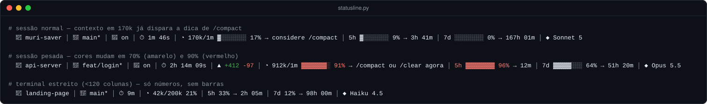
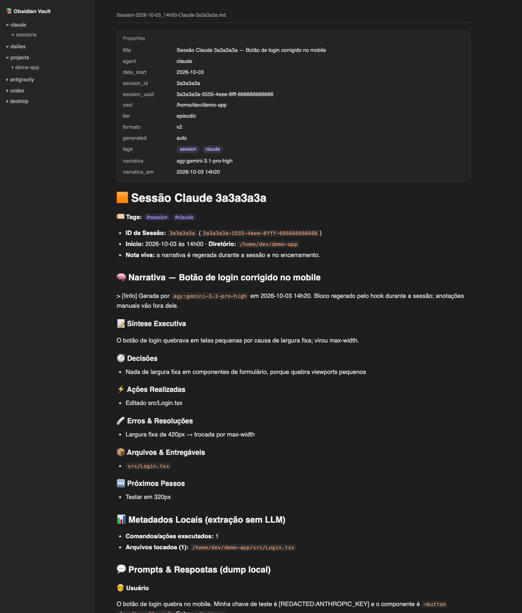
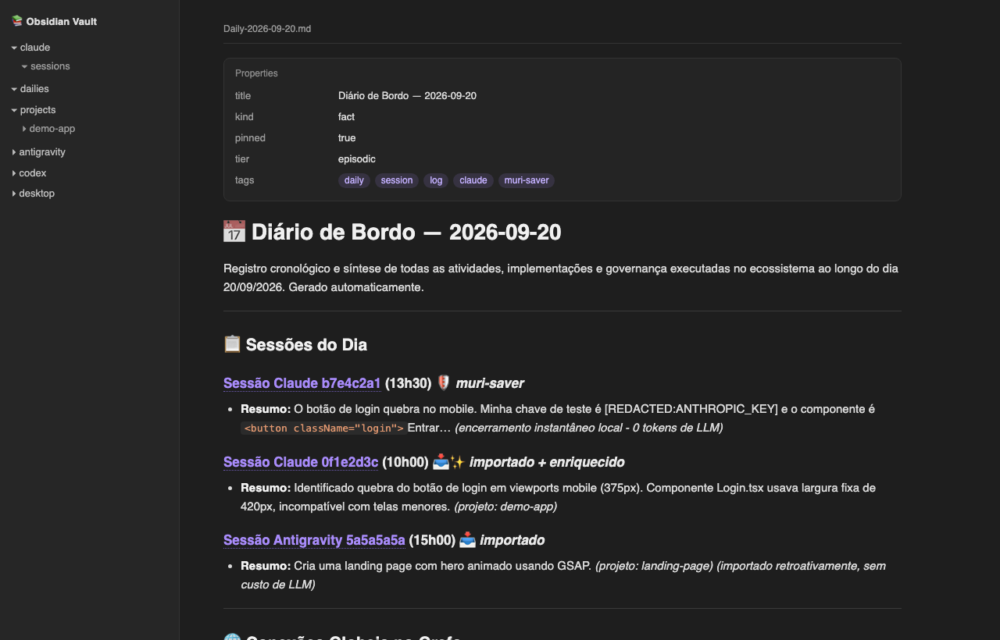
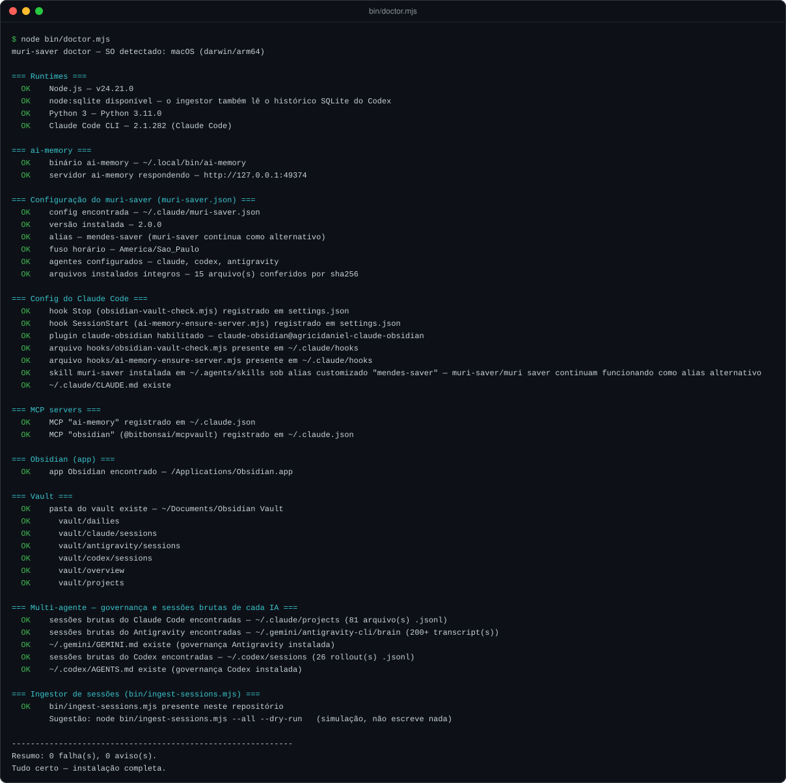
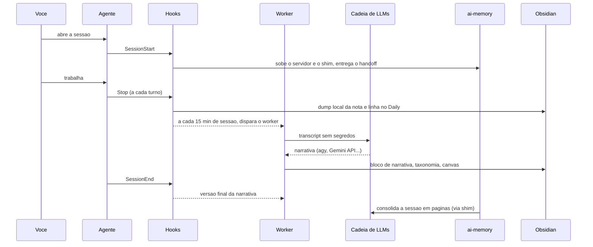

<h1 align="center">muri-saver</h1>

<p align="center"><em>Gaste menos cota, nunca perca contexto e tenha um diário legível de tudo que a IA fez. Para Claude Code, Codex e Antigravity, em macOS, Linux e Windows.</em></p>

<p align="center">
  <a href="./README.en.md">English</a> · <strong>Português</strong>
</p>

<p align="center">
  <a href="https://github.com/murilolol/muri-saver/actions/workflows/ci.yml"></a>
  <a href="https://github.com/murilolol/muri-saver/releases"></a>
  
  
  
  
</p>

<p align="center">
  
</p>

Quem usa agente de código todo dia esbarra em três problemas: a **cota acaba**
sem você entender por quê, o **contexto evapora** entre sessões e não sobra
**nenhum registro legível** do que foi feito. O muri-saver nasceu de auditar
transcripts reais (uma sessão de 42h, um arquivo relido 54 vezes, 501
screenshots contra 3 leituras de texto) e resolve os três com um sistema só:

- **Governança curta** carregada em toda sessão, mais a skill `muri-saver`
  (modo de economia agressiva sob demanda) e delegação para outros agentes na
  cota deles.
- **Memória persistente** com o [ai-memory](https://github.com/akitaonrails/ai-memory),
  consolidada por uma cadeia de modelos que troca sozinha quando um bate no limite.
- **Nota viva no Obsidian**: toda sessão vira uma nota, com narrativa gerada fora
  da cota do seu agente.

## Índice

- [Galeria](#galeria)
- [Como usar](#como-usar)
- [Opções do instalador](#opções-do-instalador)
- [O que vem junto](#o-que-vem-junto)
- [Como funciona](#como-funciona)
- [Cadeia de LLMs](#cadeia-de-llms)
- [Jobs de fundo](#jobs-de-fundo)
- [Comandos](#comandos)
- [Configuração](#configuração)
- [Multiplataforma](#multiplataforma)
- [Achados que justificam as regras](#achados-que-justificam-as-regras)
- [Desenvolvimento local](#desenvolvimento-local)
- [Documentação](#documentação)
- [Contribuindo](#contribuindo)
- [Licença e créditos](#licença-e-créditos)

## Galeria

| Nota de sessão no vault | Diário cross-agente | `doctor` depois de instalar |
| --- | --- | --- |
|  |  |  |

As imagens usam dados fictícios de [`examples/vault/`](./examples/vault/), com
uma chave falsa colada de propósito (ela aparece como `[REDACTED:ANTHROPIC_KEY]`).

## Como usar

```bash
git clone https://github.com/murilolol/muri-saver.git
cd muri-saver
node bin/install.mjs --dry-run                 # mostra o que faria, não escreve nada
node bin/install.mjs --with-all                # Claude Code + Codex + Antigravity
node bin/doctor.mjs                            # confere tudo (100% leitura)
```

Sem clonar: `npx github:murilolol/muri-saver install --with-all`.

Depois, conforme o que você quiser ligar:

```bash
# Obsidian: toda sessão vira nota no seu vault
node bin/install.mjs --update --vault "/caminho/do/seu/vault"

# ai-memory consolidando sessões pela cadeia de modelos (ver docs/llm-chain.md)
npx muri-saver llm chain && npx muri-saver llm tune

# Jobs de fundo: sessões ociosas, reprocesso, backfill, relatório semanal
node bin/install.mjs --update --with-jobs
```

No Windows, ponha o caminho do vault entre aspas (`"C:\Users\voce\Documents\Vault"`).
Abra uma sessão nova do agente e diga `muri-saver: revise este projeto gastando
menos contexto`. Vai instalar com ajuda de uma IA? Mande o link deste repo pra
ela e peça pra seguir o [`INSTALL-AI.md`](./INSTALL-AI.md).

O [ai-memory](https://github.com/akitaonrails/ai-memory) é um programa separado:
instale-o antes ([`docs/ai-memory-obsidian-setup.md`](./docs/ai-memory-obsidian-setup.md)).
O Obsidian é opcional.

## Opções do instalador

| Opção | Padrão | Descrição |
| --- | --- | --- |
| `--with-all` | só o que for detectado | Configura Codex e Antigravity mesmo sem `~/.codex`/`~/.gemini` |
| `--vault <caminho>` | desligado | Vault do Obsidian usado pelos hooks e pelo ingestor |
| `--timezone <IANA>` | fuso do sistema | Nomes de arquivo e Dailies (ex.: `America/Sao_Paulo`) |
| `--language <tag>` | `pt-BR` | Idioma das narrativas |
| `--alias <nome>` | `muri-saver` | Instala com o seu nome (`--alias mendes-saver`); o original continua funcionando |
| `--narrative-chain <lista>` | `agy` Pro → `agy` Flash → Gemini API | Modelos da narrativa do vault; `off` deixa só o dump local |
| `--ai-memory-chain <lista>` | Gemini API → `agy` | Modelos que o shim oferece ao ai-memory |
| `--llm-key-file <caminho>` | — | Arquivo `KEY=valor` de onde ler a `GEMINI_API_KEY` (a chave nunca é copiada) |
| `--with-jobs` / `--jobs <lista>` / `--no-jobs` | nenhum | Jobs de fundo no agendador do SO |
| `--with-companion-skills` | não | Instala `find-skills`, `tdd`, `prototype`, `grill-with-docs` |
| `--update` / `--uninstall` | | Reaproveita a config salva / remove só o que não foi editado |
| `--dry-run` | | Mostra tudo e não escreve nada |

Configurações existentes são **mescladas**, nunca substituídas, e arquivos que
o instalador sobrescreve ganham backup em `~/.claude/muri-saver-backups/`.

## O que vem junto

| Peça | Quando roda | O que resolve |
| --- | --- | --- |
| **Governança** (`CLAUDE.md`, `AGENTS.md`, `GEMINI.md`) | toda sessão | Regras curtas: memória primeiro, contexto × cota, delegação, logs, git |
| **Skill `muri-saver`** | sob demanda ("muri saver") | Economia agressiva: não reler, paralelizar, perfil por tarefa, sessões curtas |
| **Delegação** ([docs](./docs/delegation.md)) | quando vale a pena | Leitura e pesquisa pro Gemini, revisão e implementação pro Codex, na cota deles |
| **Nota viva no Obsidian** ([docs](./docs/vault-live-notes.md)) | todo `Stop`/`SessionEnd` | Dump local instantâneo + narrativa por LLM num processo à parte |
| **Cadeia de LLMs** ([docs](./docs/llm-chain.md)) | narrativa e ai-memory | Troca de modelo sozinha em limite/erro, com cooldown por modelo |
| **Jobs de fundo** ([docs](./docs/background-jobs.md)) | agendador do SO | Sessões ociosas, sessões estacionadas, backfill, relatório; param sozinhos |
| **Relatório de economia** ([docs](./docs/economy-report.md)) | sob demanda / semanal | Quanto da cota foi pra onde, medido nos seus transcripts |
| **Ingestor** ([docs](./docs/session-ingestor.md)) | sob demanda | Importa o histórico antigo de cada agente, sem LLM |
| **Auditoria** ([docs](./docs/audit.md)) | sob demanda | Tokens observados e chamadas repetidas, local |
| **Status line** | sempre (Claude Code) | Contexto com dica de `/compact`, cotas de 5h/7d com contagem regressiva |

## Como funciona


```mermaid
sequenceDiagram
    participant U as Voce
    participant A as Agente
    participant H as Hooks
    participant W as Worker
    participant L as Cadeia de LLMs
    participant M as ai-memory
    participant V as Obsidian

    U->>A: abre a sessao
    A->>H: SessionStart
    H->>M: sobe o servidor e o shim, entrega o handoff
    U->>A: trabalha
    A->>H: Stop (a cada turno)
    H->>V: dump local da nota e linha no Daily
    H-->>W: a cada 15 min de sessao, dispara o worker
    W->>L: transcript sem segredos
    L-->>W: narrativa (agy, Gemini API...)
    W->>V: bloco de narrativa, taxonomia, canvas
    A->>H: SessionEnd
    H-->>W: versao final da narrativa
    M->>L: consolida a sessao em paginas (via shim)
```

O `Stop` nunca espera um modelo: a narrativa roda num processo destacado. Se a
cadeia inteira estiver em cooldown, a nota fica com o dump e ganha a narrativa
depois (próximo intervalo, `SessionEnd` ou o job de backfill). Detalhes em
[`docs/architecture.md`](./docs/architecture.md).

## Cadeia de LLMs

Narrativa do vault e consolidação do ai-memory usam uma lista ordenada de
modelos. O primeiro que responder vence; erro de cota ou 5xx põe o modelo em
cooldown pelo tempo que o erro indicar, e o próximo assume.

| Tipo | Cota | Precisa de |
| --- | --- | --- |
| `gemini-api:<modelo>` | grátis, separada por modelo | `GEMINI_API_KEY` |
| `agy:<modelo>` | plano Google (Antigravity) | `agy` instalado |
| `claude:<modelo>` | **a do seu plano Claude** | `claude` instalado |
| `openai:<modelo>` | do provedor (Ollama, OpenRouter, Groq...) | `llm.openai.baseUrl` |

Nenhum padrão usa a cota do Claude. Guia completo: [`docs/llm-chain.md`](./docs/llm-chain.md).

## Jobs de fundo

| Job | Quando | Para sozinho |
| --- | --- | --- |
| `llm-shim` | serviço | — |
| `finalize-idle` | de hora em hora | — |
| `reprocess-parked` | toda hora, minuto 10 | quando a fila zera |
| `vault-backfill` | a cada 2h | quando a fila zera |
| `quota-snapshot` | de hora em hora | — |
| `economy-report` | segunda 09:00 | — |

Registrados no **launchd** (macOS), **systemd --user** ou **crontab** (Linux) e
**Agendador de Tarefas** (Windows). Sem modelo livre, os jobs de fila saem na
hora sem gastar nada. Guia: [`docs/background-jobs.md`](./docs/background-jobs.md).

## Comandos

`npx muri-saver <comando>` (ou `node bin/cli.mjs <comando>` num clone):

| Comando | Faz |
| --- | --- |
| `install` / `update` / `uninstall` | instala, atualiza, remove |
| `doctor` | verifica o ambiente inteiro, só leitura |
| `llm chain\|gemini\|anthropic\|off\|status\|tune` | provedor de LLM do ai-memory |
| `jobs list\|status\|install\|remove\|run` | jobs de fundo |
| `delegate <gemini\|codex> "<brief>"` | delega uma tarefa |
| `report [--days N] [--save]` | relatório de economia |
| `reprocess`, `backfill`, `finalize-idle` | rodam o job correspondente na hora |
| `ingest`, `audit` | importa histórico, audita consumo |

## Configuração

Tudo fica em `~/.claude/muri-saver.json`. O `--update` preserva o que você editar:

```json
{
  "alias": "muri-saver",
  "vault": "/caminho/do/vault",
  "timezone": "America/Sao_Paulo",
  "language": "pt-BR",
  "agents": ["claude", "codex", "antigravity"],
  "llm": {
    "narrative": ["agy:gemini-3.1-pro-high", "gemini-api:gemini-2.5-flash"],
    "apiKeyFile": "~/.config/muri-saver/llm.env",
    "shim": true
  },
  "narrative": { "intervalMinutes": 15 },
  "jobs": ["finalize-idle", "reprocess-parked", "quota-snapshot", "economy-report"]
}
```

`"vault": null` desliga o Obsidian. Precedência: flag > variável de ambiente
(`OBSIDIAN_VAULT`, `MURI_SAVER_TZ`, `MURI_SAVER_NARRATIVE_CHAIN`...) > arquivo.

## Multiplataforma

| | macOS | Linux | Windows |
| --- | --- | --- | --- |
| Hooks, instalador, ingestor, doctor | ✓ | ✓ | ✓ |
| Jobs de fundo | launchd | systemd --user / crontab | Agendador de Tarefas |
| CLIs do npm (`claude`, `agy`, `codex`) | PATH | PATH | o shim `.cmd` é lido e o `.js`/`.exe` real é chamado sem shell |
| Banco do ai-memory | `node:sqlite` (Node ≥ 22.5) ou `sqlite3` | idem | idem |
| Dados do ai-memory | lidos de `ai-memory status --json` | idem | idem |

Nada no código usa caminho fixo de usuário. O CI roda a suíte em macOS, Linux e
Windows com Node 18, 22 e 24. O registro real de jobs foi exercitado no macOS;
no Linux e no Windows, a geração dos arquivos (`.timer`, XML da tarefa) é coberta
por teste.

## Achados que justificam as regras

| Achado | Números reais |
| --- | --- |
| Sessão maratona é o maior vilão, não a escolha de modelo | uma sessão: **2,1 bilhões de tokens de cache** em 42h / 7.059 mensagens |
| Releitura do mesmo arquivo | **30 a 54 vezes** na mesma sessão |
| Screenshot no lugar de texto | **501** screenshots contra **3** leituras de texto |
| Loop dinâmico sem confirmação | 4 loops: **~28 milhões de tokens** |
| Onde a cota vai de verdade | 99% em turnos do modelo principal; um dia sozinho = 36% da semana |

Esses números motivam as regras; não são um benchmark de economia. Meça a sua
rotina com `muri-saver report` e `muri-saver audit`.

## Desenvolvimento local

```bash
npm test                                      # 92 testes, node:test, < 2 s
node bin/install.mjs --dry-run --with-all     # nada é escrito
MURI_SAVER_SCHEDULER=dry node scripts/muri-jobs.mjs install --all   # gera os arquivos dos jobs sem registrar
node scripts/muri-jobs.mjs list
node scripts/vault-backfill.mjs --dry-run
node scripts/ai-memory-reprocess-parked.mjs --scan --dry-run
```

Os testes rodam numa home temporária, com o agendador em `dry`, a cadeia de LLMs
desligada e binários falsos de `agy`/`ai-memory` em `tools/test-bin/`. Nenhum
teste toca a sua configuração real nem chama um modelo.

## Documentação

| | |
| --- | --- |
| [`INSTALL.md`](./INSTALL.md) · [`INSTALL-AI.md`](./INSTALL-AI.md) | instalação passo a passo (humano / IA) |
| [`docs/architecture.md`](./docs/architecture.md) | como as peças se encaixam |
| [`docs/llm-chain.md`](./docs/llm-chain.md) | cadeia de modelos, shim, chave, limites do ai-memory |
| [`docs/background-jobs.md`](./docs/background-jobs.md) | jobs por SO, como param sozinhos, logs |
| [`docs/vault-live-notes.md`](./docs/vault-live-notes.md) | nota viva, taxonomia, ponte pro ai-memory |
| [`docs/delegation.md`](./docs/delegation.md) | delegação para Gemini e Codex |
| [`docs/economy-report.md`](./docs/economy-report.md) | relatório de economia, tokens-eq |
| [`docs/ai-memory-obsidian-setup.md`](./docs/ai-memory-obsidian-setup.md) | ai-memory + MCP + Obsidian |
| [`docs/session-ingestor.md`](./docs/session-ingestor.md) | importar histórico antigo |
| [`docs/skills-companion.md`](./docs/skills-companion.md) | skills de terceiros que combinam |
| [`docs/troubleshooting.md`](./docs/troubleshooting.md) | problemas conhecidos |
| [`CHANGELOG.md`](./CHANGELOG.md) | o que mudou em cada versão |

## Contribuindo

Contribuições são bem-vindas: veja o [`CONTRIBUTING.md`](./CONTRIBUTING.md).
Problemas e ideias em [issues](https://github.com/murilolol/muri-saver/issues).

## Licença e créditos

MIT, ver [`LICENSE`](./LICENSE). Feito por [@murilolol](https://github.com/murilolol)
a partir do uso diário real. `muri-saver` e `grill-me` são conteúdo original. O
[ai-memory](https://github.com/akitaonrails/ai-memory) é de
[Fabio Akita](https://github.com/akitaonrails); as skills companheiras são dos
respectivos autores ([`docs/skills-companion.md`](./docs/skills-companion.md)).

<p align="center"><sub>Se isso te economizou cota ou uma tarde de contexto perdido, uma ⭐ ajuda outra pessoa a achar.</sub></p>
