<!-- gerado:banner -->
<picture>
  <source media="(prefers-color-scheme: dark)" srcset="assets/readme/banner-escuro.svg">
  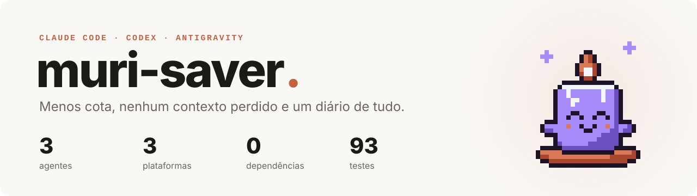
</picture>
<!-- /gerado:banner -->

<p align="center">
  <b>Português</b> &nbsp;·&nbsp; <a href="README.en.md">English</a>
</p>

<p align="center">
  <a href="#instalar">Instalar</a> &nbsp;·&nbsp;
  <a href="docs/architecture.md">Arquitetura</a> &nbsp;·&nbsp;
  <a href="docs/llm-chain.md">Cadeia de LLMs</a> &nbsp;·&nbsp;
  <a href="docs/vault-live-notes.md">Nota viva</a> &nbsp;·&nbsp;
  <a href="docs/reference.md">Referência</a> &nbsp;·&nbsp;
  <a href="CHANGELOG.md">Versões</a>
</p>

Kit de governança, memória e registro para agentes de código. Gasta menos cota, não deixa o contexto evaporar entre sessões e transforma cada sessão numa nota legível no Obsidian. Funciona no **Claude Code**, no **Codex** e no **Antigravity**, em macOS, Linux e Windows, com um instalador em Node e nenhuma dependência.

> [!NOTE]
> Os números deste README vêm do uso real do autor e servem de diagnóstico, não de benchmark. Meça a sua rotina com `muri-saver report` e `muri-saver audit`. As capturas do vault usam dados fictícios de [`examples/vault/`](examples/vault/).

## Por que existe

Quem usa agente de código todo dia esbarra em três problemas: a **cota acaba** sem você entender por quê, o **contexto evapora** entre sessões e não sobra **nenhum registro legível** do que foi feito.

O muri-saver nasceu de auditar transcripts reais. Uma sessão sozinha gastou 2,1 bilhões de tokens de cache em 42 horas; um arquivo foi relido 54 vezes na mesma sessão; a automação de navegador tirou 501 screenshots onde 3 leituras de texto bastavam. Cada regra do kit responde a um desses achados, e o resto roda sozinho em hooks, sem você precisar lembrar.

## Em 90 segundos

https://github.com/user-attachments/assets/c69dbadb-41bb-4152-825b-ace8e280813f

<sub>Sem narração. Se o player não carregar, <a href="https://github.com/user-attachments/assets/c69dbadb-41bb-4152-825b-ace8e280813f">abra o vídeo</a>. Telas de terminal marcadas como simulação usam as cores, os limites e os textos dos scripts reais.</sub>

<table>
  <tr>
    <td width="33%">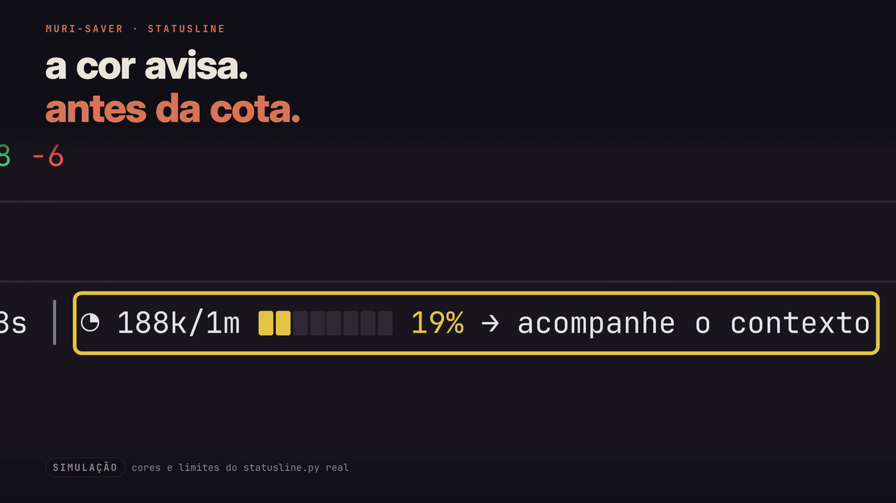<br><sub><b>Status line:</b> contexto, cache e cotas num relance</sub></td>
    <td width="33%">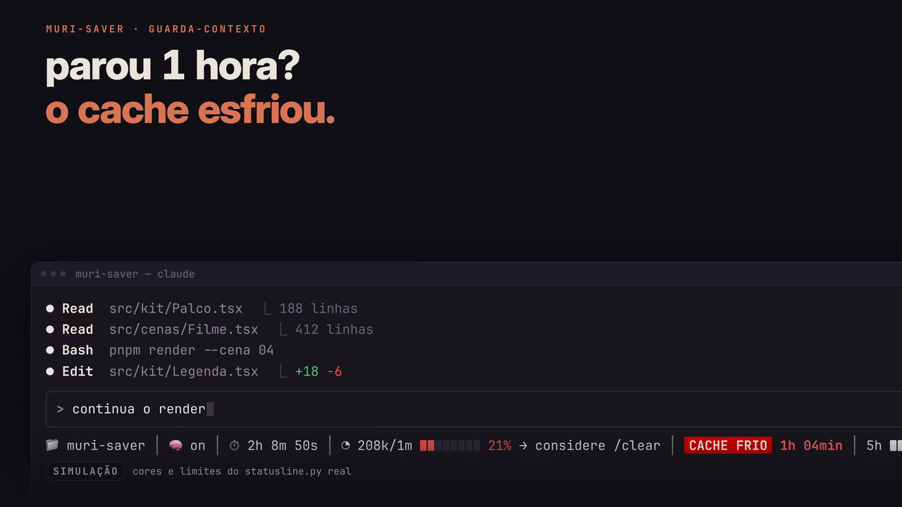<br><sub><b>Guarda de contexto:</b> segura a retomada cara</sub></td>
    <td width="33%">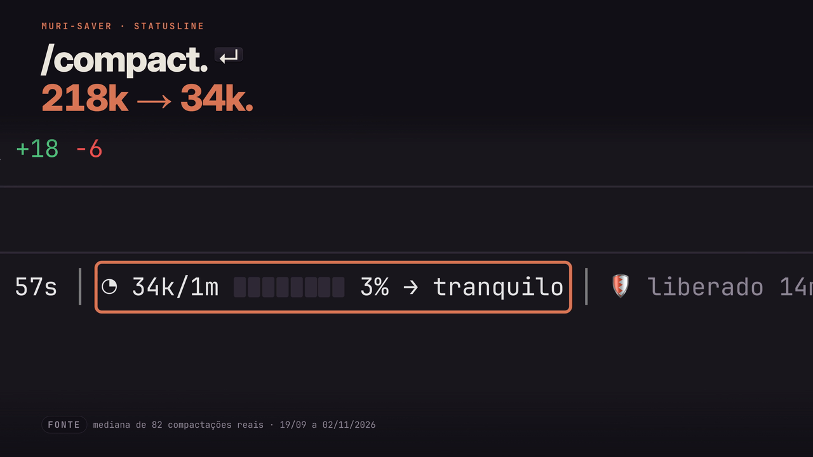<br><sub><b><code>/compact</code> na hora certa:</b> 218k → 34k</sub></td>
  </tr>
  <tr>
    <td>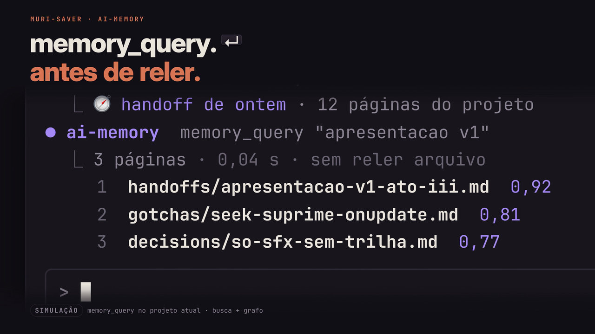<br><sub><b>Memória:</b> a sessão nova sabe de onde parou</sub></td>
    <td>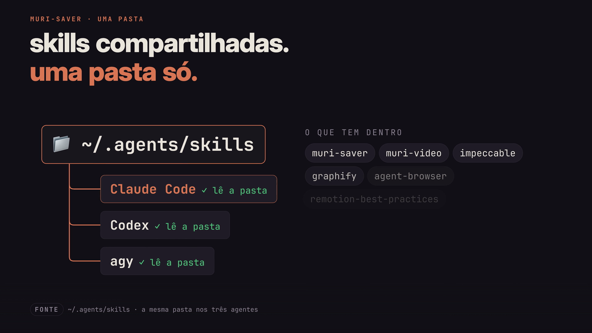<br><sub><b>Skills e conectores</b> sob demanda</sub></td>
    <td>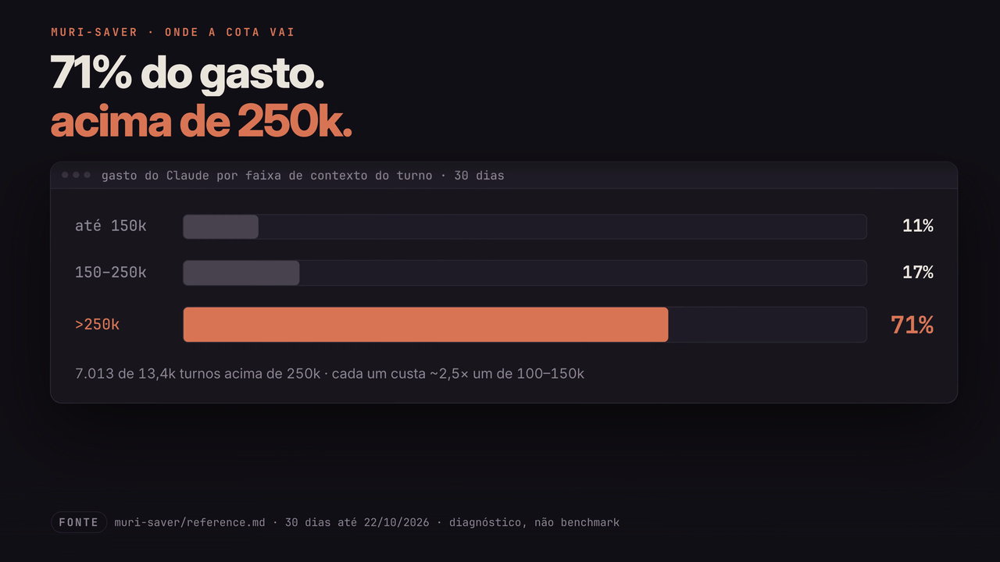<br><sub><b>Onde a cota vai:</b> 71% acima de 250k</sub></td>
  </tr>
</table>

## O que você vê no terminal

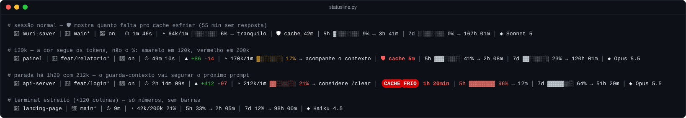

- **Status line:** o contexto muda de cor pelos tokens (amarelo em 120k, vermelho em 200k), mostra quanto falta para o cache esfriar e as cotas de 5 horas e 7 dias com contagem regressiva.
- **Guarda de contexto:** depois de 55 minutos parado com mais de 80k de contexto, segura uma vez o próximo prompt, porque a retomada regravaria o cache inteiro. Em 120k, 160k e 200k, lembra a hora de abrir sessão nova. `MURI_GUARDA=0` desliga.
- **Notificação:** alerta no desktop quando o Claude está esperando você (macOS e Linux). `MURI_NOTIFY=0` desliga.
- **Skill `muri-saver`:** diga "muri saver" e o agente entra no modo de economia agressiva: não reler, paralelizar, perfil por tarefa e sessões curtas.

## O que fica registrado

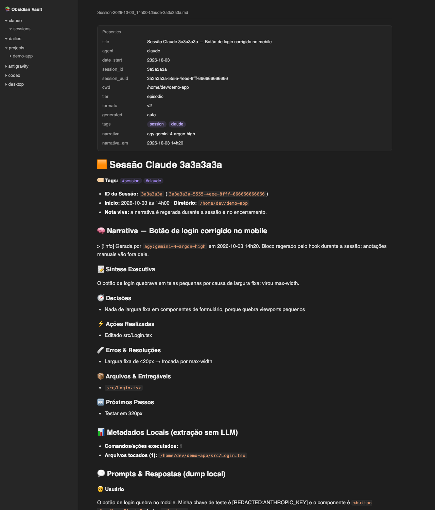

1. **Cada turno** grava um dump local da sessão no seu vault, na hora, sem esperar modelo nenhum.
2. **A cada 15 minutos**, um processo à parte escreve a narrativa: síntese, decisões, ações e arquivos.
3. **No fim da sessão**, a narrativa ganha a versão final e entra no Daily do dia, junto com as sessões dos outros agentes.
4. **O ai-memory** consolida a sessão em páginas pesquisáveis, e a próxima sessão começa sabendo de onde parou.
5. **Segredos são mascarados** antes de qualquer gravação e antes de o texto ir para o modelo: uma chave colada vira `[REDACTED:ANTHROPIC_KEY]`.

A narrativa e a consolidação usam uma [cadeia de modelos](docs/llm-chain.md) que troca sozinha quando um bate no limite. **Nenhum padrão usa a cota do Claude.**

[A nota viva em detalhe →](docs/vault-live-notes.md)

<br clear="right">

## Onde a cota vai

<!-- gerado:cota -->
<picture>
  <source media="(prefers-color-scheme: dark)" srcset="assets/readme/cota-escuro.svg">
  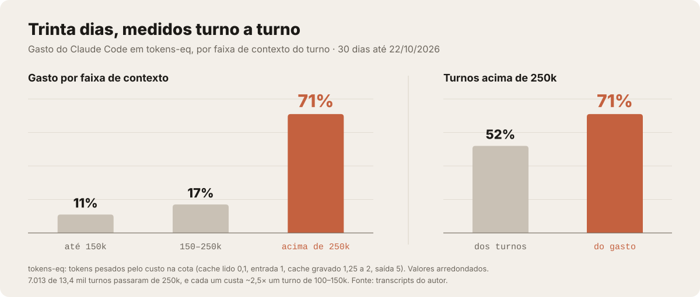
</picture>
<!-- /gerado:cota -->

Trinta dias de uso medidos turno a turno mostraram que o problema não é a escolha de modelo, é o tamanho do contexto. Os turnos acima de 250k foram metade dos turnos e **71% do gasto**, porque cada um custa cerca de 2,5 vezes um turno de 100 a 150k. Na mesma análise, 64 retomadas com o cache já frio custaram 33,5 milhões de tokens-eq, perto de 11 pontos da cota semanal no mês.

Daí a status line colorida por tokens, o guarda de contexto e o `autoCompactWindow` de 250k recomendado no [`settings.snippet.json`](claude-config/settings.snippet.json).

## Os achados

<!-- gerado:achados -->
<picture>
  <source media="(prefers-color-scheme: dark)" srcset="assets/readme/achados-escuro.svg">
  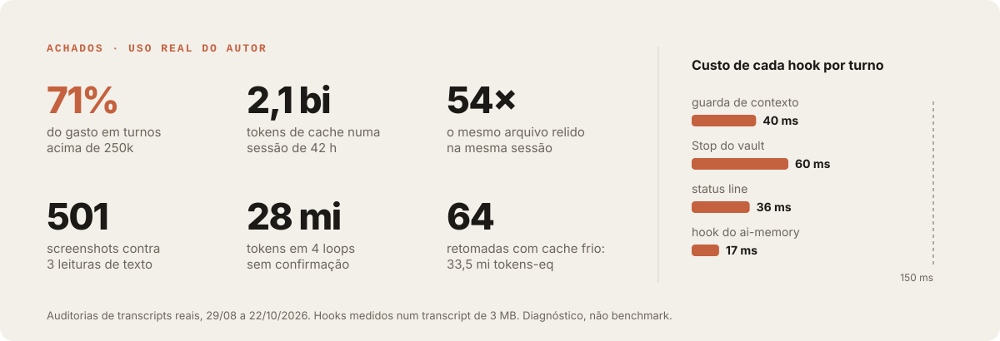
</picture>
<!-- /gerado:achados -->

Cada número virou uma regra curta na governança: memória antes de reler, texto antes de screenshot, confirmação antes de loop, sessão nova antes de maratona.

> [!IMPORTANT]
> Os hooks rodam em todo turno, então precisam ser baratos: **nenhum passa de 150 ms**. O `Stop` nunca espera um modelo; a narrativa roda num processo destacado.

## Instalar

```bash
git clone https://github.com/murilolol/muri-saver.git
cd muri-saver
node bin/install.mjs --dry-run      # mostra o que faria, não escreve nada
node bin/install.mjs --with-all     # Claude Code + Codex + Antigravity
node bin/doctor.mjs                 # confere tudo, só leitura
```

Sem clonar: `npx github:murilolol/muri-saver install --with-all`. Depois, ligue o que quiser:

```bash
node bin/install.mjs --update --vault "/caminho/do/seu/vault"   # toda sessão vira nota no Obsidian
npx muri-saver llm chain && npx muri-saver llm tune              # ai-memory pela cadeia de modelos
node bin/install.mjs --update --with-jobs                         # jobs de fundo
```

Abra uma sessão nova e diga `muri-saver: revise este projeto gastando menos contexto`. O [ai-memory](https://github.com/akitaonrails/ai-memory) é um programa à parte ([como instalar](docs/ai-memory-obsidian-setup.md)); o Obsidian é opcional. Vai instalar com ajuda de uma IA? Mande o link deste repositório e peça para seguir o [`INSTALL-AI.md`](INSTALL-AI.md).

Configurações existentes são **mescladas**, nunca substituídas; o que o instalador sobrescreve ganha backup, e o `--uninstall` remove só o que você não editou. [Passo a passo →](INSTALL.md) &nbsp;·&nbsp; [Todas as opções →](docs/reference.md)

## O que vem junto

| Peça | Quando roda | O que resolve |
|---|---|---|
| **Governança** (`CLAUDE.md`, `AGENTS.md`, `GEMINI.md`) | toda sessão | Regras curtas: memória primeiro, contexto × cota, delegação, logs, git |
| **Skill `muri-saver`** | sob demanda | Economia agressiva: não reler, paralelizar, sessões curtas |
| **Status line, guarda e notificação** | sempre (Claude Code) | Contexto, cache e cota à vista; retomada cara barrada |
| **Nota viva no Obsidian** | todo turno e no fim | Dump local na hora e narrativa por LLM num processo à parte |
| **Cadeia de LLMs** | narrativa e ai-memory | Troca de modelo sozinha em limite ou erro, fora da cota do Claude |
| **Delegação** | quando vale a pena | Leitura e pesquisa no Gemini, revisão e implementação no Codex, na cota deles |
| **Jobs de fundo** | agendador do sistema | Sessões ociosas, fila do ai-memory, backfill e relatório semanal; param sozinhos |
| **Relatório, auditoria e ingestor** | sob demanda | Quanto da cota foi para onde, chamadas repetidas e histórico antigo importado |

## Como funciona

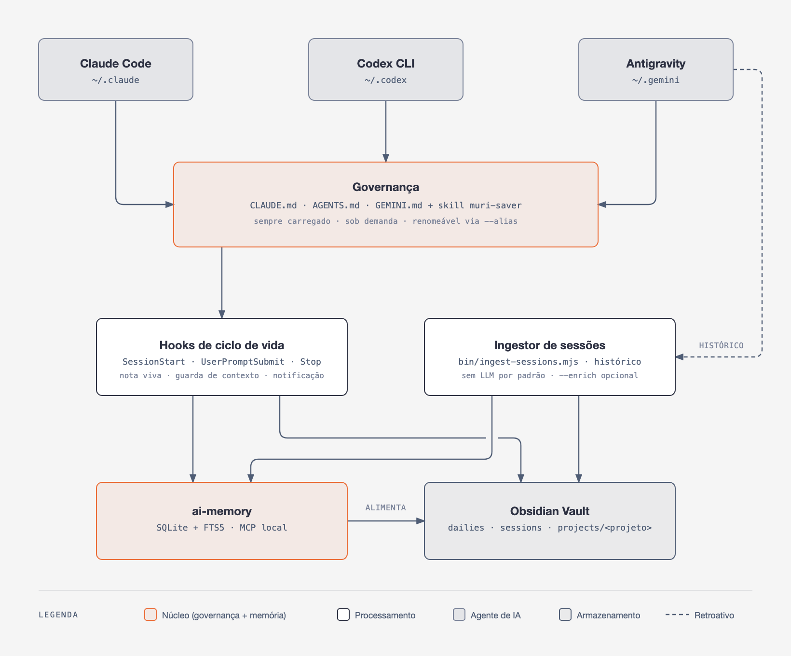

Os três agentes carregam a mesma governança. Os hooks de ciclo de vida (`SessionStart`, `UserPromptSubmit`, `Stop`, `SessionEnd`) alimentam o ai-memory e o vault a cada turno; o ingestor importa o histórico antigo de cada agente sem gastar modelo.

<details>
<summary>Uma sessão, passo a passo</summary>

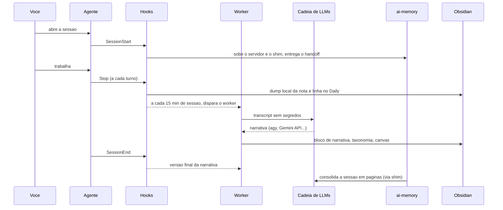
```mermaid
sequenceDiagram
    participant U as Voce
    participant A as Agente
    participant H as Hooks
    participant W as Worker
    participant L as Cadeia de LLMs
    participant M as ai-memory
    participant V as Obsidian

    U->>A: abre a sessao
    A->>H: SessionStart
    H->>M: sobe o servidor e o shim, entrega o handoff
    U->>A: trabalha
    A->>H: Stop (a cada turno)
    H->>V: dump local da nota e linha no Daily
    H-->>W: a cada 15 min de sessao, dispara o worker
    W->>L: transcript sem segredos
    L-->>W: narrativa (agy, Gemini API...)
    W->>V: bloco de narrativa, taxonomia, canvas
    A->>H: SessionEnd
    H-->>W: versao final da narrativa
    M->>L: consolida a sessao em paginas (via shim)
```

Se a cadeia inteira estiver em cooldown, a nota fica com o dump e ganha a narrativa depois: no próximo intervalo, no `SessionEnd` ou no job de backfill.

</details>

[A arquitetura em detalhe →](docs/architecture.md)

## Versões

Do kit de regras soltas à guarda de contexto. O detalhe de cada uma está no [histórico de versões](CHANGELOG.md).

| Versão | Data | Marco |
|---|---|---|
| [2.0.0](CHANGELOG.md#200) | 25/09/2026 | Vault, fuso e alias configuráveis; segredos mascarados; `--update` e `--uninstall` |
| [2.1.0](CHANGELOG.md#210) | 02/10/2026 | Skills com núcleo curto; templates de 59 KB para 8 KB; comando `audit` |
| [3.1.0](CHANGELOG.md#310--2026-10-03) | 03/10/2026 | Nota viva, cadeia de LLMs, jobs de fundo em macOS, Linux e Windows, delegação |
| [3.2.0](CHANGELOG.md#320--2026-11-01) | 01/11/2026 | Guarda de contexto, status line nova, notificação e faxineiro |

## Tecnologia

<p>
  
</p>

Node.js 18 ou mais novo, só com a biblioteca padrão, e scripts auxiliares em Python e shell. Memória no [ai-memory](https://github.com/akitaonrails/ai-memory) (SQLite com busca FTS5 e servidor MCP local). Jobs no launchd, no `systemd --user` ou crontab e no Agendador de Tarefas do Windows. 93 testes com `node:test`, rodando numa home temporária com binários falsos: nenhum teste toca a sua configuração nem chama um modelo.

## Documentação

| Página | O que tem |
|---|---|
| [Instalação](INSTALL.md) · [para IA](INSTALL-AI.md) | Passo a passo, para humano e para agente |
| [Referência](docs/reference.md) | Opções do instalador, comandos, configuração, jobs, multiplataforma |
| [Arquitetura](docs/architecture.md) | Como as peças se encaixam |
| [Cadeia de LLMs](docs/llm-chain.md) | Modelos, shim, chave e limites do ai-memory |
| [Nota viva](docs/vault-live-notes.md) | Nota por sessão, taxonomia, ponte para o ai-memory |
| [Jobs de fundo](docs/background-jobs.md) | Jobs por sistema, como param sozinhos, logs |
| [Delegação](docs/delegation.md) | Gemini e Codex na cota deles |
| [Relatório de economia](docs/economy-report.md) · [Auditoria](docs/audit.md) | Para onde a cota foi, tokens-eq |
| [ai-memory e Obsidian](docs/ai-memory-obsidian-setup.md) · [Ingestor](docs/session-ingestor.md) | Memória, MCP e histórico antigo |
| [Skills companheiras](docs/skills-companion.md) · [Problemas conhecidos](docs/troubleshooting.md) | Terceiros que combinam e soluções |

## Contribuindo e créditos

Contribuições são bem-vindas: veja o [`CONTRIBUTING.md`](CONTRIBUTING.md) e as [issues](https://github.com/murilolol/muri-saver/issues). Licença MIT ([`LICENSE`](LICENSE)). Feito por [@murilolol](https://github.com/murilolol) a partir do uso diário real; `muri-saver` e `grill-me` são conteúdo original. O [ai-memory](https://github.com/akitaonrails/ai-memory) é de [Fabio Akita](https://github.com/akitaonrails), e as skills companheiras são dos respectivos autores.

<sub>O banner, o gráfico e o cartão dos achados são gerados a partir de <a href="assets/readme/dados.json">assets/readme/dados.json</a> com <a href="tools/build-readme.mjs">tools/build-readme.mjs</a>. O mascote é o Pavio, do vídeo de apresentação. Se isso te economizou cota ou uma tarde de contexto perdido, uma ⭐ ajuda outra pessoa a achar.</sub>
