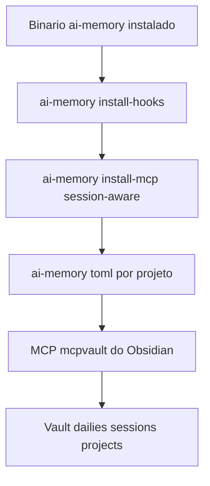

# Configurando `ai-memory` + Obsidian

<p>
  
  
  
</p>

Este repositório não inclui o binário do `ai-memory` nem o Obsidian — são
dependências externas. Este doc cobre como instalar e ligar as duas coisas
pro resto do muri-saver (skill, hooks, governança global) funcionar de
verdade.

**Passos:** [1. Instalar](#1-instalar-o-ai-memory) ·
[2. MCP session-aware](#2-mcp-session-aware-evita-ambiguidade-de-projeto) ·
[3. Marker file](#3-marker-file-por-projeto-ai-memorytoml) ·
[4. MCP Obsidian](#4-mcp-do-obsidian-bitbonsaimcpvault) ·
[5. Estrutura do vault](#5-estrutura-do-vault) ·
[6. Provedor de LLM](#6-llm-provider-pra-consolidação-opcional-mas-recomendado) ·
[7. Verificação](#7-verificação)



<br>

## 1. Instalar o `ai-memory`

Projeto: <https://github.com/akitaonrails/ai-memory>. Siga a instalação
oficial do binário pra sua plataforma (o hook `ai-memory-ensure-server.mjs`
deste repo espera encontrá-lo em `~/.local/bin/ai-memory` no macOS/Linux ou
`~/.cargo/bin/ai-memory.exe` no Windows — se o seu instalador colocar em outro
lugar, ajuste essas duas linhas no hook ou garanta que `ai-memory` esteja no
`PATH`).

Depois de instalado, registre os hooks oficiais do `ai-memory` (captura de
prompts, tool calls, handoff automático entre sessões — isso é gerado e
mantido pelo próprio `ai-memory`, não pelo muri-saver):

```bash
ai-memory install-hooks --client claude-code
```

<br>

## 2. MCP session-aware (evita ambiguidade de projeto)

Por padrão o `ai-memory` roda como um único daemon HTTP compartilhado por
todas as sessões da máquina. Isso é ambíguo quando você tem múltiplos
projetos/sessões abertos ao mesmo tempo: o servidor não sabe de qual sessão
veio cada chamada MCP. Corrija com:

```bash
ai-memory install-mcp --client claude-code --session-aware --apply
```

Isso troca o registro MCP direto por uma ponte stdio (`ai-memory mcp-bridge`)
que injeta o session id real em cada chamada. É idempotente e faz backup do
seu `.claude.json` antes de mexer.

Adicione também no `config.toml` do `ai-memory`:

```toml
[auto_scope]
mode = "per_session"
```

<br>

## 3. Marker file por projeto (`.ai-memory.toml`)

Sem um marker file, o roteamento por `project_strategy = repo-root` depende
do `cwd` do processo estar dentro de um repositório git — abrir o Claude Code
na pasta home e usar `/add-dir` **não** muda o `cwd` real, e tudo cai num
projeto genérico. Na primeira vez que for trabalhar de verdade num projeto
(não só explorar), crie:

```toml
# <repo>/.ai-memory.toml
project = "<nome-do-repo>"
project_strategy = "repo-root"

[capture]
ignore_paths = ["node_modules/**", ".env", "**/.env", ".git/**", "dist/**", "build/**"]
```

> [!IMPORTANT]
> As chaves `project`/`project_strategy` são **top-level**, não dentro de
> `[capture]`. Fixar `project =` explicitamente é o que garante que toda
> sessão nesse repo (hook, CLI, MCP) caia sempre no mesmo bucket.

Se preferir não usar marker file (o que exige `cd <projeto> && claude`
sempre, nunca abrir da home + `/add-dir`), a governança global (`CLAUDE.md`/
`GEMINI.md`/`AGENTS.md`) já inclui a regra de fallback pro bucket genérico
antes de reportar "nada encontrado" — ver seção 1 de qualquer um dos três.

<br>

## 4. MCP do Obsidian (`@bitbonsai/mcpvault`)

Não precisa instalar nada antecipadamente — `npx -y @bitbonsai/mcpvault
<caminho-do-vault>` baixa e roda sob demanda na primeira chamada MCP. Só
registre em `mcpServers` (ver `mcp/mcp-servers.example.json`) com o caminho
absoluto real do seu vault.

<br>

## 5. Estrutura do vault

O `bin/install.mjs` deste repo, com `--vault <caminho>`, cria o esqueleto
completo pros três agentes **e grava esse caminho em
`~/.claude/muri-saver.json`** — é dali que os hooks e o ingestor leem onde
gravar (com `OBSIDIAN_VAULT` como override). Instalou antes da v2? O hook
daquela versão ignorava o `--vault`; rode `node bin/install.mjs --vault "<caminho>"`
de novo.

```
<vault>/
├── dailies/              # diário de bordo cross-agente (Claude Code + Antigravity)
├── claude/sessions/      # sessões do Claude Code
├── antigravity/sessions/ # sessões do Antigravity
├── codex/sessions/       # sessões do Codex
├── codex/dailies/        # diário próprio do Codex (pasta separada, não compete com a raiz)
├── overview/             # índices e dashboards
└── projects/             # taxonomia por projeto (bugs/pedidos/melhorias/...)
```

Já usava algum desses agentes antes de instalar? Depois de configurar tudo
aqui, veja [`docs/session-ingestor.md`](./session-ingestor.md) pra importar
o histórico antigo pro vault retroativamente — sem chamar LLM nenhuma.

<br>

## 6. LLM provider pra consolidação (opcional, mas recomendado)

Se quiser que o `ai-memory` gere narrativa rica em vez de heurística crua,
configure um provedor de LLM pra consolidação. Usando a própria assinatura
Claude via `claude setup-token`:

```bash
ai-memory llm-test   # confirma quais nomes de env var o binário aceita
```

> [!CAUTION]
> Use `ANTHROPIC_OAUTH_TOKEN`, **nunca** `CLAUDE_CODE_OAUTH_TOKEN` — essa
> segunda variável é a mesma que o próprio binário `claude` (Claude Code
> CLI) lê pra decidir seu modo de autenticação, e setá-la globalmente quebra
> o login normal do Claude Code (status vira "Claude API" em vez de "Claude
> Pro/Max", erro 401 em "remote managed settings"). `ANTHROPIC_OAUTH_TOKEN` é
> exclusiva do `ai-memory` e não colide.

```bash
# macOS/Linux (adicione no seu shell rc)
export AI_MEMORY_LLM_PROVIDER=anthropic-oauth
export AI_MEMORY_LLM_MODEL=claude-haiku-4-5-20251001
export ANTHROPIC_OAUTH_TOKEN=<token-de-claude-setup-token>
```

Ou use os scripts inclusos (`scripts/ai-memory-llm-mode.sh` /
`scripts/ai-memory-llm-mode.ps1`) pra alternar entre modo "premium"
(Claude via OAuth) e um modo mais barato — veja o `--help` de cada um.

<br>

## 7. Verificação

```bash
curl -s "http://127.0.0.1:49374/api/v1/projects?workspace=default"
```

Deve listar seus projetos por nome real. Se a lista vier vazia mesmo depois
de uma sessão, confira o aviso de "sessão começou na home dir" que o hook
`ai-memory-ensure-server.mjs` injeta — é o sintoma mais comum. `node
bin/doctor.mjs` também confere binário, servidor e MCP numa única passada —
ver [`INSTALL.md`](../INSTALL.md#passo-4--verificar-tudo).
