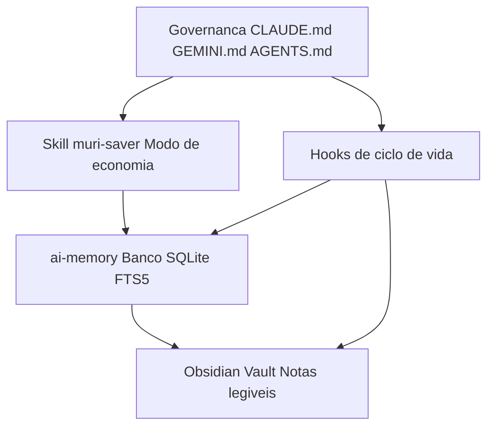
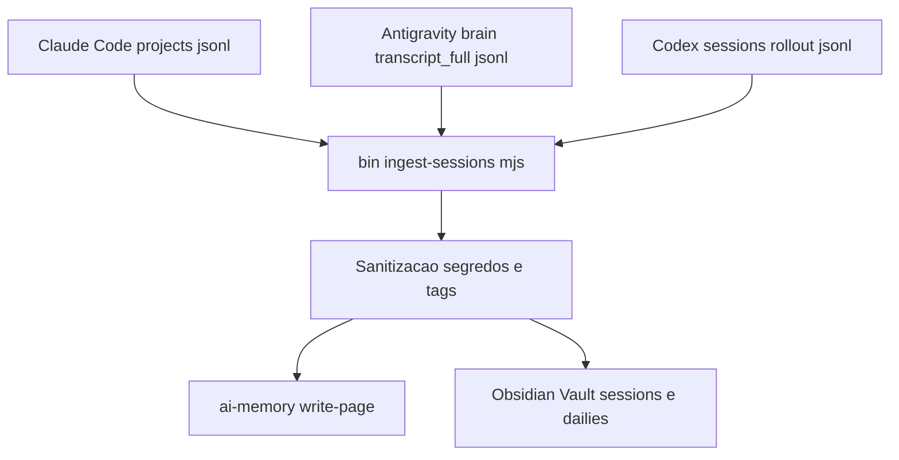

# Arquitetura

  

O muri-saver não é uma ferramenta única — é a combinação de peças que já
existem separadamente (Claude Code/Antigravity/Codex, `ai-memory`, Obsidian)
mais uma camada fina de governança e automação por cima. Nenhuma peça
sozinha resolve o problema; juntas, elas cobrem o ciclo completo **economia
de tokens → memória persistente → registro legível por humano**, pros três
agentes ao mesmo tempo.

**Nesta página:** [Visão geral](#visão-geral) · [As peças](#as-peças) ·
[Multi-agente e o ingestor](#multi-agente-e-o-ingestor) ·
[Configuração (`muri-saver.json`)](#configuração-muri-saverjson) ·
[Código e testes](#código-compartilhado-e-testes) ·
[Por que separar tudo assim](#por-que-separar-tudo-assim)

 

## Visão geral

  

Versão simplificada, em Mermaid:

 

## As peças

**Governança global** (`claude-config/CLAUDE.md.template`,
`antigravity-config/GEMINI.md.template`, `codex-config/AGENTS.md.template`)
Um arquivo por agente, carregado no início de toda sessão, todo projeto —
mesmas 12 diretrizes nos três, adaptadas às tools/modelos reais de cada um
(`AskUserQuestion` vs `ask_question`, `haiku`/`opus` vs `flash`/`pro`, e a
realidade do Codex CLI de não ter uma tool nativa de formulário ainda).
Definem regras que valem sempre: consultar a memória antes de reler arquivo,
alocação de modelo por tipo de subagente, proteções de git, convenções de
Markdown pro Obsidian, e o mapa de palavras-chave que evita varredura cega
de diretório. Curtos de propósito — são lidos em toda sessão, então só entra
aqui o que vale a pena pagar esse custo fixo (nada de badge/imagem/diagrama
decorativo — isso é fora de escopo pra um arquivo que entra no contexto de
todo agente, todo dia).

**Skill `muri-saver`** (`skills/muri-saver/SKILL.md`)
Carregada sob demanda (quando você digita "muri saver" ou pede economia de
tokens explicitamente). Governa modelo/effort, verbosidade, tool calls e
gestão de sessão de forma muito mais agressiva do que a governança global
teria espaço pra cobrir sem inflar toda sessão. Nasceu de auditorias reais
de uso (não é uma lista genérica de boas práticas) — os achados e números
que justificam cada regra estão documentados dentro do próprio arquivo.
Renomeável via `--alias` no instalador (ver `bin/install.mjs`), sem perder
compatibilidade com o gatilho original.

**Hooks** (`hooks/`)
Scripts Node chamados pelo ciclo de vida de cada agente:
- `ai-memory-ensure-server.mjs` (`SessionStart`, Claude Code/Antigravity):
  garante que o daemon HTTP do `ai-memory` está de pé antes da sessão pedir
  um handoff, e avisa se a sessão começou na home dir em vez de dentro de um
  projeto (o que quebraria o roteamento de projeto do `ai-memory`).
- `obsidian-vault-check.mjs` (`Stop`, Claude Code **e** Antigravity — o
  mesmo script detecta qual dos dois via `input.conversationId`): ao
  encerrar a sessão, gera sozinho o registro em `dailies/` e
  `<agente>/sessions/` do vault — narrativa rica via `claude -p` headless
  quando a sessão foi substancial, ou um dump barato (zero custo de LLM)
  quando não foi. Nunca depende do agente lembrar de escrever isso
  manualmente.
- `codex/obsidian-codex-session.mjs` (`Stop`, Codex CLI): equivalente,
  100% local desde o início (sem chamada de LLM em nenhum caminho) — grava
  em `codex/sessions/` e `codex/dailies/`, pastas próprias que não competem
  com a `dailies/` raiz cross-agente.

**`ai-memory`** (dependência externa, não incluída aqui)
O banco durável cross-sessão e cross-agente. Roda como um único daemon HTTP
local (`http://127.0.0.1:49374`) que qualquer client MCP (Claude Code,
Antigravity, Codex...) pode consultar. Ver
[`docs/ai-memory-obsidian-setup.md`](./ai-memory-obsidian-setup.md) pra
instalar e conectar via MCP.

**Obsidian Vault** (seu, não incluído aqui)
O lado humano-legível: dailies cross-agente, sessões por agente, e uma
taxonomia por projeto (bugs/pedidos/melhorias/decisões/etc.) que os hooks
mantêm atualizada sozinhos. `bin/install.mjs --vault <caminho>` cria o
esqueleto de pastas; o conteúdo quem gera são os próprios hooks (ou o
ingestor, retroativamente), sessão após sessão.

**Skills companheiras** (`skills/grill-me/`, ver
[`docs/skills-companion.md`](./skills-companion.md))
`muri-saver` sozinha não cobre tudo — ela orquestra outras skills pro que
não é economia de tokens (TDD, protótipo, entrevista de requisitos,
descoberta de skills novas). `grill-me` é vendorizada aqui porque é minha
reescrita completa do protocolo original; as demais são de terceiros e só
referenciadas, com o comando de instalação de cada uma.

**`bin/doctor.mjs`**
Verificação read-only de todo o ambiente — detecta o SO e confere runtimes,
binário/servidor do `ai-memory`, hooks registrados, plugin `claude-obsidian`,
MCP servers, app Obsidian, a estrutura do vault, a config salva (com
integridade dos arquivos instalados por sha256), e as sessões brutas +
governança de cada agente (Claude Code/Antigravity/Codex).
Existe pra uma IA instaladora (ou você) confirmar o estado real em vez de
assumir que um passo funcionou.

 

## Multi-agente e o ingestor

A governança e os hooks cobrem sessões **novas**, daqui pra frente. Pra
quem já tinha meses de histórico em algum desses agentes antes de instalar
isto, `bin/ingest-sessions.mjs` faz o mesmo trabalho retroativamente — sem
nunca chamar uma LLM (ver [por quê](./session-ingestor.md#por-que-não-chama-nenhuma-llm),
importar milhares de sessões via `claude -p` custaria uma fortuna):

 

## Configuração (`muri-saver.json`)

O instalador grava `~/.claude/muri-saver.json` com alias, vault, fuso,
agentes configurados, caminhos usados e um **manifesto** (caminho + sha256
+ tipo) de cada arquivo que ele escreveu. É o ponto único de verdade da
instalação:

| Quem lê | Pra quê |
|---|---|
| `hooks/obsidian-vault-check.mjs` | Vault e fuso onde gravar cada sessão (procura o arquivo uma pasta acima de `hooks/`, então funciona com `--claude-dir` também) |
| `hooks/codex/obsidian-codex-session.mjs` | Idem, pro Codex (via `~/.claude/muri-saver.json` ou `MURI_SAVER_CONFIG`) |
| `bin/ingest-sessions.mjs` | Vault e fuso padrão quando não vêm por flag |
| `bin/install.mjs --update` | Reinstalar sem repetir flags; saber quais arquivos de governança ele criou e ninguém editou |
| `bin/install.mjs --uninstall` | Remover exatamente o que foi instalado, e só se o hash ainda bater |
| `bin/doctor.mjs` | Mostrar a config e conferir a integridade dos arquivos instalados |

Precedência do vault em todos eles: flag `--vault` > `OBSIDIAN_VAULT` >
`muri-saver.json` > `~/Documents/Obsidian Vault`.

 

## Código compartilhado e testes

`bin/*.mjs` são finos: a lógica mora em `lib/` (config, alias,
sanitização, parsers de cada agente, escrita no vault, enriquecimento,
merge de hooks), o que deixa tudo testável com `node:test` sem dependência
nenhuma. A exceção deliberada são os **hooks**: eles são copiados sozinhos
pra `~/.claude/hooks`, então carregam a própria cópia da sanitização e da
leitura de config em vez de importar de `lib/`.

Os testes (`test/`) usam fixtures de cada agente (sessões fictícias com um
segredo falso, HTML solto e tags de sistema de propósito) e rodam cada
script num `HOME` temporário. O CI roda em macOS, Linux e Windows × Node
18/22/24. `tools/build-assets.mjs` usa os mesmos fixtures pra gerar
[`examples/vault/`](../examples/vault/) e as imagens do README.

 

## Por que separar tudo assim

- **Governança sempre carregada, skill sob demanda**: manter tudo na
  governança global custaria tokens de contexto em toda sessão de todo
  projeto, mesmo quando você não precisa do modo de economia agressiva.
- **Um arquivo de governança por agente, não um único genérico**: `AskUserQuestion`
  não existe no Antigravity, `flash_lite`/`pro` não existem no Claude Code —
  um arquivo só, genérico o bastante pra servir os três, teria que virar
  condicionais confusas ("se você for X, faça Y") em vez de instrução direta.
  Três arquivos curtos e específicos leem melhor que um genérico e ambíguo.
- **Hooks em vez de regra escrita**: uma regra tipo "sempre grave a sessão no
  final" na governança global depende do agente lembrar. Testado na
  prática (ver achados dentro do próprio hook) — sem enforcement automático,
  a gravação simplesmente para de acontecer depois de alguns dias.
- **`ai-memory` como fonte de verdade, Vault como vitrine**: o `ai-memory`
  guarda tudo num data-dir único fora do repositório de qualquer projeto (faz
  sentido pra um daemon compartilhado); o Vault é onde você (humano) navega e
  lê. Os dois nunca competem pelo mesmo dado — o hook decide o que replicar
  pra cada um.
- **Ingestor separado dos hooks ao vivo, não integrado**: os hooks ao vivo
  podem se dar ao luxo de uma chamada `claude -p` por sessão substancial
  (poucas por dia). Uma varredura retroativa de possivelmente milhares de
  sessões não pode — por isso o ingestor é um script deliberadamente mais
  simples (sem narrativa de LLM, sem categorização automática por projeto),
  não uma reexecução do hook em lote.
