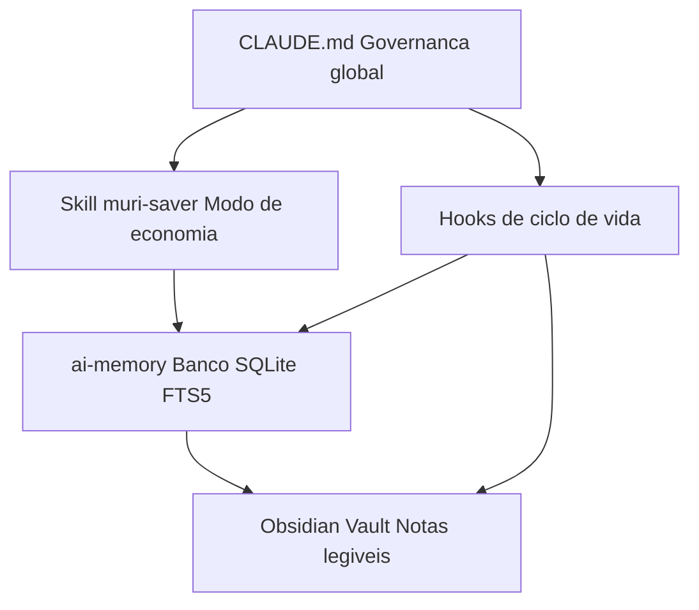

# Arquitetura

O muri-saver não é uma ferramenta única — é a combinação de quatro peças que já
existem separadamente (Claude Code, `ai-memory`, Obsidian) mais uma camada fina
de governança e automação por cima. Nenhuma peça sozinha resolve o problema;
juntas, elas cobrem o ciclo completo **economia de tokens → memória
persistente → registro legível por humano**.

## As peças

**`CLAUDE.md`** (`claude-config/CLAUDE.md.template`)
Carregado pelo Claude Code no início de toda sessão, em todo projeto. Define
regras que valem sempre: consultar a memória antes de reler arquivo, alocação
de modelo por tipo de subagente, proteções de git, convenções de Markdown pro
Obsidian, e o mapa de palavras-chave que evita varredura cega de diretório.
Curto de propósito — é lido em toda sessão, então só entra aqui o que vale a
pena pagar esse custo fixo.

**Skill `muri-saver`** (`skills/muri-saver/SKILL.md`)
Carregada sob demanda (quando você digita "muri saver" ou pede economia de
tokens explicitamente). Governa modelo/effort, verbosidade, tool calls e
gestão de sessão de forma muito mais agressiva do que o `CLAUDE.md` global
teria espaço pra cobrir sem inflar toda sessão. Nasceu de auditorias reais de
uso (não é uma lista genérica de boas práticas) — os achados e números que
justificam cada regra estão documentados dentro do próprio arquivo.

**Hooks** (`hooks/`)
Dois scripts Node chamados pelo ciclo de vida do Claude Code:
- `ai-memory-ensure-server.mjs` (`SessionStart`): garante que o daemon HTTP do
  `ai-memory` está de pé antes da sessão pedir um handoff, e avisa se a sessão
  começou na home dir em vez de dentro de um projeto (o que quebraria o
  roteamento de projeto do `ai-memory`).
- `obsidian-vault-check.mjs` (`Stop`): ao encerrar a sessão, gera sozinho o
  registro em `dailies/` e `claude/sessions/` do vault — narrativa rica via
  `claude -p` headless quando a sessão foi substancial, ou um dump barato
  (zero custo de LLM) quando não foi. Nunca depende do agente lembrar de
  escrever isso manualmente.

**`ai-memory`** (dependência externa, não incluída aqui)
O banco durável cross-sessão e cross-agente. Roda como um único daemon HTTP
local (`http://127.0.0.1:49374`) que qualquer client MCP (Claude Code,
Antigravity, Codex...) pode consultar. Ver
[`docs/ai-memory-obsidian-setup.md`](./ai-memory-obsidian-setup.md) pra
instalar e conectar via MCP.

**Obsidian Vault** (seu, não incluído aqui)
O lado humano-legível: dailies cross-agente, sessões por agente, e uma
taxonomia por projeto (bugs/pedidos/melhorias/decisões/etc.) que os hooks
mantêm atualizada sozinhos. `bin/install.mjs --vault <caminho>` cria o esqueleto
de pastas; o conteúdo quem gera são os próprios hooks, sessão após sessão.

**Skills companheiras** (`skills/grill-me/`, ver `docs/skills-companion.md`)
`muri-saver` sozinha não cobre tudo — ela orquestra outras skills pro que
não é economia de tokens (TDD, protótipo, entrevista de requisitos,
descoberta de skills novas). `grill-me` é vendorizada aqui porque é minha
reescrita completa do protocolo original; as demais são de terceiros e só
referenciadas, com o comando de instalação de cada uma.

**`bin/doctor.mjs`**
Verificação read-only de todo o ambiente — detecta o SO e confere runtimes,
binário/servidor do `ai-memory`, hooks registrados, plugin `claude-obsidian`,
MCP servers, app Obsidian e a estrutura do vault, tudo numa única passada.
Existe pra uma IA instaladora (ou você) confirmar o estado real em vez de
assumir que um passo funcionou.

## Por que separar tudo assim

- **`CLAUDE.md` sempre carregado, skill sob demanda**: manter tudo no
  `CLAUDE.md` custaria tokens de contexto em toda sessão de todo projeto,
  mesmo quando você não precisa do modo de economia agressiva.
- **Hooks em vez de regra escrita**: uma regra tipo "sempre grave a sessão no
  final" no `CLAUDE.md` depende do agente lembrar. Testado na prática (ver
  achados dentro do próprio hook) — sem enforcement automático, a gravação
  simplesmente para de acontecer depois de alguns dias.
- **`ai-memory` como fonte de verdade, Vault como vitrine**: o `ai-memory`
  guarda tudo num data-dir único fora do repositório de qualquer projeto (faz
  sentido pra um daemon compartilhado); o Vault é onde você (humano) navega e
  lê. Os dois nunca competem pelo mesmo dado — o hook decide o que replicar
  pra cada um.
