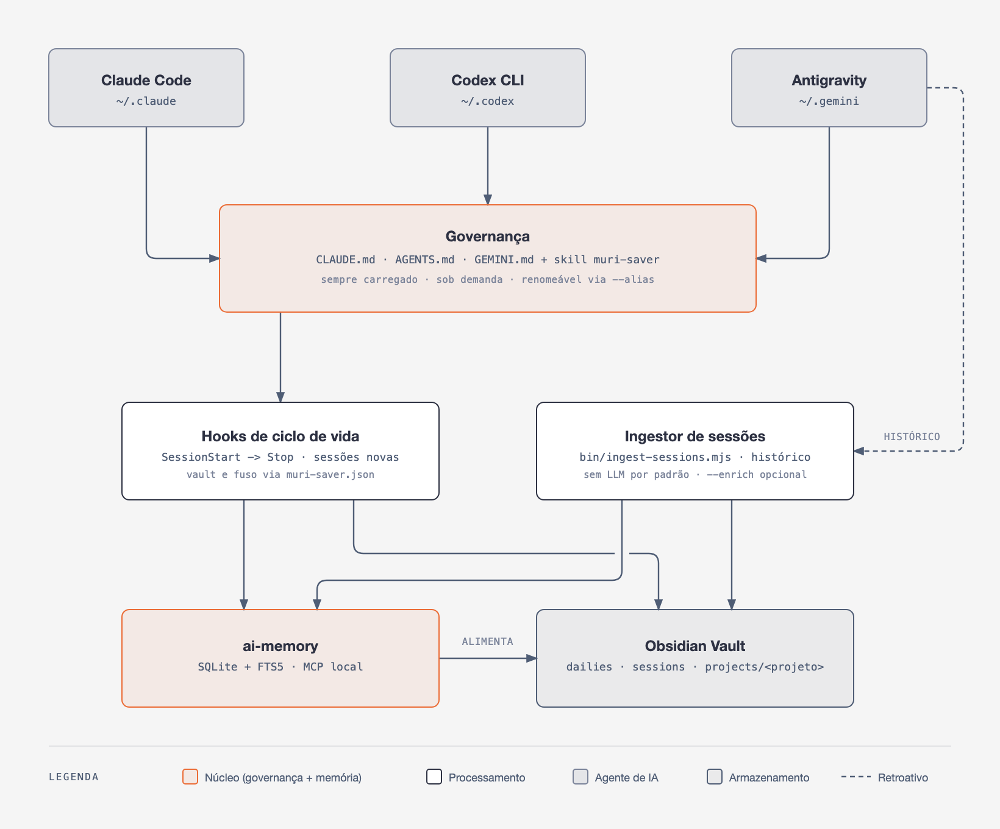
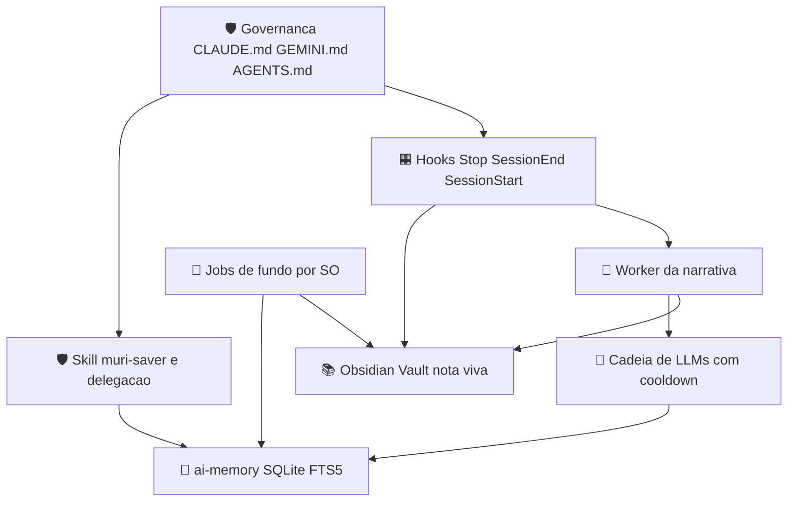
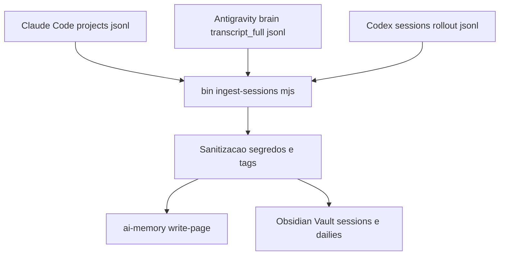

# Arquitetura

  

O muri-saver não é uma ferramenta única — é a combinação de peças que já
existem separadamente (Claude Code/Antigravity/Codex, `ai-memory`, Obsidian)
mais uma camada fina de governança e automação por cima. Nenhuma peça
sozinha resolve o problema; juntas, elas cobrem o ciclo completo **economia
de tokens → memória persistente → registro legível por humano**, pros três
agentes ao mesmo tempo.

**Nesta página:** [Visão geral](#visão-geral) · [As peças](#as-peças) ·
[Multi-agente e o ingestor](#multi-agente-e-o-ingestor) ·
[Configuração (`muri-saver.json`)](#configuração-muri-saverjson) ·
[Código e testes](#código-compartilhado-e-testes) ·
[Por que separar tudo assim](#por-que-separar-tudo-assim)

 

## Visão geral

  

Versão simplificada, em Mermaid:

```mermaid
graph TD
    Gov["🛡️ Governanca CLAUDE.md GEMINI.md AGENTS.md"]
    Skill["🛡️ Skill muri-saver e delegacao"]
    Hooks["🟧 Hooks Stop SessionEnd SessionStart"]
    Worker["🤖 Worker da narrativa"]
    Chain["🤖 Cadeia de LLMs com cooldown"]
    Jobs["🚀 Jobs de fundo por SO"]
    AiMemory["🧠 ai-memory SQLite FTS5"]
    Vault["📚 Obsidian Vault nota viva"]

    Gov --> Skill
    Gov --> Hooks
    Hooks --> Vault
    Hooks --> Worker
    Worker --> Chain
    Worker --> Vault
    Chain --> AiMemory
    Jobs --> AiMemory
    Jobs --> Vault
    Skill --> AiMemory
```

 

## As peças

**Governança global** (`claude-config/CLAUDE.md.template`,
`antigravity-config/GEMINI.md.template`, `codex-config/AGENTS.md.template`)
Um arquivo por agente, carregado no início de toda sessão, todo projeto —
um núcleo curto comum e uma introdução específica para cada host. Perguntas,
modelos e controles de sessão dependem das capacidades realmente expostas;
o Codex usa sua interface nativa de perguntas quando disponível.
Definem regras de leituras direcionadas, memória com escopo confirmado,
capacidades reais do host, proteção de git e integridade de notas. Curtos
de propósito — são lidos em toda sessão, então só entra
aqui o que vale a pena pagar esse custo fixo (nada de badge/imagem/diagrama
decorativo — isso é fora de escopo pra um arquivo que entra no contexto de
todo agente, todo dia).

**Skill `muri-saver`** (`skills/muri-saver/SKILL.md`)
Carregada sob demanda (quando você digita "muri saver" ou pede economia de
tokens explicitamente). Mantém um núcleo curto em inglês; referências de
memória, adaptações dos agentes e auditoria carregam só quando necessárias.
Recomenda configurações disponíveis, sem trocar o modelo automaticamente.
Nasceu de auditorias reais
de uso (não é uma lista genérica de boas práticas) — os achados e números
ficam no README; a skill instalada contém apenas instruções de uso.
Renomeável via `--alias` no instalador (ver `bin/install.mjs`), sem perder
compatibilidade com o gatilho original.

**Hooks** (`hooks/`)
Scripts Node chamados pelo ciclo de vida de cada agente:
- `ai-memory-ensure-server.mjs` (`SessionStart`, Claude Code/Antigravity):
  garante que o daemon HTTP do `ai-memory` está de pé antes da sessão pedir
  um handoff, e avisa se a sessão começou na home dir em vez de dentro de um
  projeto (o que quebraria o roteamento de projeto do `ai-memory`).
- `obsidian-vault-check.mjs` (`Stop` e `SessionEnd` do Claude Code, `Stop`
  do Antigravity, e do Codex via repassador): a **nota viva v2**. Todo `Stop`
  garante um dump local (sem LLM) em `<agente>/sessions/` e a linha no Daily;
  em sessão substancial, dispara um worker destacado que escreve a narrativa
  pela cadeia `llm.narrative` a cada 15 min de sessão e de novo no
  `SessionEnd`. Só os blocos marcados são regerados. Ver
  [vault-live-notes.md](./vault-live-notes.md).
- `codex/obsidian-codex-session.mjs` (`Stop`/`SessionEnd`, Codex CLI): só
  repassa o payload pro hook acima; o rollout do Codex é normalizado pro
  formato do Claude Code.
- `muri-common.mjs` e `muri-llm.mjs`: código compartilhado entre hooks e
  scripts (config, fuso, máscara de segredos, resolução de binário em
  qualquer SO, acesso ao ai-memory, cadeia de modelos com cooldown).
- `aim-guard.mjs`: embrulha os hooks do ai-memory no Antigravity pra que as
  chamadas headless do próprio muri-saver ao `agy` não virem sessões-lixo.

**Scripts de fundo** (`scripts/`, instalados em `~/.claude/scripts`)
O que não cabe num hook. `ai-memory-llm-shim.mjs` dá ao ai-memory a mesma
cadeia de modelos ([llm-chain.md](./llm-chain.md));
`ai-memory-finalize-idle.mjs` encerra sessões ociosas (o Antigravity não tem
`SessionEnd`); `ai-memory-reprocess-parked.mjs` refaz as sessões que o
ai-memory estacionou sem cota; `vault-backfill.mjs` dá narrativa às notas que
ficaram só com o dump; `muri-delegate.mjs` delega tarefas pro Gemini e pro
Codex ([delegation.md](./delegation.md)); `muri-economy-report.py` mede a
economia ([economy-report.md](./economy-report.md)). `muri-jobs.mjs` registra
os que rodam sozinhos no agendador de cada SO
([background-jobs.md](./background-jobs.md)).

**`ai-memory`** (dependência externa, não incluída aqui)
O banco durável cross-sessão e cross-agente. Roda como um único daemon HTTP
local (`http://127.0.0.1:49374`) que qualquer client MCP (Claude Code,
Antigravity, Codex...) pode consultar. Ver
[`docs/ai-memory-obsidian-setup.md`](./ai-memory-obsidian-setup.md) pra
instalar e conectar via MCP.

**Obsidian Vault** (seu, não incluído aqui)
O lado humano-legível: dailies cross-agente, sessões por agente, e uma
taxonomia por projeto (bugs/pedidos/melhorias/decisões/etc.) que os hooks
mantêm atualizada sozinhos. `bin/install.mjs --vault <caminho>` cria o
esqueleto de pastas; o conteúdo quem gera são os próprios hooks (ou o
ingestor, retroativamente), sessão após sessão.

**Skills companheiras** (`skills/grill-me/`, ver
[`docs/skills-companion.md`](./skills-companion.md))
`muri-saver` sozinha não cobre tudo — ela orquestra outras skills pro que
não é economia de tokens (TDD, protótipo, entrevista de requisitos,
descoberta de skills novas). `grill-me` é vendorizada aqui porque é minha
reescrita completa do protocolo original; as demais são de terceiros e só
referenciadas, com o comando de instalação de cada uma.

**`bin/doctor.mjs`**
Verificação read-only de todo o ambiente — detecta o SO e confere runtimes,
binário/servidor do `ai-memory`, hooks registrados, plugin `claude-obsidian`,
MCP servers, app Obsidian, a estrutura do vault, a config salva (com
integridade dos arquivos instalados por sha256), e as sessões brutas +
governança de cada agente (Claude Code/Antigravity/Codex).
Existe pra uma IA instaladora (ou você) confirmar o estado real em vez de
assumir que um passo funcionou.

 

## Multi-agente e o ingestor

A governança e os hooks cobrem sessões **novas**, daqui pra frente. Pra
quem já tinha meses de histórico em algum desses agentes antes de instalar
isto, `bin/ingest-sessions.mjs` faz o mesmo trabalho retroativamente — sem
nunca chamar uma LLM (ver [por quê](./session-ingestor.md#por-que-não-chama-nenhuma-llm),
importar milhares de sessões via `claude -p` custaria uma fortuna):

```mermaid
graph TD
    CC["Claude Code projects jsonl"]
    AGY["Antigravity brain transcript_full jsonl"]
    CDX["Codex sessions rollout jsonl"]
    Ing["bin ingest-sessions mjs"]
    San["Sanitizacao segredos e tags"]
    AM["ai-memory write-page"]
    V["Obsidian Vault sessions e dailies"]

    CC --> Ing
    AGY --> Ing
    CDX --> Ing
    Ing --> San
    San --> AM
    San --> V
```

 

## Configuração (`muri-saver.json`)

O instalador grava `~/.claude/muri-saver.json` com alias, vault, fuso,
agentes configurados, caminhos usados e um **manifesto** (caminho + sha256
+ tipo) de cada arquivo que ele escreveu. É o ponto único de verdade da
instalação:

| Quem lê | Pra quê |
|---|---|
| `hooks/obsidian-vault-check.mjs` | Vault e fuso onde gravar cada sessão (procura o arquivo uma pasta acima de `hooks/`, então funciona com `--claude-dir` também) |
| `hooks/codex/obsidian-codex-session.mjs` | Repassa pro hook acima (o instalador grava nele o caminho real da pasta de hooks) |
| `scripts/*.mjs`, `scripts/muri-economy-report.py` | Mesma config, via `hooks/muri-common.mjs` (Python lê o JSON direto) |
| `bin/ingest-sessions.mjs` | Vault e fuso padrão quando não vêm por flag |
| `bin/install.mjs --update` | Reinstalar sem repetir flags; saber quais arquivos de governança ele criou e ninguém editou |
| `bin/install.mjs --uninstall` | Remover exatamente o que foi instalado, e só se o hash ainda bater |
| `bin/doctor.mjs` | Mostrar a config e conferir a integridade dos arquivos instalados |

Precedência do vault: flag `--vault` > `OBSIDIAN_VAULT` >
`muri-saver.json`. O valor salvo `"vault": null` desativa o Obsidian;
instalações antigas sem configuração ainda usam `~/Documents/Obsidian Vault`.

 

## Código compartilhado e testes

`bin/*.mjs` são finos: a lógica mora em `lib/` (config, alias,
sanitização, parsers de cada agente, escrita no vault, enriquecimento,
merge de hooks), o que deixa tudo testável com `node:test` sem dependência
nenhuma. A exceção deliberada são os **hooks**: eles são copiados sozinhos
pra `~/.claude/hooks`, então carregam a própria cópia da sanitização e da
leitura de config em vez de importar de `lib/`.

Os testes (`test/`) usam fixtures de cada agente (sessões fictícias com um
segredo falso, HTML solto e tags de sistema de propósito) e rodam cada
script num `HOME` temporário. O CI roda em macOS, Linux e Windows × Node
18/22/24. Binários falsos de `agy` e `ai-memory` (`tools/test-bin/`) cobrem a
narrativa, a cadeia e o reprocessamento sem chamar nada de verdade.
`tools/build-assets.mjs` usa os mesmos fixtures pra gerar
[`examples/vault/`](../examples/vault/) e as imagens do README.

 

## Por que separar tudo assim

- **Governança sempre carregada, skill sob demanda**: manter tudo na
  governança global custaria tokens de contexto em toda sessão de todo
  projeto, mesmo quando você não precisa do modo de economia agressiva.
- **Um arquivo de governança por agente, não um único genérico**: `AskUserQuestion`
  não existe no Antigravity, `flash_lite`/`pro` não existem no Claude Code —
  um arquivo só, genérico o bastante pra servir os três, teria que virar
  condicionais confusas ("se você for X, faça Y") em vez de instrução direta.
  Três arquivos curtos e específicos leem melhor que um genérico e ambíguo.
- **Hooks em vez de regra escrita**: uma regra tipo "sempre grave a sessão no
  final" na governança global depende do agente lembrar. Testado na
  prática (ver achados dentro do próprio hook) — sem enforcement automático,
  a gravação simplesmente para de acontecer depois de alguns dias.
- **`ai-memory` como fonte de verdade, Vault como vitrine**: o `ai-memory`
  guarda tudo num data-dir único fora do repositório de qualquer projeto (faz
  sentido pra um daemon compartilhado); o Vault é onde você (humano) navega e
  lê. Os dois nunca competem pelo mesmo dado — o hook decide o que replicar
  pra cada um.
- **Ingestor separado dos hooks ao vivo, não integrado**: os hooks ao vivo
  podem se dar ao luxo de uma narrativa por sessão substancial (poucas por
  dia). Uma varredura retroativa de possivelmente milhares de sessões não
  pode — por isso o ingestor é deliberadamente mais simples (sem narrativa
  por padrão). Quem quiser narrativa nas sessões importadas usa o
  `vault-backfill`, que respeita a cota e para no primeiro limite.
- **Narrativa fora da cota do agente principal**: até a 3.0 a narrativa ia
  pro Haiku, na cota do Claude. A cadeia de LLMs manda pro Google (API grátis
  por modelo, depois `agy`) e troca sozinha quando um modelo bate no limite.
- **Worker destacado em vez de chamada síncrona**: o `Stop` roda a cada turno;
  esperar um modelo (minutos, às vezes) travaria o agente. O hook grava o dump
  em milissegundos e entrega a narrativa a um processo à parte, com lock por
  sessão.
- **Jobs no agendador nativo, não um daemon próprio**: launchd, systemd e o
  Agendador de Tarefas já sabem acordar no horário, sobreviver a reboot e
  registrar saída. Os jobs de fila se desativam sozinhos, então nada fica
  rodando à toa.

## Auditoria e distribuição

`bin/audit.mjs` lê JSONL em streaming e usa `lib/audit.mjs` para contar usage
observada e assinaturas de ferramentas. Não faz chamadas de modelo/rede nem
grava no vault ou no ai-memory. Contadores ausentes ficam desconhecidos;
chamadas repetidas são sinais para revisão. Veja [audit.md](./audit.md).

`tools/package-skills.py` usa uma lista explícita de arquivos para produzir
ZIPs reproduzíveis das duas skills, com licença e manifesto. O auditor no ZIP
carrega seus módulos locais. Serviços e hooks dependem da instalação completa.
