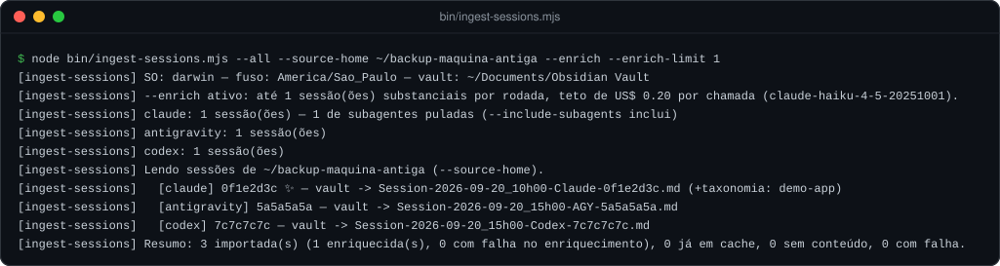
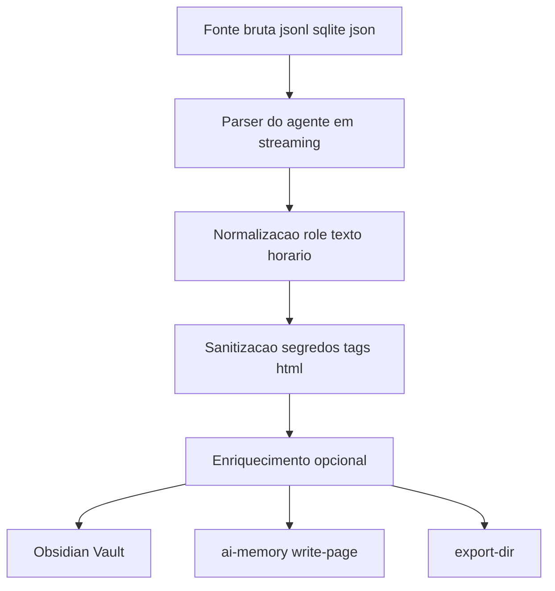

# Ingestor de Sessões (`bin/ingest-sessions.mjs`)

<p>
  
  
  
  = 18" />
</p>

Varre as sessões que cada IA já gravou sozinha na sua máquina — antes mesmo de
você instalar o muri-saver — e registra elas retroativamente no Obsidian Vault
e/ou no `ai-memory`. Útil pra quem já usa Claude Code/Antigravity/Codex há
meses e não quer perder esse histórico só porque os hooks deste repositório
não estavam instalados ainda.

<p align="center">
  
</p>

**Nesta página:** [Por que não chama LLM](#por-que-não-chama-llm-por-padrão) ·
[Fontes](#fontes-suportadas-e-onde-cada-uma-guarda-sessão) ·
[Pipeline](#pipeline) · [Subagentes](#subagentes) ·
[Detecção de projeto](#detecção-de-projeto) · [Sanitização](#sanitização) ·
[Idempotência](#idempotência) · [Destinos](#destinos) ·
[Enriquecimento](#enriquecimento---enrich) · [Flags](#flags)

<br>

## Por que não chama LLM por padrão

Os hooks deste repositório (`hooks/obsidian-vault-check.mjs`) chamam
`claude -p` pra gerar uma narrativa rica de sessões **substanciais**, uma por
uma, em tempo real. Fazer isso retroativamente pra uma varredura de
possivelmente milhares de sessões custaria uma fortuna e contradiria a
filosofia de economia do próprio projeto — por isso o ingestor, **por
padrão, nunca chama LLM nenhuma**. Toda sessão importada vira o equivalente
ao "dump bruto" que os hooks usam pra sessões triviais: prompts e respostas
extraídos localmente e sanitizados.

Se você quiser a narrativa e a taxonomia por projeto em algumas sessões
específicas, existe o [`--enrich`](#enriquecimento---enrich) — opt-in, com
teto de sessões por rodada e de custo por chamada.

<br>

## Fontes suportadas e onde cada uma guarda sessão

| Agente | Onde | Formato |
|---|---|---|
| Claude Code | `~/.claude/projects/<cwd-slugificado>/<session-id>.jsonl` | JSON Lines — um evento por linha (`type: "user"\|"assistant"`, `message.content`) |
| Antigravity / Gemini CLI | `~/.gemini/antigravity-cli/brain/<conversation-id>/.system_generated/logs/transcript_full.jsonl` (fallback `transcript.jsonl`) | JSON Lines — `type: "USER_INPUT"\|"PLANNER_RESPONSE"\|...`, `content` string, `tool_calls[]` |
| Codex CLI (rollouts) | `~/.codex/sessions/<ano>/<mes>/<dia>/rollout-<timestamp>-<session-id>.jsonl` | JSON Lines — `session_meta` + `response_item` com `payload.type: "message"\|"function_call"\|...` |
| Codex CLI (SQLite) | `~/.codex/state_N.sqlite` (índice de threads) + `~/.codex/thread_history_N.sqlite` (itens) | Lido via `node:sqlite` quando o Node tem (≥ 22.5): dá título, `cwd` e origem (subagente ou não) de cada thread, e recupera threads cujo `.jsonl` foi apagado. Em Node mais antigo, só os rollouts são lidos e o `--dry-run` avisa |
| Claude Desktop/Web | `conversations.json` exportado manualmente (Configurações → Exportar dados) | JSON — array de conversas, cada uma com `chat_messages`/`messages` |

Cada fonte tem seu parser em [`lib/parsers.mjs`](../lib/parsers.mjs)
(`parseClaudeSession`, `parseAntigravitySession`, `parseCodexSession`,
`parseDesktopFile`). Todos leem **em streaming, linha a linha** (rollouts
reais do Codex passam de 100 MB), ignoram linhas malformadas e nunca lançam
exceção só porque uma sessão específica é ilegível.

Mensagens que não são conversa de verdade ficam de fora: comandos como
`/clear`, resultados de ferramenta, trechos de subagente dentro da sessão
principal (`isSidechain`), mensagens `developer`/`system` e as instruções
que o Codex injeta como se fossem do usuário (`# AGENTS.md instructions`,
`<environment_context>`).

<br>

## Pipeline



<br>

## Subagentes

Claude Code e Codex gravam cada subagente como uma transcrição separada
(`<sessão>/subagents/agent-*.jsonl` no Claude Code; threads com
`source.subagent` no índice SQLite do Codex). Importar cada uma como
"sessão" enche o vault de ruído, então elas são **puladas por padrão** e o
log conta quantas foram puladas. `--include-subagents` inclui.

<br>

## Detecção de projeto

| Agente | De onde vem o projeto |
|---|---|
| Claude Code | Campo `cwd` dos próprios eventos da transcrição (mais confiável que reverter o nome slugificado da pasta, que é ambíguo quando o projeto já tem `-`) |
| Codex | `cwd` do índice SQLite quando disponível, senão `payload.cwd` do `session_meta` |
| Antigravity | Não tem `cwd` estruturado; inferido do primeiro caminho em `tool_calls` (`Cwd`, `TargetFile`, `path`), subindo além de pastas genéricas (`src`, `app`, `components`…) — `/landing-page/src/Hero.tsx` vira `landing-page` |
| Claude Desktop/Web | Não tem `cwd`; nunca associa projeto |

O nome usado é o último segmento do caminho, separando tanto `/` quanto `\`
(histórico migrado do Windows traz `C:\Users\...`). Um `cwd` que é a própria
home (`/Users/voce`, `C:\Users\voce`) não vira projeto.

<br>

## Sanitização

Antes de gravar qualquer coisa (vault, `ai-memory` ou `--export-dir`), cada
mensagem passa por três passadas, nessa ordem:

| # | Passada | O que faz |
|---|---|---|
| 1 | **Mascaramento de segredos** (`maskSecrets`) | Chaves Anthropic (`sk-ant-...`), OpenAI (`sk-...`, `sk-proj-...`), GitHub (`ghp_...`, `github_pat_...`), Slack (`xox...`), AWS (`AKIA...`, `aws_secret_access_key=...`), Google (`AIza...`), JWT, `Bearer <token>`, blocos de chave privada e atribuições de senha. Cada ocorrência vira `[REDACTED:TIPO]` |
| 2 | **Expurgo de tags de sistema** (`stripSystemTags`) | Blocos só de metadado (`<ADDITIONAL_METADATA>`, `<SYSTEM_MESSAGE>`, `<system-reminder>`…) somem com o conteúdo; marcadores que embrulham o pedido real (`<USER_REQUEST>`) somem mas o texto de dentro fica |
| 3 | **Blindagem anti-quebra do Obsidian** (`escapeStrayHtml`) | Qualquer tag HTML/JSX/SVG solta que sobrar vira inline-code (`` `<div>` ``), pra nunca deixar uma tag desbalanceada engolir o resto da nota |

> [!NOTE]
> Títulos e resumos são **limpos antes de cortar** no tamanho máximo — cortar
> primeiro partia um segredo ou uma tag ao meio, e a metade escapava dos
> padrões. O `title:` do frontmatter é sempre gravado entre aspas e escapado
> (`yamlQuote`), porque vem do primeiro prompt real do usuário e pode conter
> `:` ou `"`. O hook `Stop` aplica exatamente a mesma sanitização.

<br>

## Idempotência

Cache em `<home lida>/.claude/cache/.muri-saver-ingested.json`, chaveado por
`<agente>:<id-da-sessão>`, guardando um fingerprint barato (`tamanho:mtime`
do arquivo fonte) — não o conteúdo. Uma sessão só é reprocessada se:
- o fingerprint mudou (ex: uma sessão do Claude Code ainda ativa, sendo
  escrita pelo processo real); ou
- `--force` foi passado.

Além do cache, a gravação no vault também é idempotente por arquivo: se já
existe uma sessão com o mesmo id em `<agente>/sessions/` (inclusive uma
gravada pelo hook ao vivo), não duplica. `--dry-run` e `--export-dir` nunca
escrevem no cache.

<br>

## Destinos

| Destino | Ativo por padrão? | Comportamento |
|---|---|---|
| **Obsidian Vault** | Sim (`--skip-vault` desativa) | Vault de `--vault` > `OBSIDIAN_VAULT` > `muri-saver.json` > `~/Documents/Obsidian Vault`. Mesma convenção de pasta dos hooks: `dailies/` raiz pra Claude/Antigravity/Desktop, `codex/dailies/` própria pro Codex. Sessão em `<agente>/sessions/Session-AAAA-MM-DD_HHhMM-<Tag>-<id8>.md`; entrada no diário dentro de "Sessões do Dia" |
| **`ai-memory`** | Sim (`--skip-ai-memory` desativa) | Via CLI: `ai-memory write-page --path sessions/imported-<agente>-<data>-<id8>.md --body - --tier episodic -t session -t <agente> -t muri-saver -t imported [-t <projeto>] [--project <projeto>]`. Sem o binário, avisa e segue |
| **`--export-dir <pasta>`** | Não (opt-in, ignora os dois acima) | Um `.md` avulso por sessão em `<pasta>/<agente>-<data>_<hora>-<id8>.md` — pra quem não tem vault nem `ai-memory`, ou quer revisar antes |

<br>

## Enriquecimento (`--enrich`)

Opt-in. Pra cada sessão **substancial** (2+ prompts reais do usuário), até
`--enrich-limit` sessões por rodada (padrão 10), o ingestor manda a
transcrição sanitizada pelo `stdin` de um `claude -p` com Haiku e grava:

- uma nota de sessão com síntese executiva, decisões, ações, orientações e
  arquivos — e a transcrição sanitizada no fim;
- notas atômicas em `projects/<projeto>/<categoria>/` (bug, pedido,
  melhoria, correção, decisão, risco… as mesmas 12 categorias do hook),
  **só pra projetos que já existem** em `projects/` no vault;
- a contagem por categoria no `README.md` do projeto.

Cada chamada tem teto de US$ 0,20 (`--max-budget-usd`) e, na prática, custa
centavos. Se a chamada falhar (não logado, cota, timeout), a sessão é
gravada como dump local e o motivo aparece no log. Veja uma nota enriquecida
real em [`examples/vault/`](../examples/vault/).

<br>

## Flags

<details open>
<summary><strong>Referência completa</strong> (mesmo texto de <code>--help</code>)</summary>

| Flag | Descrição |
|---|---|
| `--all` | Varre todos os agentes detectados (claude, antigravity, codex) |
| `--agent <nome[,nome2]>` | Só esses agentes: `claude`, `antigravity`, `codex` |
| `--file <caminho>` | Export avulso do Claude Desktop/Web (`conversations.json`) |
| `--include-subagents` | Inclui transcrições de subagentes (puladas por padrão) |
| `--since <AAAA-MM-DD>` | Só sessões a partir dessa data |
| `--limit <N>` | Só as N sessões mais recentes por agente |
| `--source-home <pasta>` | Procura as sessões nessa "home" em vez da sua (ex: backup de outra máquina) |
| `--vault <caminho>` | Vault de destino (padrão: o do `muri-saver.json`) |
| `--skip-vault` | Não grava no Obsidian |
| `--skip-ai-memory` | Não grava no `ai-memory` |
| `--export-dir <pasta>` | Só exporta Markdown avulso (ignora vault e `ai-memory`) |
| `--enrich` | Narrativa + taxonomia via `claude -p` (Haiku) nas sessões substanciais |
| `--enrich-limit <N>` | Máximo de sessões enriquecidas por rodada (padrão: 10) |
| `--enrich-model <modelo>` | Modelo do enriquecimento (padrão: `claude-haiku-4-5-20251001`) |
| `--timezone <IANA>` | Fuso dos nomes de arquivo (padrão: o do `muri-saver.json`, senão o do sistema) |
| `--dry-run` | Só lista o que seria feito, não escreve nada |
| `--force` | Reimporta mesmo se já estiver no cache |
| `--help` | Mostra a ajuda |

</details>

Combine como quiser:

```bash
# Simulação total, todos os agentes
node bin/ingest-sessions.mjs --all --dry-run

# Só as 20 sessões mais recentes do Claude Code
node bin/ingest-sessions.mjs --agent claude --limit 20

# Antigravity desde uma data, enriquecendo até 5 sessões
node bin/ingest-sessions.mjs --agent antigravity --since 2026-09-01 --enrich --enrich-limit 5

# Home de outra máquina (backup) pro vault atual
node bin/ingest-sessions.mjs --all --source-home "/Volumes/Backup/Users/voce"

# Claude Desktop/Web pra Markdown avulso, sem tocar vault/ai-memory
node bin/ingest-sessions.mjs --file ./conversations.json --export-dir ./out
```
